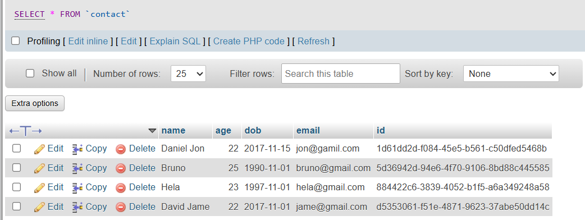
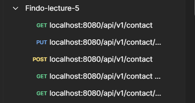
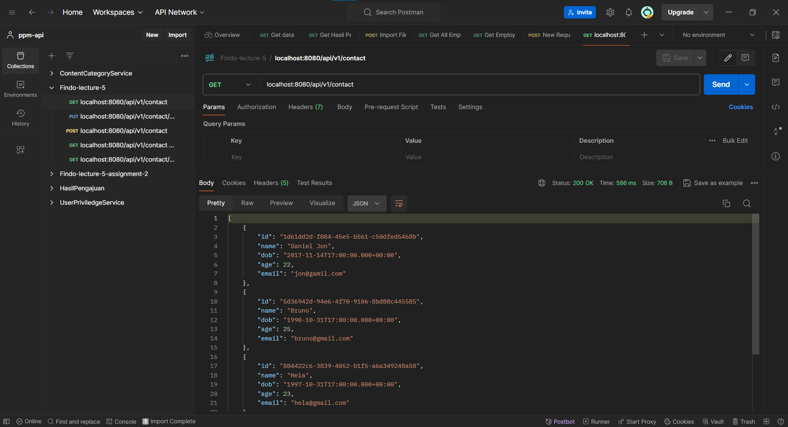
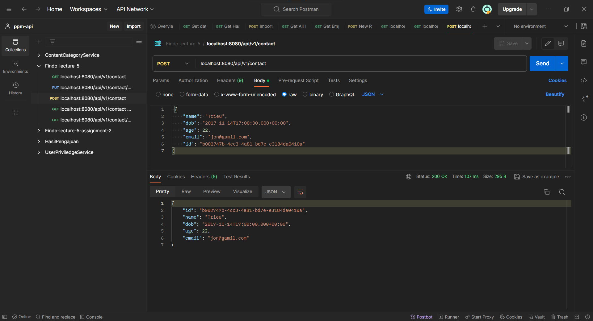
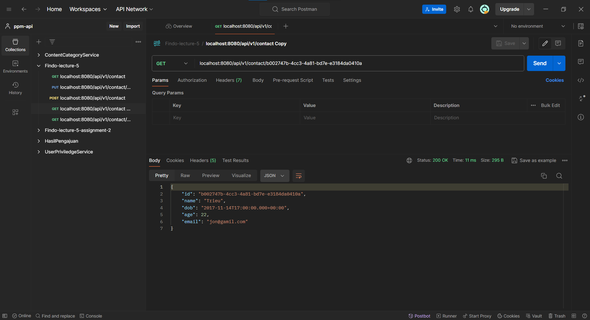
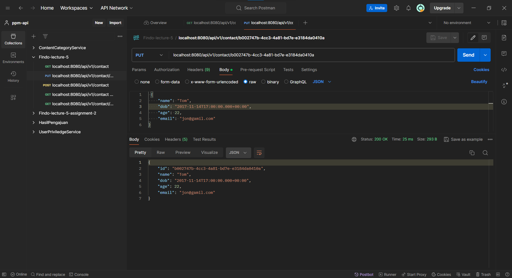

# Lecture 05 - Assignment 01

Basic BE, Spring

## Project Structure

This is the project structure of `Simple CRUD Springboot Application` project, [Reference spring-crud](https://github.com/NguyenVanTrieu/spring-crud)

```bash
lecture_5
├── .mvn/wrapper/
│   └── maven-wrapper.properties
├── src/main/
│   ├── java/com/fsoft/lecture5/lecture5
│   │   ├── controller/
│   │   │   └── ContactController.java
│   │   ├── model/
│   │   │   └── Contact.java
│   │   ├── repository/
│   │   │   └── ContactRepository.java
│   │   └── Lecture5Application.java
│   └── resources/
│       └── application.properties
├── .gitignore
├── mvnw
├── mvnw.cmd
├── pom.xml
├── run.bat
└── run.sh
```

## Init Database

`SQL Query` to create a table and insert some data to the table.

```sql
-- Create Contact Table
CREATE TABLE `contact` (
           `name` varchar(100) COLLATE utf8mb4_unicode_ci NOT NULL,
           `age` int(3) NOT NULL,
           `dob` date NOT NULL,
           `email` varchar(100) COLLATE utf8mb4_unicode_ci NOT NULL,
           `id` varchar(50) NOT NULL
) ENGINE=InnoDB DEFAULT CHARSET=utf8mb4 COLLATE=utf8mb4_unicode_ci;

-- Add Primary Key
ALTER TABLE `contact`
    ADD PRIMARY KEY (`id`);

-- Insert Data
INSERT INTO `contact` (`name`, `age`, `dob`, `email`, `id`) VALUES
('Daniel Jon', 22, '2017-11-15', 'jon@gamil.com', "1d61dd2d-f084-45e5-b561-c50dfed5468b"),
('David Jame', 22, '2017-11-01', 'jame@gmail.com', "d5353061-f51e-4871-9623-37abe50dd14c"),
('Hela', 23, '1997-11-01', 'hela@gmail.com', "884422c6-3839-4052-b1f5-a6a349248a58"),
('Bruno', 25, '1990-11-01', 'bruno@gmail.com', "5d36942d-94e6-4f70-9106-8bd88c445585");
```

\
**Result**

Table `Contact` with the data given.



\
**Configure Application Properties**

Configure so that the application can access the database that has been created.

```java
spring.datasource.driver-class-name=com.mysql.jdbc.Driver
spring.datasource.url=jdbc:mysql://localhost:3306/fsoft-lecture
spring.datasource.username=root
spring.datasource.password=
```

## Postman

Import `Postman` collection.



**Result**

`API` testing result with `Postman`

1. Get all contact `localhost:8080/api/v1/contact`
    \
    \
    Getting all contact data from database.
    

2. Create a new contact `localhost:8080/api/v1/contact`
    \
    \
    Body create a new contact
    ```json
     {
        "name": "Trieu",
        "dob": "2017-11-14T17:00:00.000+00:00",
        "age": 22,
        "email": "jon@gamil.com",
        "id": "b002747b-4cc3-4a81-bd7e-e3184da0410a"
    }
    ```
    \
    Result
    

    \
    Contact has stored in the database
    

3. Get contact by id `localhost:8080/api/v1/contact/b002747b-4cc3-4a81-bd7e-e3184da0410a`

    \
    \
    Get a contact detail of id `b002747b-4cc3-4a81-bd7e-e3184da0410a`
    

4. Update contact by id `localhost:8080/api/v1/contact/b002747b-4cc3-4a81-bd7e-e3184da0410a`
    \
    \
    Body update a contact by id `b002747b-4cc3-4a81-bd7e-e3184da0410a`
    ```json
     {
        "name": "Tom",
        "dob": "2017-11-14T17:00:00.000+00:00",
        "age": 22,
        "email": "jon@gamil.com"
    }
    ```

    \
    Result
    

    \
    Contact has updated in the database, from `Trieu` to `Tom`.
    