# Lecture 05 - Assignment 02

Manage Employees CRUD with Spring Boot

## Model

Defines an `entity` of `Employee` that can be used with Spring Boot and JPA for data persistence.

[Employee.java](lecture5/src/main/java/com/fsoft/lecture5/lecture5/model/Employee.java)

- `@Getter`: generates getter methods for all fields.
- `@Setter`: generates setter method for all non-final fields.
- `@Entity`: annotation marks as JPA entity that will be mapped to a database table.
- `@Table(name = "employees")`: specifies the name of the database table of entity.
- `@id`: marks the primary key.

## Repository

[EmployeeRepository.java](lecture5/src/main/java/com/fsoft/lecture5/lecture5/repository/EmployeeRepository.java)

This interface defines an employee `repository` using JPA Repository. Used as a contract for interacting with the `Employee` entities in the database.

- `@Repository`: annotation used to indicate that the interface is to manage and persist data, it can be encapsulate storage, retrieval, and search a collection.

## Controller

[EmployeeController.java](lecture5/src/main/java/com/fsoft/lecture5/lecture5/controller/EmployeeController.java)

Serves as the endpoint for managing `Employee` through various `HTTP` operations.

- `@RestController`: indicates as a RESTful controller to handle `HTTP` requests based on the `@RequestMapping` annotations, with spesific map that is `@GetMapping`, `@PostMapping`, `@PutMapping`,.

- `@RequestMapping("/api/v1/employees")`: specifies the endpoint base URI path.

- `@AllArgsConstructor`: generates a constructor with one parameter for each field.

**New api receives input csv file​**

```java
@PostMapping("/import")
public ResponseEntity<String> importEmployeesFromCsv(@RequestParam("file") MultipartFile file) {
    try {
        fileUtils.importData(file);
        return ResponseEntity.ok("File imported successfully.");
    } catch (IOException | CsvValidationException e) {
        return ResponseEntity.status(500).body("Error importing file: " + e.getMessage());
    }
}
```

Handling `HTTP POST` request for importing employee data from a CSV file. Accepts a multipart/form-data request as a `MultipartFile file`. This method will call `importData()` method from `fileUtils` 

[FileUtils.java](lecture5/src/main/java/com/fsoft/lecture5/lecture5/utils/FileUtils.java)
\
[DateUtils.java](lecture5/src/main/java/com/fsoft/lecture5/lecture5/utils/DateUtils.java)

```java
@Getter
@Component
public class FileUtils {

    @Autowired
    private EmployeeRepository employeeRepository;

    public void importData(MultipartFile file) throws IOException, CsvValidationException {
        List<String[]> csvData = new ArrayList<>();

        try (CSVReader reader = new CSVReader(new InputStreamReader(file.getInputStream()))) {
            String[] line;
            while ((line = reader.readNext()) != null) {
                csvData.add(line);
            }
        }

        for (int i = 1; i < csvData.size(); i++) {
            String[] row = csvData.get(i);
            String id = row[0];
            String name = row[1];
            LocalDate dateOfBirth = DateUtils.parseDate(row[2]);
            String address = row[3];
            String department = row[4];

            Employee employee = new Employee(id, name, dateOfBirth, address, department);
            employeeRepository.save(employee);
        }
    }
}
```

This class used for logic for importing employee data from a CSV file, in the end of employee loop, the employee saved into database by `empmloyeeRepository.save(employee)`.

\
**Api receive input department by query-parameter, return list emloyees​**

```java
@GetMapping("/department/{department}")
public ResponseEntity<List<Employee>> getEmployeesByDepartment(@PathVariable("department") String department){
    List<Employee> employees = employeeRepository.findByDepartment(department);
    if (employees.isEmpty()) {
        return ResponseEntity.noContent().build();
    }
    return ResponseEntity.ok(employees);
}
```

The `getEmployeesByDepartment()` method defines an endpoint in a Spring Boot application for retrieving a list of employees based on their department.

## API Test

1. **Import CSV File**

    Import `data.csv` to Postman
    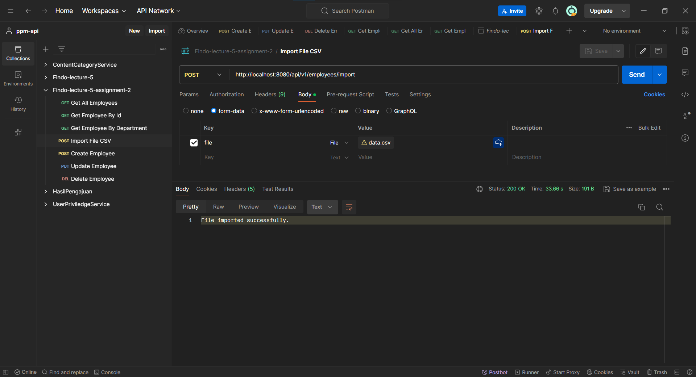

    \
    Result:
    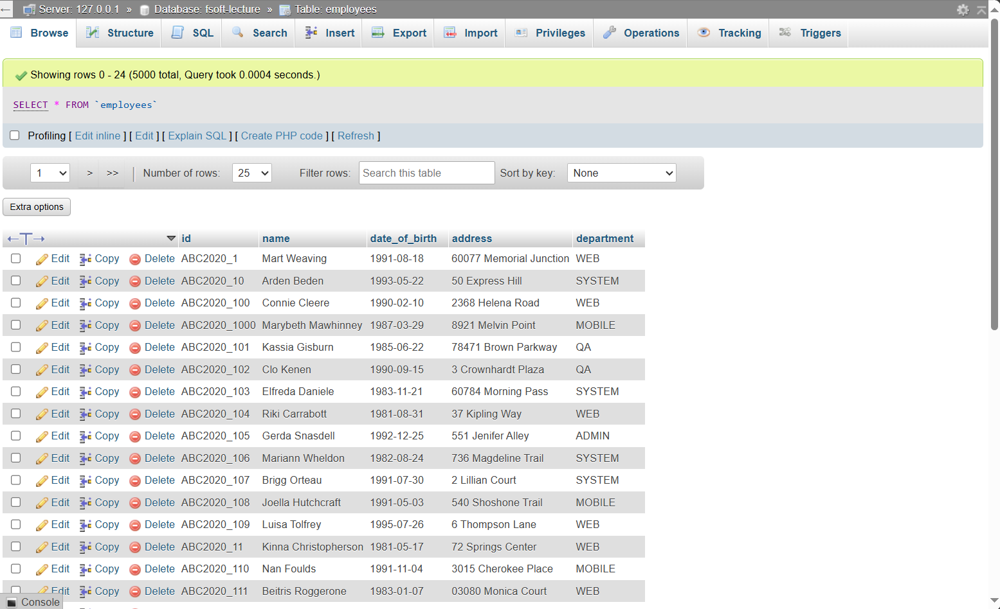

2. **Get All Data Employee**

    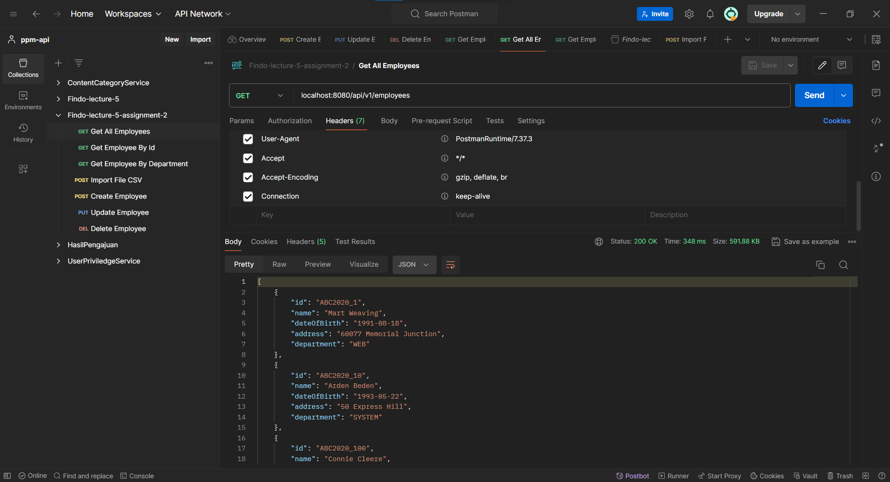

3. **Get Employee By Id**

    Id = `ABC2020_1`
    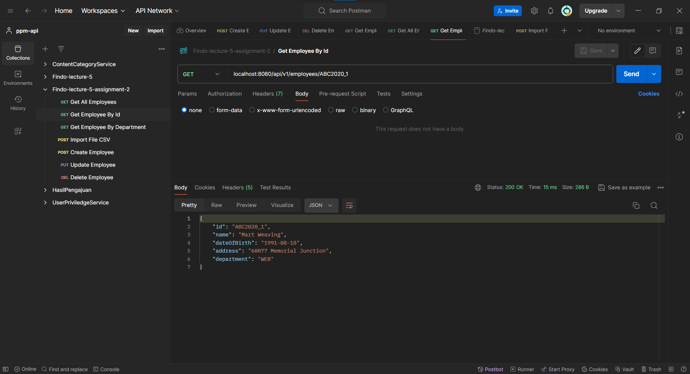

4. **Get Employee By Department**

    Department = `system`
    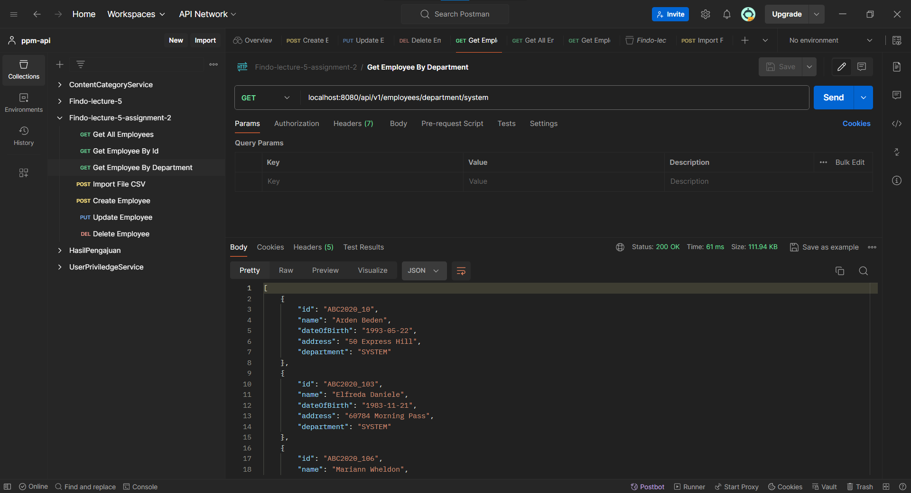

5. **[POST] Create Employee**

    Body:
    ```json
    {
        "id": "A_1",
        "name": "Alif",
        "dateOfBirth": "2024-06-21",
        "address": "Indonesia",
        "department": "Software"
    }
    ```

    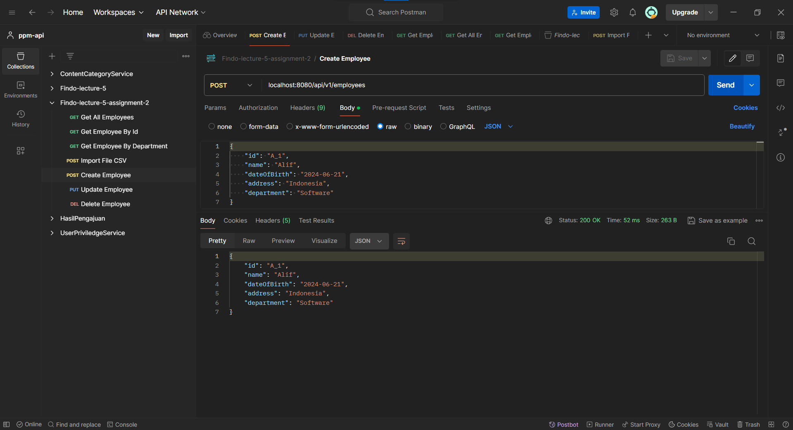

    Result:
    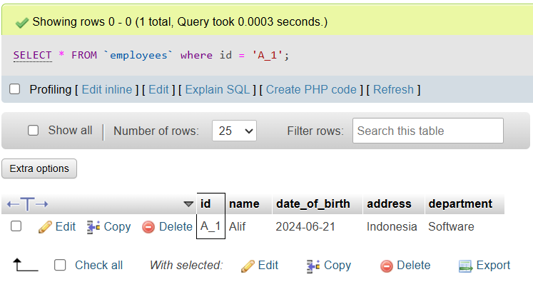

6. **[PUT] Update Employee**

    Body:
    ```json
    {
        "name": "Alif After Update",
        "dateOfBirth": "2001-08-04",
        "address": "Jakarta",
        "department": "QA"
    }
    ```

    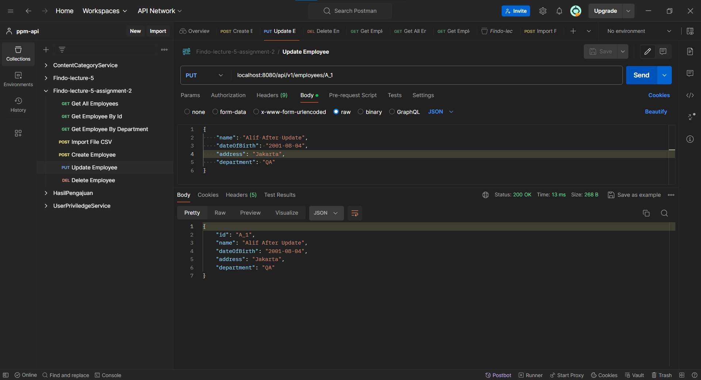

    Result:
    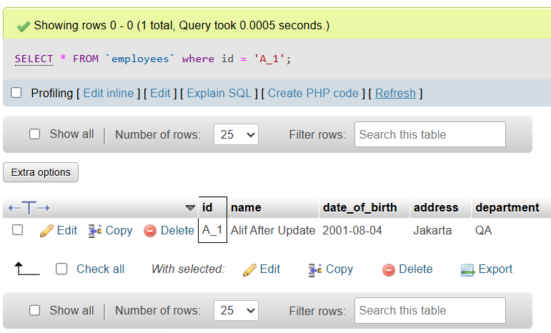

7. **[DELETE] Delete Employee**

    Id: `A_1`

    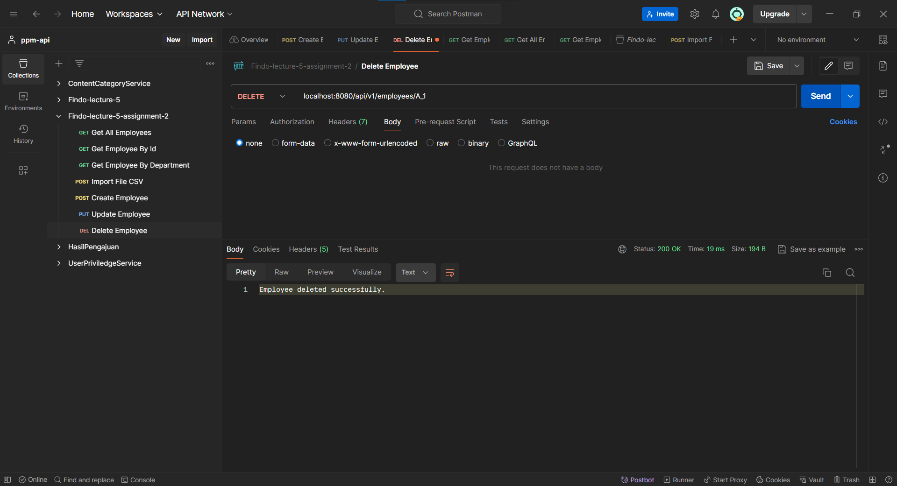

    Result:
    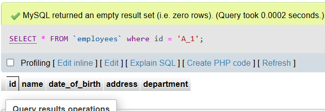