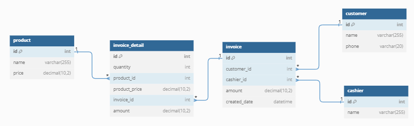

# Assignment 2

A store want to have an application to manage invoices. And also can see the daily, monthly, annual revenue. The following is `SQL` (MySQL) queries of the corresponding table for the application, that is `customer`, `cashier`, `product`, `invoice`, and `invoice_detail` table.

## Diagram



## Initialize Database

[initialize_database.sql](initialize_database.sql)

### Customer Table

```sql
-- Create customer table
CREATE TABLE customer (
    id INT AUTO_INCREMENT PRIMARY KEY,
    name VARCHAR(255) NOT NULL,
    phone VARCHAR(20) NOT NULL
);
```

### Cashier Table

```sql
-- Create cashier table
CREATE TABLE cashier (
    id INT AUTO_INCREMENT PRIMARY KEY,
    name VARCHAR(255) NOT NULL
);
```

### Product Table

```sql
-- Create product table
CREATE TABLE product (
    id INT AUTO_INCREMENT PRIMARY KEY,
    name VARCHAR(255) NOT NULL,
    price DECIMAL(10, 2) NOT NULL
);
```

### Invoice Table

```sql
-- Create invoice table
CREATE TABLE invoice (
    id INT AUTO_INCREMENT PRIMARY KEY,
    customer_id INT,
    cashier_id INT,
    amount DECIMAL(10, 2) NOT NULL,
    created_date DATETIME NOT NULL,
    FOREIGN KEY (customer_id) REFERENCES customer(id),
    FOREIGN KEY (cashier_id) REFERENCES cashier(id)
);
```

### Invoice_detail Table

```sql
-- Create invoice_detail table
CREATE TABLE invoice_detail (
    id INT AUTO_INCREMENT PRIMARY KEY,
    quantity INT NOT NULL,
    product_id INT,
    product_price DECIMAL(10, 2) NOT NULL,
    invoice_id INT,
    amount DECIMAL(10, 2) NOT NULL,
    FOREIGN KEY (product_id) REFERENCES product(id),
    FOREIGN KEY (invoice_id) REFERENCES invoice(id)
);
```

### Result All Table


## Design Database
[design_database.sql](design_database.sql)

Mock the data for design the database.

### Customer Data

```sql
-- Insert data into customer
INSERT INTO customer (name, phone) VALUES 
    ('John Doe', '123-456-7890'),
    ('Jane Smith', '987-654-3210'),
    ('Michael Johnson', '111-222-3333'),
    ('Emily Davis', '123-123-1230'),
    ('Chris Brown', '321-654-7890');
```

### Cashier Data

```sql
-- Insert data into cashier
INSERT INTO cashier (name) VALUES 
    ('Alice'),
    ('Bob');
```

### Product Data

```sql
-- Insert data into product
INSERT INTO product (name, price) VALUES 
    ('Product A', 10.00),
    ('Product B', 15.00),
    ('Product C', 20.00);
```

### Invoice Data

```sql
-- Insert data into invoice
INSERT INTO invoice (customer_id, cashier_id, amount, created_date) VALUES 
    (1, 1, 40.00, '2024-04-01'),
    (2, 1, 60.00, '2024-04-02'),
    (3, 2, 65.00, '2024-05-03'),
    (4, 2, 80.00, '2024-06-04'),
    (5, 1, 90.00, '2024-06-05'),
    (5, 1, 85.00, '2024-06-05');
```

### Invoice_detail Data

```sql
-- Insert data into invoice_detail
INSERT INTO invoice_detail (quantity, product_id, product_price, invoice_id, amount) VALUES 
    (1, 1, 10.00, 1, 10.00),
    (2, 2, 15.00, 1, 30.00),
    (3, 3, 20.00, 2, 60.00),
    (2, 1, 10.00, 3, 20.00),
    (3, 2, 15.00, 3, 45.00),
    (4, 3, 20.00, 4, 80.00),
    (1, 1, 10.00, 5, 10.00),
    (4, 2, 15.00, 5, 60.00),
    (1, 3, 20.00, 5, 20.00),
    (2, 3, 20.00, 6, 40.00),
    (3, 2, 15.00, 6, 45.00);
```