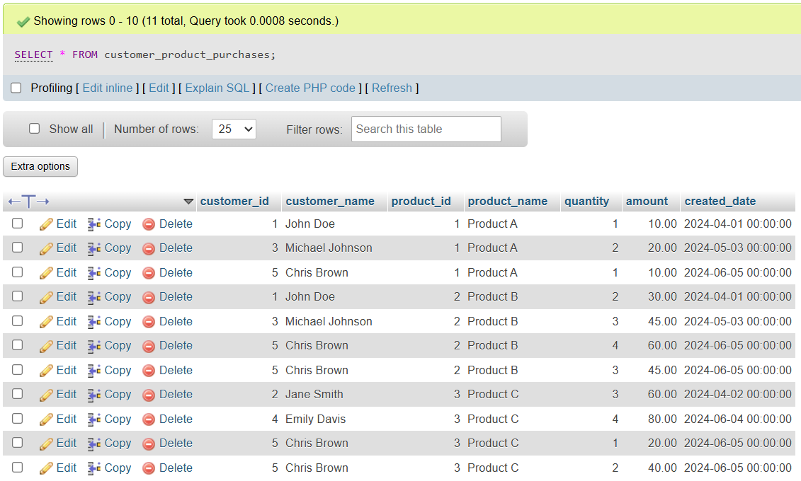
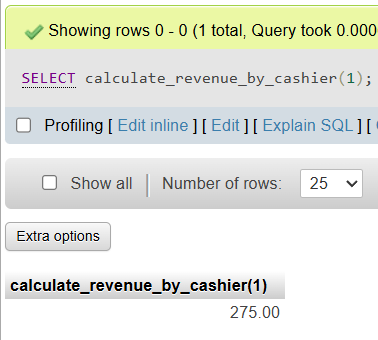
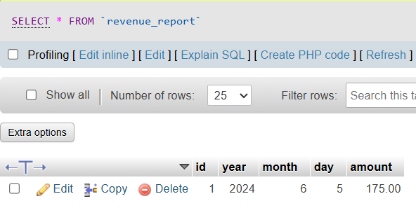
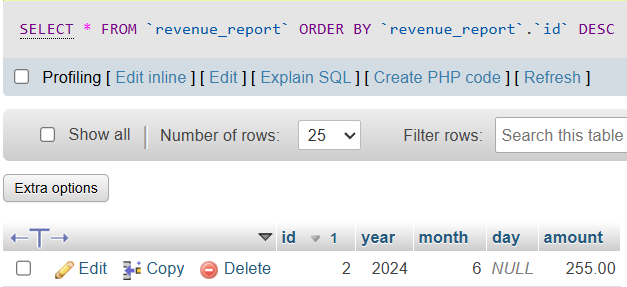
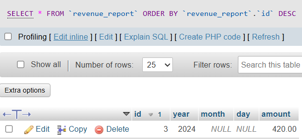
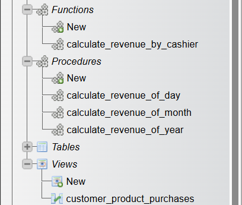

# Assignment 3 - Query SQL (Views, Functions, and Procedures)

Query:
[query.sql](query.sql)

In database, `views`, `procedures`, and `functions` are tools that help manage and interact with the database.

- Views
    views is a virtual table created based on the result of a set of a SQL query. It can simplify complex query, improve secure data, provide a consistent, and reusable to represent data.

- Functions
    Function is a set of SQL statements that can be stored in the database and can be executed repeatedly. Function can take input parameters, execute a series of SQL statements, and return a single value. It can be used in SQL statements wherever an expression is allowed.

- Procedures
    Procedures is similiar to a function, but it doesn't have a return value, and using `call` to call the procedures.

## Create view to show list products customer bought: customer_id, customer_name, product_id, product_name, quantity, amount, created_date​

`Query`:

```sql
CREATE VIEW customer_product_purchases AS
SELECT 
    c.id AS customer_id, 
    c.name AS customer_name, 
    p.id AS product_id, 
    p.name AS product_name, 
    id.quantity, 
    id.amount, 
    i.created_date
FROM 
    customer c
JOIN 
    invoice i ON c.id = i.customer_id
JOIN 
    invoice_detail id ON i.id = id.invoice_id
JOIN 
    product p ON id.product_id = p.id;
```

\
`Usage and Result`:

```sql
SELECT * FROM customer_product_purchases;
```



## Create a function calculating revenue by cashier: input cashier_id

`Query`:

```sql
DELIMITER //
CREATE FUNCTION calculate_revenue_by_cashier(cashier_id INT)
RETURNS DECIMAL(10, 2)
BEGIN
    DECLARE total_revenue DECIMAL(10, 2);
    SELECT 
        SUM(i.amount) INTO total_revenue
    FROM 
        invoice i
    WHERE 
        i.cashier_id = cashier_id;
    RETURN total_revenue;
END //
DELIMITER ;
```

\
`Usage and Result`:

```sql
SELECT calculate_revenue_by_cashier(1);
```



## Create table revenue_report: id, year, month, day, amount​

`Query`:
```sql
CREATE TABLE revenue_report (
    id INT AUTO_INCREMENT PRIMARY KEY,
    year INT,
    month INT,
    day INT,
    amount DECIMAL(10, 2) NOT NULL
);
```

## Revenue of day: input day of year​

`Query`:
```sql
DELIMITER //
CREATE PROCEDURE calculate_revenue_of_day(IN input_day DATE)
BEGIN
    DECLARE total_revenue DECIMAL(10,2);
    SELECT 
        SUM(i.amount) INTO total_revenue
    FROM 
        invoice i
    WHERE 
        DATE(i.created_date) = input_day;
    INSERT INTO revenue_report (year, month, day, amount) VALUES 
        (YEAR(input_day), MONTH(input_day), DAY(input_day), total_revenue);
END //
DELIMITER ;
```

`Usage and Result`:
```sql
CALL calculate_revenue_of_day('2024-06-05');
```



## Revenue of month: input month of year​

`Query`:
```sql
DELIMITER //
CREATE PROCEDURE calculate_revenue_of_month(IN input_year INT, IN input_month INT)
BEGIN
    DECLARE total_revenue DECIMAL(10,2);
    SELECT 
        SUM(i.amount) INTO total_revenue
    FROM 
        invoice i
    WHERE 
        YEAR(i.created_date) = input_year AND MONTH(i.created_date) = input_month;
    INSERT INTO revenue_report (year, month, day, amount) VALUES 
        (input_year, input_month, NULL, total_revenue);
END //
DELIMITER ;
```

`Usage and Result`:
```
CALL calculate_revenue_of_month(2024, 6);
```



## Revenue of year: input year​

`Query`:
```sql
DELIMITER //
CREATE PROCEDURE calculate_revenue_of_year(year_inp INT)
BEGIN
    DECLARE total_revenue DECIMAL(10, 2);
    SELECT 
        SUM(i.amount) INTO total_revenue
    FROM 
        invoice i
    WHERE 
        YEAR(i.created_date) = year_inp;
    INSERT INTO revenue_report (year, month, day, amount) VALUES 
        (year_inp, NULL, NULL, total_revenue);
END //
DELIMITER ;
```

`Usage and Result`:
```sql
CALL calculate_revenue_of_year(2024);
```



## Created Views, Functions, and Procedures

