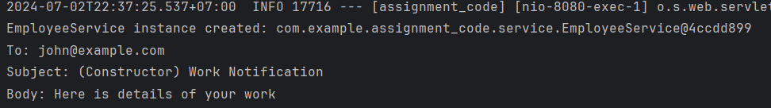

# Assignment 3 - Lecture 7

## 3.1 Add bean scopes (singleton, prototype) to Assignment 2, print output to see the scope of beans​

### Singleton beans

[EmployeeServiceConstructor.java](assignment_code/src/main/java/com/example/assignment_code/service/EmployeeServiceConstructor.java)

Configures the `EmployeeServiceConstructor` as a singleton bean using `@Scope("singleton")`, even though the default scope of bean is singleton.

```java
@Service
@Scope("singleton")
public class EmployeeServiceConstructor {
    // ...
}
```

### Prototype beans

[EmployeeServiceField.java](assignment_code/src/main/java/com/example/assignment_code/service/EmployeeServiceField.java)

Configures the `EmployeeServiceField` as a prototype bean using `@Scope("prototype")`.

```java
@Service
@Scope("prototype")
public class EmployeeServiceField {
    // ...
}
```

### Print output to see the scope of beans​

**Singleton Beans**

This is the example output to see the usage and the scope of `singleton` beans.

```java
public static void main(String[] args) {

    // ... other code

    // Get the EmployeeServiceSetter bean (singleton)
    EmployeeServiceConstructor employeeServiceConstructor = context.getBean(EmployeeServiceConstructor.class);
    employeeServiceConstructor.notifyEmployee("john@example.com", "Here is details of your work");
    // Print the scope of the bean
    System.out.println("Scope of EmployeeServiceConstructor: " + context.isSingleton("employeeServiceConstructor"));

    String[] beanNamesForType = context.getBeanNamesForType(EmployeeServiceConstructor.class);
    for (String beanName : beanNamesForType) {
        String scope = context.getBeanFactory().getBeanDefinition(beanName).getScope();
        System.out.println("Bean: " + beanName + ", Scope: " + scope);
    }

    // ...
}
```

And the output will be:

```bash
To: john@example.com
Subject: (Constructor) Work Notification
Body: Here is details of your work
Scope of EmployeeServiceConstructor: true
Bean: employeeServiceConstructor, Scope: singleton
```

\
**Prototype Beans**

This is the example output to see the usage and the scope of `prototype` beans.

```java
public static void main(String[] args) {
    // ...

    // Get the EmployeeServiceField bean (prototype)
    EmployeeServiceField employeeServiceField = context.getBean(EmployeeServiceField.class);
    employeeServiceField.notifyEmployee("john@example.com", "Here is details of your work");

    // Prototype beans will be different instances
    EmployeeServiceField employeeServiceField2 = context.getBean(EmployeeServiceField.class);
    employeeServiceField2.notifyEmployee("michael@example.com", "Here are details of your work");

    // Print the scope of the bean
    String[] beanNamesForTypeField = context.getBeanNamesForType(EmployeeServiceField.class);
    for (String beanName : beanNamesForTypeField) {
        String scope = context.getBeanFactory().getBeanDefinition(beanName).getScope();
        System.out.println("Bean: " + beanName + ", Scope: " + scope);
    }
    
    // ...
}
```

`EmployeeServiceField` is prototype, so each time getBean is called, a new instance is created. The output is:

```bash
To: john@example.com
Subject: (Field) Work Notification
Body: Here is details of your work
To: michael@example.com
Subject: (Field) Work Notification
Body: Here are details of your work
Bean: employeeServiceField, Scope: prototype
```

## 3.2 For request scope, Create a controller and test it.​

**Request Scope**

[EmployeeService.java](request/assignment_code/src/main/java/com/example/assignment_code/service/EmployeeService.java)

```java
@Service
@Scope(value = WebApplicationContext.SCOPE_REQUEST, proxyMode = ScopedProxyMode.TARGET_CLASS)
public class EmployeeService {
    private final EmailService emailService;

    @Autowired
    public EmployeeService(@Qualifier("primaryEmailService") EmailService emailService) {
        this.emailService = emailService;
    }

    public void notifyEmployee(String receiver, String workDetails) {
        emailService.sendEmail(receiver, "(Constructor) Work Notification", workDetails);
    }

    @PostConstruct
    public void init() {
        System.out.println("EmployeeService instance created: " + this);
    }
}
```

The `WebApplicationContext.SCOPE_REQUEST` in th scope specifies that a new instance of `EmployeeService` will be created for each HTTP request. Also, the `ScopedProxyMode.TARGET_CLASS` ensure that a proxy of the target class is injected.

**Controller**

[EmployeeController.java](request/assignment_code/src/main/java/com/example/assignment_code/controller/EmployeeController.java)

```java
@RestController
@RequestMapping("/employee")
public class EmployeeController {

    private final EmployeeService employeeService;

    @Autowired
    public EmployeeController(EmployeeService employeeService) {
        this.employeeService = employeeService;
    }

    @GetMapping("/notify")
    public String notifyEmployee() {
        String receiver = "john@example.com";
        String workDetails = "Here is details of your work";
        employeeService.notifyEmployee(receiver, workDetails);
        return "Notification sent to " + receiver;
    }
}
```

This class is a `REST` controller that handles HTTP requests related to employees, and uses the `EmployeeService` to perform operations. The `notifyEmployee()` method use `GET` request to the `/notify` endpoint, this method returns a string and send an email to the receiver.

**Output**




The `EmployeeService` that is request scope is successfully created.

## 3.3 Q: How to inject prototype Bean into singleton Bean ?​

By default, Spring beans are singletons, which means the same instance of the bean is shared accross the application. Some problem occur when trying to wire beans of different scopes. The following is way to inject the prototype bean into singleton bean.

1. Using `@Lookup` Annotation

    Method injection with the `@Lookup` annotation can be used to indicate that the method is return type should be looked up in the container each time it is called.

    ```java
    @Component
    public class SingletonBean {
        
        public void usePrototypeBean() {
            PrototypeBean prototypeBean = getPrototypeBean();
            // Use the prototypeBean instance
        }

        @Lookup
        public PrototypeBean getPrototypeBean() {
            // Spring will override this method to return a new instance of PrototypeBean
            return null;
        }
    }
    ```

    Spring will override the `getPrototypeBean()` method annotated with `@Lookup`, then it'll register the bean into the application context.

2. Using `ObjectFactory` Interface

    Spring provides the `ObjectFactory<T>` interface to produce the given type of object.

    ```java
    public class SingletonObjectFactoryBean {

        @Autowired
        private ObjectFactory<PrototypeBean> prototypeBeanObjectFactory;

        public PrototypeBean getPrototypeInstance() {
            return prototypeBeanObjectFactory.getObject();
        }
    }
    ```

    In the `getPrototypeInstance()` method, the `getObject()` returns a new instance of `PrototypeBean` for each request to control over initialization of the prototype.

3. Using `ApplicationContext`

    Inject the `ApplicationContext` directly into a bean, using the `@Autowire` annotation or implement the `ApplicationContextAware` interface.

    ```java
    public class SingletonAppContextBean implements ApplicationContextAware {

        private ApplicationContext applicationContext;

        public PrototypeBean getPrototypeBean() {
            return applicationContext.getBean(PrototypeBean.class);
        }

        @Override
        public void setApplicationContext(ApplicationContext applicationContext) 
        throws BeansException {
            this.applicationContext = applicationContext;
        }
    }
    ```

    When the `getPrototypeBean()` method is called, a new instance of PrototypeBean will be return. But it has some disadvantages, contradicts the principle of inversion of control because request the dependencies from the container directly, and it can coupling the code to the spring framework. 

## 3.4 Q: Diference between BeanFactory and ApplicationContext ?​

| ​Feature | BeanFactory | ApplicationContext |
| --- | --- | --- |
| **Container Type** | Basic container | Advanced container |
| **Initialization** | Lazy initialized by default | Eager initialized by default |
| **Lightweight** | Yes | No (due to additional features) |
| **Customization** | Basic support for dependency injection and lifecycle management | Extensible with additional features and configuration options |
| **Core Interface** | Yes | Yes, extends BeanFactory |
| **Automatic Post-processing** | No | Yes |
| **Internationalization** | No | Yes, supports message resolution for localization |
| **Event Handling** | No | Yes, supports event propagation within the container |
| **Hierarchy Support** | No | Yes |
| **Common Implementations** | `XmlBeanFactory`, `DefaultListableBeanFactory` | `ClassPathXmlApplicationContext`, `AnnotationConfigApplicationContext` |
| **Suitable For** | Basic applications, resource-constrained environments | Most enterprise applications, larger systems |

### BeanFactory

BeanFactory is the most basic version of inversion of control containers.

1. Container type, BeanFactory provides basic mechanism for dependency injection and bean lifecycle management.
2. Lazy initialization, Beans are lazily initialized by default, means a bean created and its dependencies are injected only when requested via `getBean()` method.
3. Lightweight, BeanFactory is lightweight because it only initializes beans when needed.
4. Customization, BeanFactory provides extends and customization by impleemnting custom factories or extending existing implementations.
5. Core interface, it is the core interface for accessing and managing beans in Spring.
6. Commpon implementations including `XmlBeanFactory` and `DefaultListableBeanFactory`.
7. Suitable for basic application or environment with resource contstraints where lightweight and lazy init of beans are preferred.

### ApplicationContext

1. Container type, this extends the BeanFactory and provides more advanced container with additional enterprise features.
2. Eager initialization, beans are eagerly initialized by default, all singleton beans are created and their dependencies are injected at application startup unless marked as lazy.
3. Automatic post-processing, allowing more extensive configuration and customization of dependency injection.
4. Internationalization, provides messages based on locale-specific properties file or database resources.
5. Event handling, ApplicationContext supports event propagation within the container context, with communication between components through events and listeners.
6. Hieararchi support, where one ApplicationContext can be a parent of another.
7. Common implementations include `ClassPathXmlApplicationContext` and `AnnotationConfigApplicationContext`.
8. Suitable for most enterprise application and larger system where advanced features are required.
