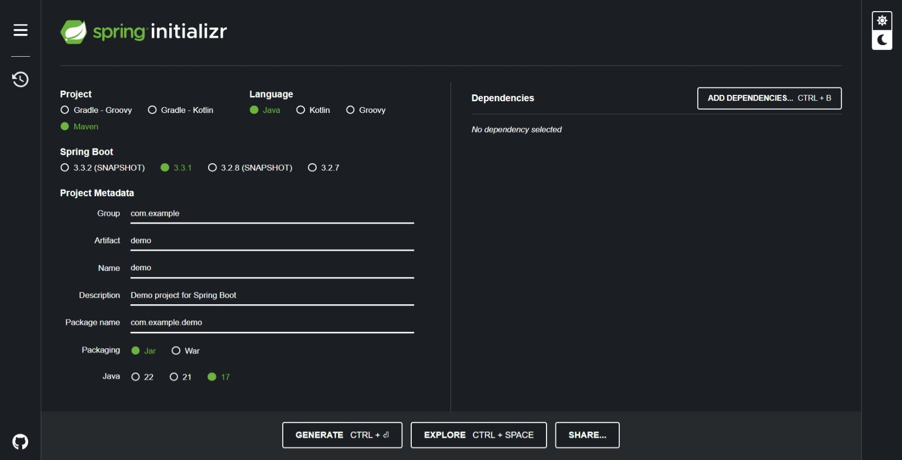
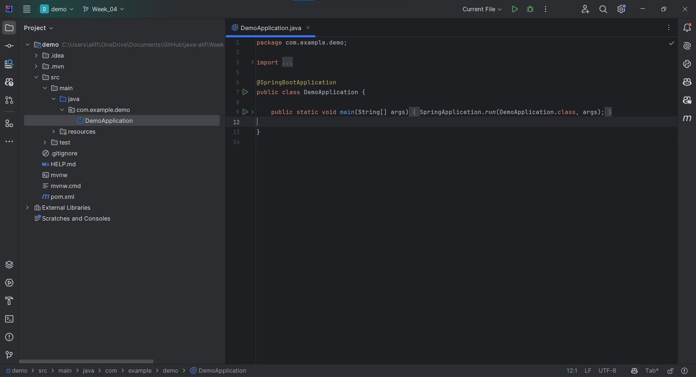

# Assignment 1 - Lecture 8

## 1.1 Create Spring boot project ​

1. **Spring initializr**

    I'm using spring initializer from https://start.spring.io/ to create spring boot project.

    

2. **Project Metadata**

    - **Project**: choose `Maven Project` or `Gradle Project` based on preference, in this case I choose the `Maven Project`.
    - **Language**: choose the program language, I'm choosing the `Java`.
    - **Spring Boot**: choose the version of Spring Boot, I'm choosing version `3.3.1`
    - **Group**: the domain name in reverse.
    - **Artifact**: the name of the project.
    - **Name**: the display name of the project.
    - **Description**: a brief description of the project.
    - **Package Name**: auto-filled based on the group and artifact definition.
    - **Packaging**: choose `Jar` or `War` package, I'm choosing the `Jar` package.
    - **Java Version**: java version of the project, I'm choosing the `17` java version.

3. **Dependencies**

    The dependencies needed for the project.

4. **Project**

    After generate from the initializr, open it in the IDE.

    

    The main class and method:

    [Code](demo/src/main/java/com/example/demo/DemoApplication.java)

    ```java
    @SpringBootApplication
    public class DemoApplication {

        public static void main(String[] args) {
            SpringApplication.run(DemoApplication.class, args);
        }

    }
    ```

    The `@SpringBootApplication` annotation is a key component in the framework. It enables auto-configuration, component scanning, and configuration for the Spring Boot application.

## 1.2 Run it on local​

Running the Spring Boot project by `Intellij IDEA`. The output will be,

