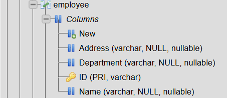
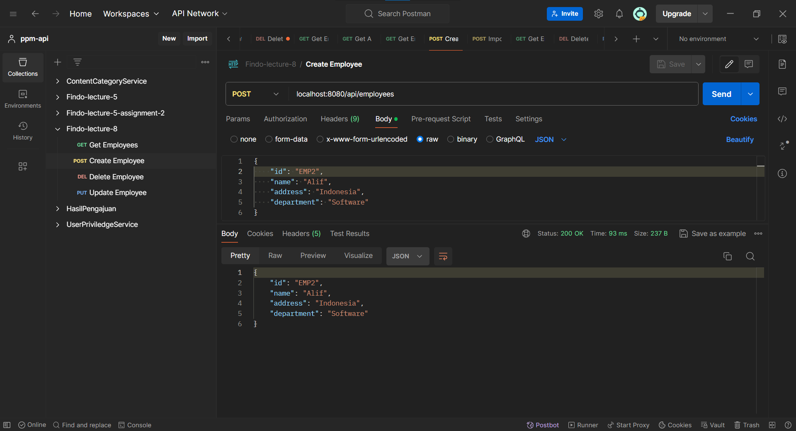
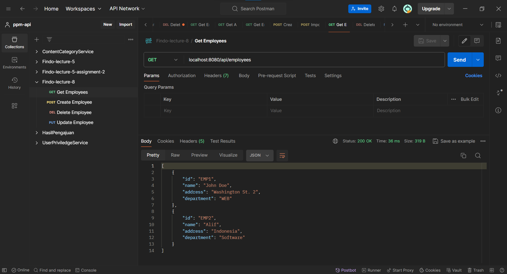
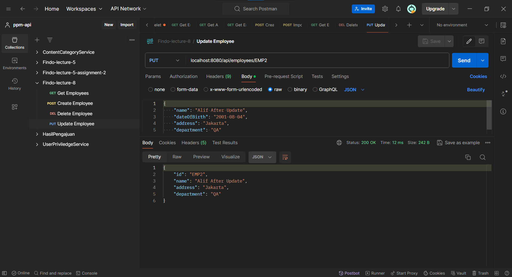
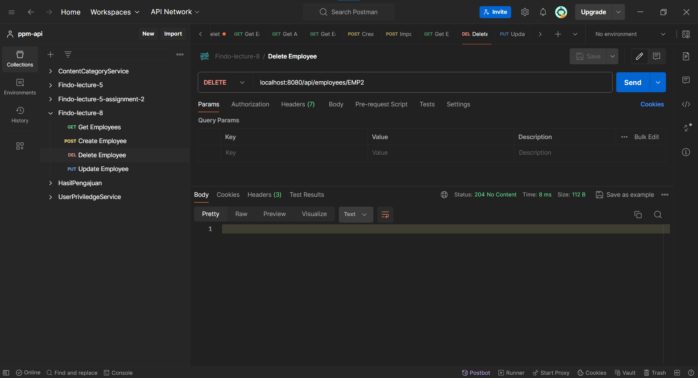

# Assignment 2 - Lecture 8

## 2.1 Create Employee table with basic information​

Using `MySQL` to create the `Employee` table.

```sql
CREATE TABLE Employee (
    ID VARCHAR(255) NOT NULL,
    Name VARCHAR(255),
    Address VARCHAR(255),
    Department VARCHAR(255),
    PRIMARY KEY (ID)
);
```

Result:



## 2.2 Create simple CRUD to manage employee using JDBC template with Spring Boot​

[Full_Code](employee_manager/src/main/java/com/example/employee_manager)

In this assignment, I'm using MySQL database. The following is the project structure of the simple CRUD project using Java Spring Boot.

```bash
com.example.employee_manager
├─ controller
│  └─ EmployeeController.java
├─ dao
│  └─ EmployeeDAO.java
├─ model
│  └─ Employee.java
└─ EmployeeManagerApplication.java
```

### Configuration

[application.properties](employee_manager/src/main/resources/application.properties)

```
spring.datasource.url=jdbc:mysql://localhost:3306/fsoft-lecture
spring.datasource.username=root
spring.datasource.password=
spring.datasource.driver-class-name=com.mysql.cj.jdbc.Driver
spring.jpa.hibernate.ddl-auto=update
spring.jpa.database-platform=org.hibernate.dialect.MySQL5Dialect
```

### Model

[Employee.java](employee_manager/src/main/java/com/example/employee_manager/model/Employee.java)

```java
@Getter
@Setter
public class Employee {
    private String id;
    private String name;
    private String address;
    private String department;
}
```

As a model, the `Employee` class represents the entity, it corresponds directly to the `Employee` table in the database, the field represent the column in the table. The `@Getter` and `@Setter` from Lombok uses to create the getter and setter method for each field.

### Data Access Object (DAO)

[EmployeeDAO.java](employee_manager/src/main/java/com/example/employee_manager/dao/EmployeeDAO.java)

This class handles database operations including CRUD operations for the `Employee` entity using Spring's `JdbcTemplate`.

```java
@Repository
public class EmployeeDAO {

    @Autowired
    private JdbcTemplate jdbcTemplate;

    // SQL queries
    private final String INSERT_QUERY = "INSERT INTO Employee (ID, Name, Address, Department) VALUES (?, ?, ?, ?)";
    private final String SELECT_QUERY = "SELECT * FROM Employee";
    private final String SELECT_BY_ID_QUERY = "SELECT * FROM Employee WHERE ID = ?";
    private final String UPDATE_QUERY = "UPDATE Employee SET Name = ?, Address = ?, Department = ? WHERE ID = ?";
    private final String DELETE_QUERY = "DELETE FROM Employee WHERE ID = ?";

    // Create the Employee
    public int save(Employee employee) {
        return jdbcTemplate.update(INSERT_QUERY, employee.getId(), employee.getName(), employee.getAddress(), employee.getDepartment());
    }

    // Get all (Read) Employees
    public List<Employee> findAll() {
        return jdbcTemplate.query(SELECT_QUERY, new EmployeeRowMapper());
    }

    // Get Employee by ID
    public Employee findById(String id) {
        return jdbcTemplate.queryForObject(SELECT_BY_ID_QUERY, new EmployeeRowMapper(), id);
    }

    // Update the Employee
    public int update(Employee employee) {
        return jdbcTemplate.update(UPDATE_QUERY, employee.getName(), employee.getAddress(), employee.getDepartment(), employee.getId());
    }

    // Delete the Employee
    public int delete(String id) {
        return jdbcTemplate.update(DELETE_QUERY, id);
    }

    // RowMapper to map the ResultSet to Employee
    private static final class EmployeeRowMapper implements RowMapper<Employee> {
        public Employee mapRow(ResultSet rs, int rowNum) throws SQLException {
            Employee employee = new Employee();
            employee.setId(rs.getString("ID"));
            employee.setName(rs.getString("Name"));
            employee.setAddress(rs.getString("Address"));
            employee.setDepartment(rs.getString("Department"));
            return employee;
        }
    }
}
```

The `@Repository` annotation marks the class as a Spring bean and used to manage data in a database. `JdbcTemplate` injected with `@Autowired` to do database operations and eliminating boilerplate code for connection management. The `SQL` queries defined and used for CRUD operations.

### Controller

[EmployeeController.java](employee_manager/src/main/java/com/example/employee_manager/controller/EmployeeController.java)

The `EmployeeController` handles HTTP requests and REST API operations.

```java
@RestController
@RequestMapping("/api/employees")
public class EmployeeController {

    @Autowired
    private EmployeeDAO employeeDAO;

    // Create an Employee by sending a POST request to /api/employees with the Employee object in the request body
    @PostMapping
    public ResponseEntity<Employee> createEmployee(@RequestBody Employee employee) {
        employeeDAO.save(employee);
        return ResponseEntity.ok(employee);
    }

    // Get all Employees by sending a GET request to /api/employees
    @GetMapping
    public List<Employee> getAllEmployees() {
        return employeeDAO.findAll();
    }

    // Get an Employee by ID by sending a GET request to /api/employees/{id}
    @GetMapping("/{id}")
    public ResponseEntity<Employee> getEmployeeById(@PathVariable String id) {
        return ResponseEntity.ok(employeeDAO.findById(id));
    }

    // Update an Employee by sending a PUT request to /api/employees/{id} with the updated Employee object in the request body
    @PutMapping("/{id}")
    public ResponseEntity<Employee> updateEmployee(@PathVariable String id, @RequestBody Employee employeeDetails) {
        Employee employee = employeeDAO.findById(id);
        employee.setName(employeeDetails.getName());
        employee.setAddress(employeeDetails.getAddress());
        employee.setDepartment(employeeDetails.getDepartment());
        employeeDAO.update(employee);
        return ResponseEntity.ok(employee);
    }

    // Delete an Employee by sending a DELETE request to /api/employees/{id}
    @DeleteMapping("/{id}")
    public ResponseEntity<Void> deleteEmployee(@PathVariable String id) {
        employeeDAO.delete(id);
        return ResponseEntity.noContent().build();
    }
}
```

The `@RestController` annotation indicates that this class is a controller that handle RESTful requests. The `@RequestMapping` annotation specifies that all endpoints mapped and start with `/employees`. And the `EmployeeDAO` injected by `@Autowired` to access database operations. CRUD Operations:

- `createEmployee(Employee employee)` handle HTTP Post requests to create a new employee.
- `getAllEmployees()` handle the HTTP GET requests to fetch all employees.
- `getEmployeeById(String id)` handle HTTP GET request to fetch an employee by ID from the parameter.
- `updateEmployee(String id, Employee employeeDetails)` handles HTTP PUT requests to update an existing employee.
- `deleteEmployee(String id)` handles HTTP DELETE requests to delete an employee by ID.

### Tests

**Create Employee**



**Read Employee**



**Update Employee**



**Delete Employee**



## 2.3 Using datasource with properties file

[application.properties](employee_manager/src/main/resources/application.properties)

From the simple CRUD project before, it configure the datasource in the properties file `application.properties`, it configure the database connection details.

```
spring.datasource.url=jdbc:mysql://localhost:3306/fsoft-lecture
spring.datasource.username=root
spring.datasource.password=
spring.datasource.driver-class-name=com.mysql.cj.jdbc.Driver
spring.jpa.hibernate.ddl-auto=update
spring.jpa.database-platform=org.hibernate.dialect.MySQL5Dialect
```

- `spring.datasource.url`: Specifies the JDBC URL of the database.
- `spring.datasource.username`: Specifies the database username.
- `spring.datasource.password`: Specifies the database password.
- `spring.datasource.driver-class-name`: Specifies the JDBC driver class name for MySQL.
- `spring.jpa.properties.hibernate.dialect`: Specifies the Hibernate dialect for MySQL.
- `spring.jpa.hibernate.ddl-auto`: Specifies the Hibernate behavior for database schema generation (update will update the schema if necessary).
