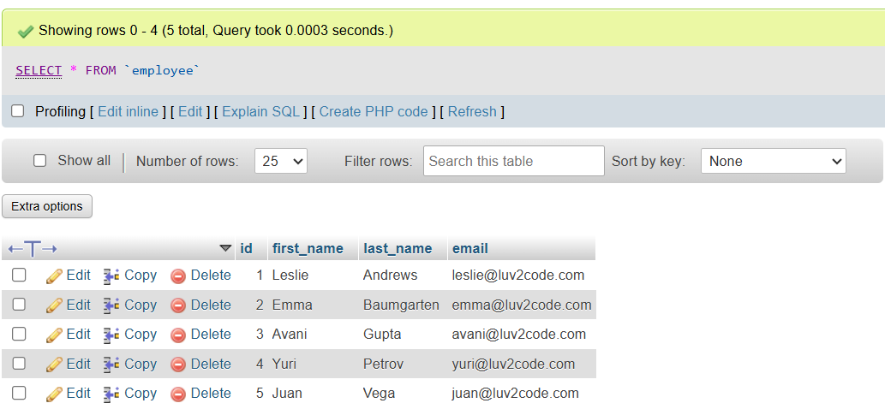
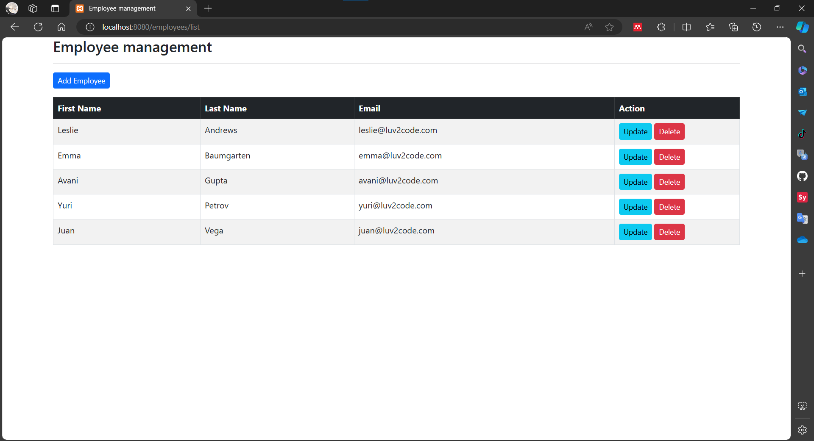
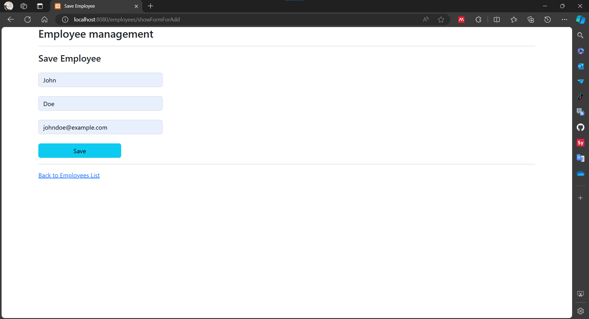
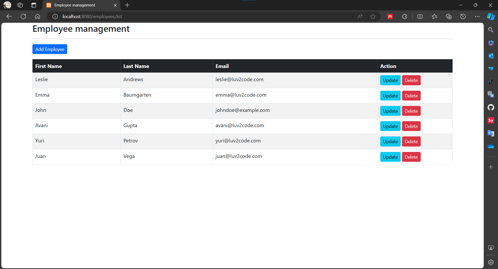
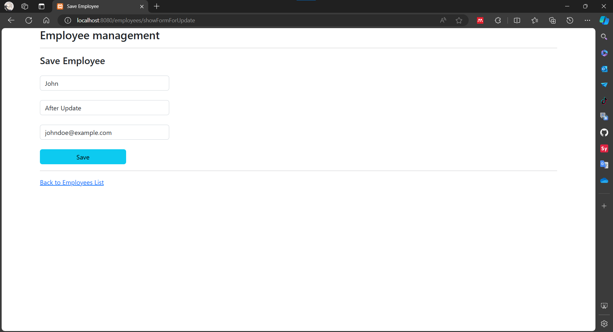
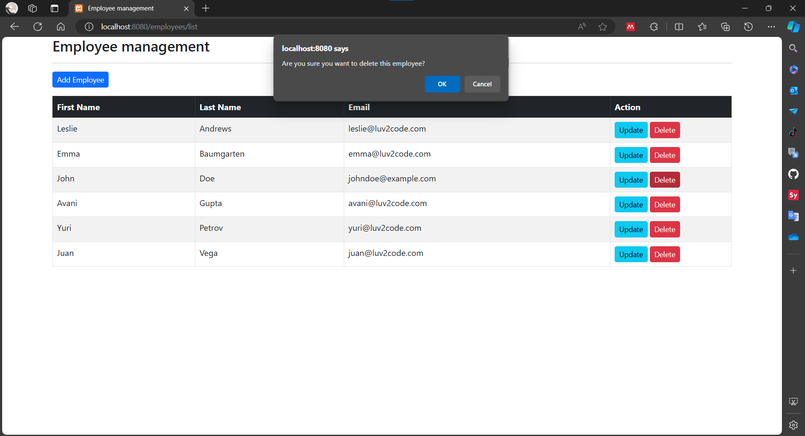

# Assignment 1 - Lecture 9

## Do the example of Spring MVC Project given

### Project Structure

```bash
come/fsof/lecture5/findolecture10/
│
├── FindoLecture10Application.java
│
├── controller/
│   └── EmployeeController.java
│
├── model/
│   └── Employee.java
│
├── repository/
│   └── EmployeeRepository.java
│
└── service/
    ├── EmployeeService.java
    └── impl/
        └── EmployeeServiceImpl.java
```

### Init database

Using `MySQL` database to proceed the project.

`query`:

```sql
DROP TABLE IF EXISTS `employee`;

CREATE TABLE `employee` (
    `id` int NOT NULL AUTO_INCREMENT,
    `first_name` varchar(45) DEFAULT NULL,
    `last_name` varchar(45) DEFAULT NULL,
    `email` varchar(45) DEFAULT NULL,
    PRIMARY KEY (`id`)
) ENGINE=InnoDB AUTO_INCREMENT=1 DEFAULT CHARSET=latin1;

--
-- Data for table `employee`
--

INSERT INTO `employee` VALUES
(1,'Leslie','Andrews','leslie@luv2code.com'),
(2,'Emma','Baumgarten','emma@luv2code.com'),
(3,'Avani','Gupta','avani@luv2code.com'),
(4,'Yuri','Petrov','yuri@luv2code.com'),
(5,'Juan','Vega','juan@luv2code.com');
```

`result`:



### Application Properties configuration

```bash
spring.datasource.driver-class-name=com.mysql.jdbc.Driver
spring.datasource.url=jdbc:mysql://localhost:3306/fsoft-lecture?allowPublicKeyRetrieval=true&useSSL=false
spring.datasource.username=root
spring.datasource.password=
```

### Run App

`http://localhost:8080/`



**Create**



Created `John Doe`.

**Update**



Updated `John Doe` to `John After Update`.

**Delete**


Delete `John Doe`.
