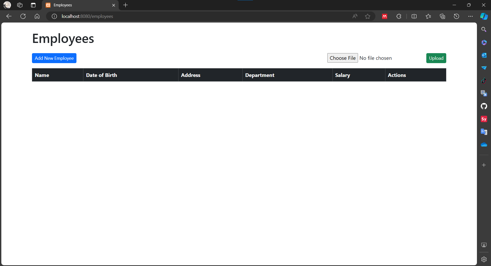
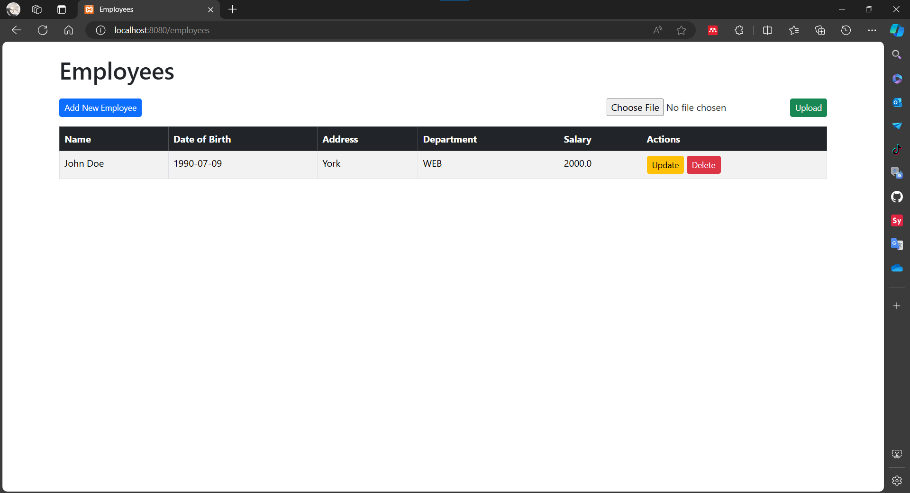
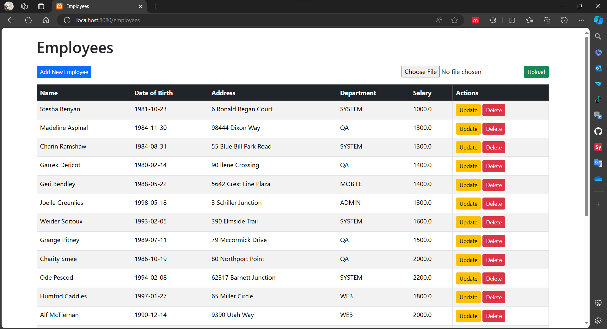

# Assignment 2 - Lecture 9

## Create CRUD project to manage employees with the data follow given csv, and add new button to upload the CSV file, and store to database.

[Full Code](employee-manager/src/main/java/com/example/fsoft/employee_manager/)
[Resources Templates](employee-manager/src/main/resources/templates/)

### Screenshot


**Create**



**Update**


**Delete**


### Upload CSV File



### Project Structure

```bash
com/example/fsoft/employee_manager/
│
├── EmployeeManagerApplication.java
│
├── controller/
│   └── EmployeeController.java
│
├── model/
│   └── Employee.java
│
├── repository/
│   └── EmployeeRepository.java
│
├── service/
│   ├── EmployeeService.java
│   └── impl/
│       └── EmployeeServiceImpl.java
│
└── utils/
    └── FileUtils.java
```

### Entity Model Employee

[Employee.java](employee-manager/src/main/java/com/example/fsoft/employee_manager/model/Employee.java)

```java
@Data
@AllArgsConstructor
@NoArgsConstructor
@Entity
@Table(name = "employees")
public class Employee {
    @Id
    private String id;

    private String name;

    @DateTimeFormat(pattern = "yyyy-MM-dd")
    private LocalDate dateOfBirth;
    private String address;
    private String department;
    private Double salary;
}
```

This class defines an `Employee` entity that can be stored in a database, in the table name of `employees`. Using Lombok annotations, namely as `@Data`, `@AllArgsConstructor`, and `@NoArgsConstructor` for generating reusable method, and the JPA annotations namely as `@Entity`, `@Table`, and `@Id` to map the class to database table and specify the primary key.

### Employee Repository

[EmployeeRepository.java](employee-manager/src/main/java/com/example/fsoft/employee_manager/repository/EmployeeRepository.java)

```java
@Repository
public interface EmployeeRepository extends JpaRepository<Employee, String>{
}
```

This interface provides operation methods to do CRUD (Create, Read, Update, Delete) operations, and other common database operations on `Employee` entities, like `findById`, `findAll`, etc. Using this repository because it can operate without write the methods explicitly.

### Employee Service

[EmployeeService.java](employee-manager/src/main/java/com/example/fsoft/employee_manager/service/EmployeeService.java)

```java
@Service
public interface EmployeeService {
    List<Employee> getAllEmployees();
    Employee getEmployeeById(String id);
    Employee addEmployee(Employee employee);
    Employee updateEmployee(Employee employee);
    void deleteEmployee(String id);
    void saveAllEmployees(List<Employee> employees);
}
```

This interface defines methods that provide business logic operations of `Employee` entities, it acts between controllers or other service with the `EmployeeRepository`. These methods provide common CRUD operations related to managing employees.

### Employee Service Implementation

[EmployeeServiceImpl.java](employee-manager/src/main/java/com/example/fsoft/employee_manager/service/impl/EmployeeServiceImpl.java)

```java
@Service
@AllArgsConstructor
public class EmployeeServiceImpl implements EmployeeService {
    // ...
}
```

This class implements the `EmployeeService` interface, and provides the implementations for each method to handle CRUD operations. This class dependent on `EmployeeRepository` to calls the action for the operations.

**Get All Employees**

```java
@Override
public List<Employee> getAllEmployees() {
    return employeeRepository.findAll();
}
```

This `getAllEmployees()` method retrieves all employees from the database, using `findAll()` to fetch and return a list of all employees that stored in the database.

**Get Employee By ID**

```java
@Override
public Employee getEmployeeById(String id) {
    return employeeRepository.findById(id)
            .orElseThrow(() -> new NoSuchElementException("Employee not found"));
}
```

This `getEmployeeById()` methodretrieves specific employee by `id`, using `findById` method to find an employee by `id`. If no employee founded, it'll throws a `NoSuchElementException`.

**Add Employee**

```java
@Override
public Employee addEmployee(Employee employee) {
    Employee existingEmployee = employeeRepository.findById(employee.getId()).orElse(null);
    if (existingEmployee != null) {
        throw new IllegalArgumentException("Employee already exists");
    }
    return employeeRepository.save(employee);
}
```

This `addEmployee()` method adds a new employee to the database. First, it checks if there is an employee with the same `id` exist. If existing employee is found it throws an `IllegalArgumentException`. Otherwise, it saves the new employee using `save(employee)`.

**Update Employee**

```java
@Override
public Employee updateEmployee(Employee employee) {
    Employee existingEmployee = employeeRepository.findById(employee.getId())
            .orElseThrow(() -> new NoSuchElementException("Employee not found"));
    existingEmployee.setName(employee.getName());
    existingEmployee.setDateOfBirth(employee.getDateOfBirth());
    existingEmployee.setAddress(employee.getAddress());
    existingEmployee.setDepartment(employee.getDepartment());

    return employeeRepository.save(existingEmployee);
}
```

This method updates an existing employee in the database by `id`. First, it retrieves the existing employee from the database using `findById(id)`. If the employee found, it updates the attributes with values provided from `employee` object in the params. Then saves the updated using `save()` method. Also if the employee not found, it will throws an `NoSuchElementException`.

**Delete Employee**

```java
@Override
public void deleteEmployee(String id) {
    Employee existingEmployee = employeeRepository.findById(id)
            .orElseThrow(() -> new NoSuchElementException("Employee not found"));
    employeeRepository.delete(existingEmployee);
}
```

This method will deletes an employee from the database by `id`. If the employee found, then deletes by `delete()` methods, and if not found will throws a `NoSuchElementException`.

**Save All Employees**

```java
@Override
public void saveAllEmployees(List<Employee> employees) {
    employeeRepository.saveAll(employees);
}
```

This method saves a list of employees to the database by using `saveAll()` method.

### Employee Controller and View

`Controller`:
[EmployeeController.java](employee-manager/src/main/java/com/example/fsoft/employee_manager/controller/EmployeeController.java)

`Templates View`:
[employees.html](employee-manager/src/main/resources/templates/employees.html)
[form-employee.html](employee-manager/src/main/resources/templates/form-employee.html)

In this project, i'm using `employees.html` and `form-employee.html` as a view. The `employees.html` is used to show the list of employee that contain `CSV` upload button, `table`, and `button` to change and doing operations (create, update, delete). The `form-employee.html` is used to show the input to `create` and `update` the `employee` data.

**Get All Employee**

```java
@GetMapping
public String getAllEmployees(Model model) {
    model.addAttribute("employees", employeeService.getAllEmployees());
    return "employees";
}
```

This controller retrieves all employees from `employeeService` and adds it to the `model` with the attribute name `employees`. And returns the view name `employees`.

```html
<tr th:each="employee : ${employees}">
  <td th:text="${employee.id}"></td>
  <td th:text="${employee.name}"></td>
  <td th:text="${employee.dateOfBirth}"></td>
  <td th:text="${employee.address}"></td>
  <td th:text="${employee.department}"></td>
  <td th:text="${employee.salary}"></td>
  <td>
    <a
      th:href="@{/employees/update/{id}(id=${employee.id})}"
      class="btn btn-sm btn-warning"
      >Edit</a
    >
    <form
      action="#"
      th:action="@{employees/delete/{id}(id=${employee.id})}"
      method="POST"
      class="d-inline"
    >
      <button type="submit" class="btn btn-sm btn-danger">Delete</button>
    </form>
  </td>
</tr>
```

In the `employees.html`, the thymeleaf can use the `employees` that pass from the controller.

**Create Employee**

`GET`:

```java
@GetMapping("/create")
public String createEmployee(Model model) {
    model.addAttribute("employee", new Employee());
    model.addAttribute("endpoint", "create");
    return "form-employee";
}
```

This methods will display a `form` for creating a new employee, and return the view name `form-employee`.

`POST`:

```java
@PostMapping("/create")
public String createEmployee(@ModelAttribute("employee") Employee employee, Model model) {
    employeeService.addEmployee(employee);
    model.addAttribute("message", "Employee added successfully");
    return "redirect:/employees";
}
```

This methods will processes the form submission from the view for creating a new `employee`.

`form-employee.html`:

```html
<form
  action="#"
  th:action="@{@{/employees/{endpoint}(endpoint=${endpoint})}}"
  th:object="${employee}"
  method="post"
  class="form-horizontal"
>
  <div class="form-group my-3" th:if="${id == null}">
    <label for="id" class="col-sm-2 control-label">Employee ID</label>
    <input type="text" id="id" th:field="*{id}" class="form-control" required />
  </div>
  <!-- Other input -->
</form>
```

The form will action the `/employees/create` by `POST` method, with the each input field is same as the employee field. The form action is dynamic, it can switch between `create` and `update` endpoints based on the provided model attribute.

**Update Employee**

`GET`:

```java
@GetMapping("/update/{id}")
public String updateEmployee(@PathVariable String id, Model model) {
    model.addAttribute("employee", employeeService.getEmployeeById(id));
    model.addAttribute("endpoint", "update/" + id);
    return "form-employee";
}
```

Displaying a form for updating an existing `employee`, first it find the employee by `id` and adds it to the `model` with the attribute name `employee`, and return the model to the view `form-employee`.

`POST`:

```java
@GetMapping("/update/{id}")
public String updateEmployee(@PathVariable String id, Model model) {
    model.addAttribute("employee", employeeService.getEmployeeById(id));
    return "form-employee";
}
```

Processes the form submission for updating an existing employee. The form view is same as the create.

**Delete Employee**

```java
@PostMapping("/delete/{id}")
public String deleteEmployee(@PathVariable String id, Model model) {
    employeeService.deleteEmployee(id);
    model.addAttribute("message", "Employee deleted successfully");
    return "redirect:/employees";
}
```

Deletes an existing employee by `id` from the path variable, it get the `id` by pass through the `employees.html` view, and it will redirect to the `/employees`.

### Import CSV and store to database

**File Utils**

[FileUtils.java](employee-manager/src/main/java/com/example/fsoft/employee_manager/utils/FileUtils.java)

```java
public class FileUtils {
    public static List<Employee> parseCSVFile(MultipartFile file) throws Exception {
        // ...
    }
}
```

This `FileUtils` class provide a utility method to parse a CSV file and convert its data into a list of `Employee` objects

**Controller**

````java
@PostMapping("/import")
    public String importEmployees(@RequestParam("file") MultipartFile file, Model model) {
        if (file.isEmpty()) {
            model.addAttribute("message", "Please select a CSV file to upload");
            return "import-employees";
        }

        try {
            List<Employee> employees = FileUtils.parseCSVFile(file);
            employeeService.saveAllEmployees(employees);
            model.addAttribute("message", "File uploaded successfully");
        } catch (Exception e) {
            model.addAttribute("message", "Could not upload the file: " + e.getMessage());
            e.printStackTrace();
        }
        return "redirect:/employees";
    }
````

This controller method processes the CSV file upload and save the employees to the database. First, it checks if the file is empty. If it not empty, uses the `FileUtils.parseCSVFile(file)` to parse the CSV file into a list of employees. and saves them using `saveAllEmployees()` methods.

**HTML**

`employees.html`

```html
 <form action="#" th:action="@{/employees/import}" method="post" enctype="multipart/form-data" class="d-flex flex-row align-items-baseline gap-3">
      <input type="file" name="file" accept=".csv" class="form-control-file">
      <button type="submit" class="btn btn-secondary">Upload</button>
    </form>
```

It takes the `multipart/form-data` to input the `file` type.