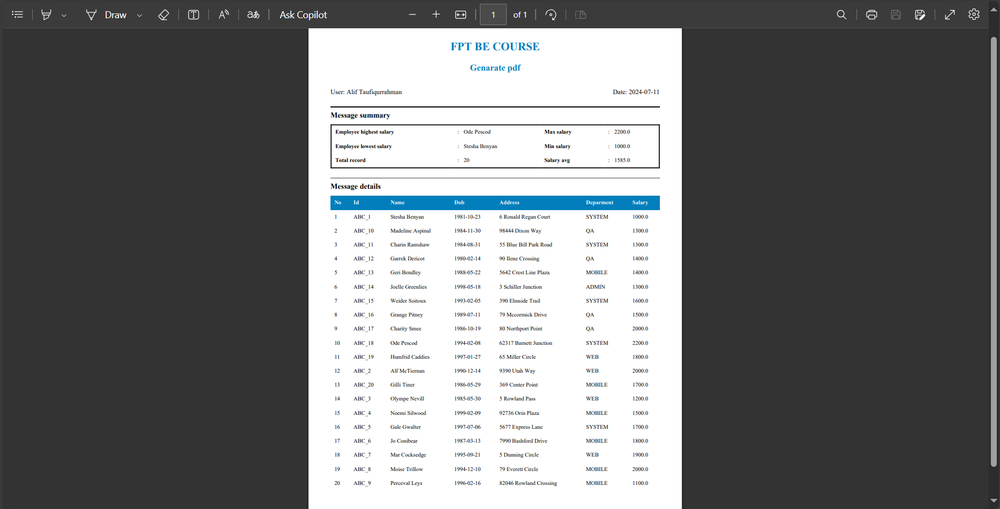

# Assignment 3 - Lecture 9

## Gen pdf from given html template file, csv data. Calculate and bind data from csv data

[Full-Code](employee-manager/src/main/java/com/example/fsoft/employee_manager/)

I'm using the project that similiar to the `assignment 2 - lecture 9`, in this assignment, i've added new service to generate a pdf.

[PdfGenerateService.java](employee-manager/src/main/java/com/example/fsoft/employee_manager/service/PdfGenerateService.java)

```java
@Service
public class PdfGenerateService {

    @Autowired
    private TemplateEngine templateEngine;

    public void generatePdf(List<Employee> employees, HttpServletResponse response) throws IOException {
        Context context = new Context();
        context.setVariable("employees", employees);

        // Calculate
        OptionalDouble maxSalary = employees.stream()
                .mapToDouble(Employee::getSalary)
                .max();
        Optional<Employee> maxSalaryEmployee = employees.stream()
                .filter(employee -> employee.getSalary() == maxSalary.getAsDouble())
                .findFirst();

        OptionalDouble minSalary = employees.stream()
                .mapToDouble(Employee::getSalary)
                .min();
        Optional<Employee> minSalaryEmployee = employees.stream()
                .filter(employee -> employee.getSalary() == minSalary.getAsDouble())
                .findFirst();

        double averageSalary = employees.stream()
                .mapToDouble(Employee::getSalary)
                .average()
                .orElse(0.0);

        String dateNow = java.time.LocalDate.now().toString();

        // Bind data to the template
        context.setVariable("maxSalary", maxSalary.orElse(0.0));
        context.setVariable("maxSalaryEmployee", maxSalaryEmployee.orElse(new Employee()).getName());
        context.setVariable("minSalary", minSalary.orElse(0.0));
        context.setVariable("minSalaryEmployee", minSalaryEmployee.orElse(new Employee()).getName());
        context.setVariable("averageSalary", averageSalary);
        context.setVariable("length", employees.size());
        context.setVariable("dateNow", dateNow);

        String htmlContent = templateEngine.process("pdf-template", context);

        ByteArrayOutputStream target = new ByteArrayOutputStream();
        HtmlConverter.convertToPdf(htmlContent, target);
        byte[] bytes = target.toByteArray();

        response.setContentType("application/pdf");
        response.setHeader("Content-Disposition", "attachment; filename=employees.pdf");
        response.setContentLength(bytes.length);
        response.getOutputStream().write(bytes);
    }
}
```

This service class generates a `PDF` from a list of `employees` using Thymeleaf and `iText`. The `PdfGenerateService` class injects a `TemplateEngine` and uses it to process an HTML template with employee data, such as maximum and minimum salaries, corresponding employees, average salary, total number of employees, and the current date. These details are set in a `Context` object. The resulting HTML content is then converted to a PDF using `HtmlConverter`. Finally, the generated PDF is written to the HTTP response, allowing it to be downloaded as a file named "employees.pdf".

## Result

[Result PDF](result/employees.pdf)

