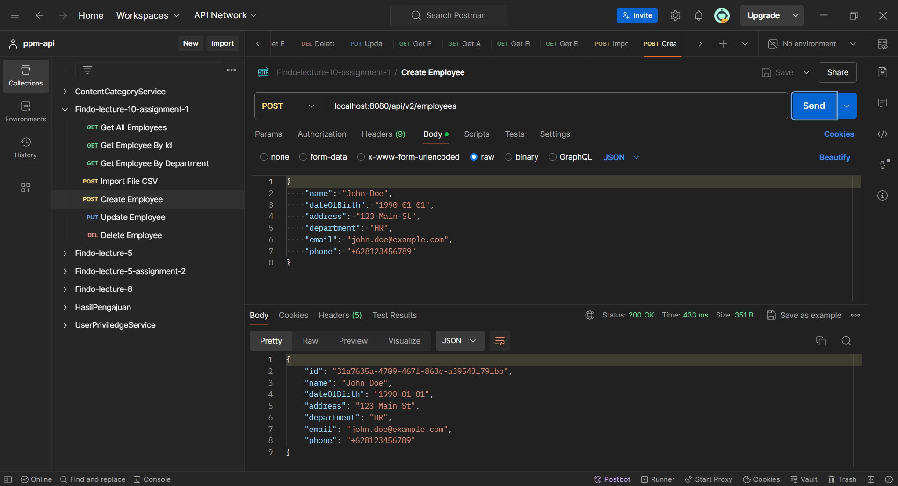
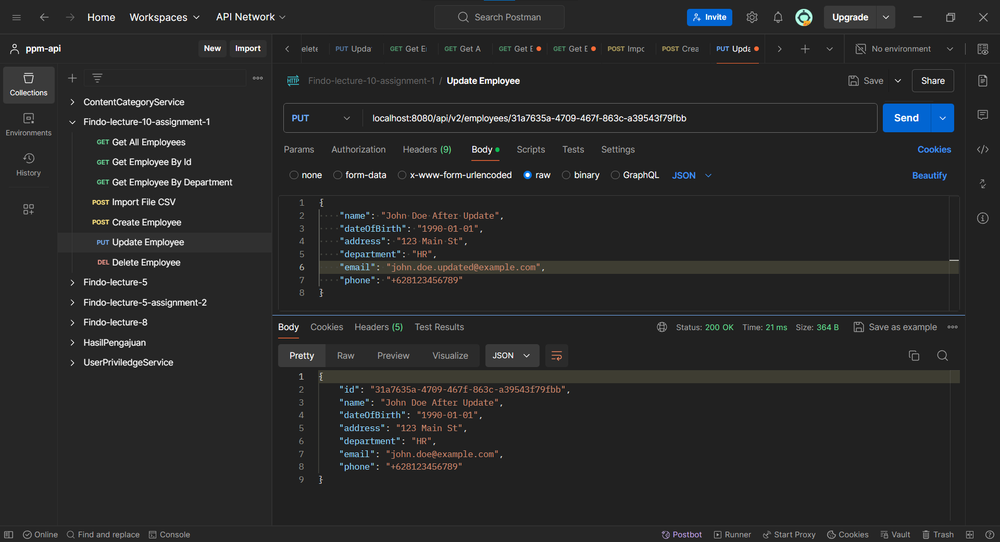
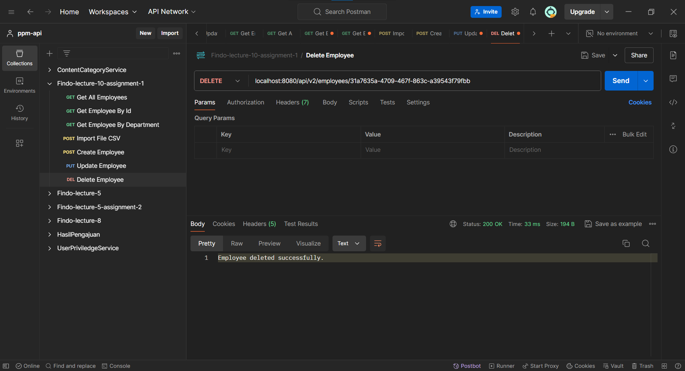
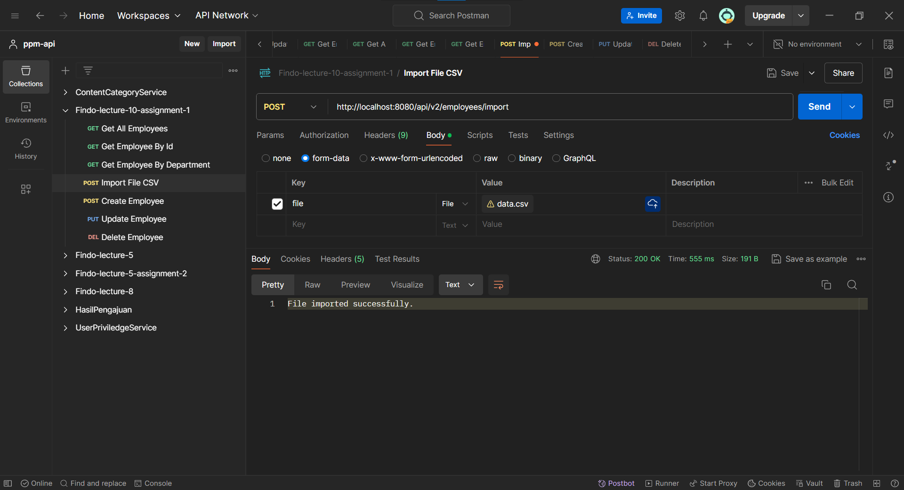

# Assignment 01 - Lecture 10 - Week 5

This project was updated and similiar to `lecture 5 - assignment2`

[Full Code](lecture5/src/main/java/com/fsoft/lecture5/lecture5/)

The [screenshot of testing](#test-with-postman) is in the last section.

## Project Structure

```bash
src
└── main
    ├── java.com.fsoft.lecture5
    │           └── lecture5
    │               ├── Lecture5Application.java
    │               ├── controller
    │               │   └── EmployeeController.java
    │               ├── dto
    │               │   └── EmployeeDTO.java
    │               ├── exception
    │               │   └── EmployeeAlreadyExistsException.java
    │               │   └── NoSuchEmployeeExistsException.java
    │               │   └── GlobalExceptionHandler.java
    │               ├── mapper
    │               │   └── EmployeeMapper.java
    │               ├── model
    │               │   └── Employee.java
    │               ├── repository
    │               │   └── EmployeeRepository.java
    │               ├── service
    │               │   └── EmployeeService.java
    │               │   └── impl
    │               │       └── EmployeeServiceImpl.java
    │               └── util
    │                   └── DateUtils.java
    │                   └── FileUtils.java
    └── resources
        ├── application.properties
        ├── static
        └── templates
```

## Add field email and phone, use id by UUID, and validate email, name (notnull, only text), phone as Indonesia format phone

[Employee.java](lecture5/src/main/java/com/fsoft/lecture5/lecture5/model/Employee.java)

```java
@Getter
@Setter
@Entity
@Table(name = "employees")
public class Employee implements Serializable {

    private static final long serialVersionUID = 1L;

    @Id
    @GeneratedValue(strategy = GenerationType.AUTO)
    private UUID id;

    @NotNull(message = "Name is required")
    @Pattern(regexp = "^[a-zA-Z\\s]+$", message = "Name must contain only text")
    private String name;

    private LocalDate dateOfBirth;
    private String address;
    private String department;

    `@Email`(message = "Email should be valid")
  `  privat`e String email;

    @Pattern(regexp = "^\\+62[0-9]{9,14}$", message = "Phone must be a valid Indonesian phone number")
    private String phone;

    public Employee() {}

    public Employee(UUID id, String name, LocalDate dateOfBirth, String address, String department, String email, String phone) {
        this.id = id;
        this.name = name;
        this.dateOfBirth = dateOfBirth;
        this.address = address;
        this.department = department;
        this.email = email;
        this.phone = phone;
    }
}
```

- **Email and Phone Fields** Added and validated using `@Email` and `@Pattern`.
- **UUID for ID** Implemented using `UUID` type with auto generation.
- **Name Validation** Ensured NotNull and only text characters using `@NotNull` and `@Pattern`.
- **Phone Validation** Ensured it follows the Indonesian phone format using `@Pattern`.

### Use ID by UUID

```java
@Id
@GeneratedValue(strategy = GenerationType.AUTO)
private UUID id;
```

- `@Id` marks the field as the primary key.
- `@GeneratedValue(strategy = GenerationType.AUTO)` allows Hibernate to automatically generate the UUID.


### Add field email and phone. Validate email, name (not null, only text), phone as indonesian format phone.

```java
@NotNull(message = "Name is required")
@Pattern(regexp = "^[a-zA-Z\\s]+$", message = "Name must contain only text")
private String name;

@Email(message = "Email should be valid")
private String email;

@Pattern(regexp = "^\\+62[0-9]{9,14}$", message = "Phone must be a valid Indonesian phone number")
private String phone;
```

- `@NotNull` ensures that the name field cannot be null.
- `@Pattern` annotation in the name field ensures that the name contains only letters with uppercase and lowercase and spaces.
- `@Email` annotation ensures that the email is in a valid format.
- `@Pattern` annotation in the phone ensures that the phone number follows the Indonesian format that is starting with `+62` and followed by 9 to 14 digits.

## Use dto and mapstruct

[EmployeeDTO.java](lecture5/src/main/java/com/fsoft/lecture5/lecture5/dto/EmployeeDTO.java)

```java
@Getter
@Setter
public class EmployeeDTO {

    private UUID id;

    @NotNull(message = "Name cannot be null")
    @Pattern(regexp = "^[a-zA-Z\\s]+$", message = "Name must contain only text")
    private String name;

    private LocalDate dateOfBirth;
    private String address;
    private String department;

    @Email(message = "Email should be valid")
    private String email;

    @Pattern(regexp = "^\\+62[0-9]{9,14}$", message = "Phone must be a valid Indonesian phone number")
    private String phone;
}
```

This DTO class mirrors the `Employee` entity but is used for transferring data between different layers of the application.

[EmployeeMapper.java](lecture5/src/main/java/com/fsoft/lecture5/lecture5/mapper/EmployeeMapper.java)

```java
@Mapper(componentModel = "spring")
public interface EmployeeMapper {
    EmployeeDTO toEmployeeDTO(Employee employee);
    Employee toEmployee(EmployeeDTO employeeDTO);
}
```

- `@Mapper(componentModel = "spring")` annotation tells MapStruct to generate a Spring Bean for the mapper.
- `toEmployeeDTO(Employee employee)` method Converts an Employee entity to an EmployeeDTO.
- `toEmployee(EmployeeDTO employeeDTO)` method Converts an EmployeeDTO to an Employee entity.

## Handle Exception

[EmployeeAlreadyExistsException.java](lecture5/src/main/java/com/fsoft/lecture5/lecture5/exception/EmployeeAlreadyExistsException.java)

```java
public class EmployeeAlreadyExistsException extends RuntimeException {
    public EmployeeAlreadyExistsException(String message) {
        super(message);
    }
}
```

[NoSuchEmployeeExistsException.java](lecture5/src/main/java/com/fsoft/lecture5/lecture5/exception/NoSuchEmployeeExistsException.java)

```java
public class NoSuchEmployeeExistsException extends RuntimeException{
    public NoSuchEmployeeExistsException(String message) {
        super(message);
    }
}
```

Adding these custom exceptions enhance the error handling and provide more specific error message, also it can handle unique cases appropriately.

Also,

```java
@RestControllerAdvice
public class GlobalExceptionHandler {

    @ExceptionHandler(EmployeeAlreadyExistsException.class)
    public ResponseEntity<String> handleEmployeeAlreadyExistsException(EmployeeAlreadyExistsException e) {
        return ResponseEntity.status(HttpStatus.CONFLICT).body(e.getMessage());
    }

    @ExceptionHandler(NoSuchEmployeeExistsException.class)
    public ResponseEntity<String> handleNoSuchEmployeeExistsException(NoSuchEmployeeExistsException e) {
        return ResponseEntity.status(HttpStatus.NOT_FOUND).body(e.getMessage());
    }

    @ExceptionHandler(MethodArgumentNotValidException.class)
    public ResponseEntity<String> handleValidationExceptions(MethodArgumentNotValidException e) {
        String errors = e.getBindingResult().getAllErrors().stream()
                .map(DefaultMessageSourceResolvable::getDefaultMessage)
                .collect(Collectors.joining(", "));
        return ResponseEntity.status(HttpStatus.BAD_REQUEST).body(errors);
    }
}
```

by adds the `GlobalExceptionHandler` can handle exceptions globally and provide consistent responses.

## Service

[EmployeeService.java](lecture5/src/main/java/com/fsoft/lecture5/lecture5/service/EmployeeService.java)


```java
public interface EmployeeService {
    EmployeeDTO createEmployee(EmployeeDTO employeeDTO);
    List<EmployeeDTO> getAllEmployees();
    EmployeeDTO getEmployeeById(UUID id);
    EmployeeDTO updateEmployee(UUID id, EmployeeDTO employeeDTO);
    void deleteEmployee(UUID id);
    List<EmployeeDTO> getEmployeesByDepartment(String department);
}
```

The `EmployeeService` interface defines methods for managing employee data. Creating, retrieving, updating, and deleting employees. That is `createEmployee`, `getAllEmployees`, `getEmployeeById`, `updateEmployee`, and `deleteEmployee` methods, as well as `getEmployeesByDepartment` to fetch employees by department.


**`Implementation`**

[EmployeeServiceImpl.java](lecture5/src/main/java/com/fsoft/lecture5/lecture5/service/impl/EmployeeServiceImpl.java)

The `EmployeeServiceImpl` class implements the `EmployeeService` interface and provides implementations for managing employee data. It uses an `EmployeeRepository` for data access and an `EmployeeMapper` for converting between Employee entities and EmployeeDTO objects.

```java
@Override
public EmployeeDTO createEmployee(EmployeeDTO employeeDTO) {
    Employee employee = employeeMapper.toEmployee(employeeDTO);
    employee.setId(UUID.randomUUID());
    return employeeMapper.toEmployeeDTO(employeeRepository.save(employee));
}
```

The `createEmployee(EmployeeDTO employeeDTO)` converts the given `EmployeeDTO` to an `Employee` entity, assigns a new UUID, saves it to the repository, and returns the saved entity as an `EmployeeDTO`.

```java
@Override
public List<EmployeeDTO> getAllEmployees() {
    return employeeRepository.findAll().stream().map(employeeMapper::toEmployeeDTO).toList();
}
```

The `getAllEmployees()` retrieves all employee entities from the repository, converts them to `EmployeeDTO`s, and returns them as a list.

```java
@Override
public EmployeeDTO getEmployeeById(UUID id) {
    Employee employee = employeeRepository.findById(id)
            .orElseThrow(() -> new NoSuchEmployeeExistsException("Employee not found"));
    return employeeMapper.toEmployeeDTO(employee);
}
```

The `getEmployeeById(UUID id)` finds an employee by its UUID, throws an exception if not found, converts the found entity to an `EmployeeDTO`, and returns it.

```java
@Override
public EmployeeDTO updateEmployee(UUID id, EmployeeDTO employeeDTO) {
    Employee existingEmployee = employeeRepository.findById(id)
            .orElseThrow(() -> new NoSuchEmployeeExistsException("Employee not found"));

    existingEmployee.setName(employeeDTO.getName());
    existingEmployee.setDateOfBirth(employeeDTO.getDateOfBirth());
    existingEmployee.setAddress(employeeDTO.getAddress());
    existingEmployee.setDepartment(employeeDTO.getDepartment());
    existingEmployee.setEmail(employeeDTO.getEmail());
    existingEmployee.setPhone(employeeDTO.getPhone());

    Employee updatedEmployee = employeeRepository.save(existingEmployee);
    return employeeMapper.toEmployeeDTO(updatedEmployee);
}
```

The `updateEmployee(UUID id, EmployeeDTO employeeDTO)` finds an existing employee by its UUID, throws an exception if not found, updates the employee's details with those from the given `EmployeeDTO`, saves the updated entity, and returns it as an `EmployeeDTO`.

```java
@Override
public void deleteEmployee(UUID id) {
    Employee employee = employeeRepository.findById(id)
            .orElseThrow(() -> new NoSuchEmployeeExistsException("Employee with ID " + id + " not found."));
    employeeRepository.delete(employee);
}
```

The `deleteEmployee(UUID id)` finds an employee by its UUID, throws an exception if not found, and deletes the found entity from the repository.

```java
@Override
public List<EmployeeDTO> getEmployeesByDepartment(String department) {
    List<Employee> employees = employeeRepository.findByDepartment(department);
    return employees.stream()
            .map(employeeMapper::toEmployeeDTO)
            .collect(Collectors.toList());
}
```

The `getEmployeesByDepartment(String department)` retrieves all employees in the specified department, converts them to `EmployeeDTO`s, and returns them as a list.

## Controller

[EmployeeController.java](lecture5/src/main/java/com/fsoft/lecture5/lecture5/controller/EmployeeController.java)

The `EmployeeController` class is a REST controller that handles HTTP requests for managing employee data. It provides endpoints to create, retrieve, update, delete employees, and import employee data from a CSV file. The class interacts with the `EmployeeService` for business logic and `FileUtils` for file operations.

```java
@PostMapping
public ResponseEntity<EmployeeDTO> createEmployee(@RequestBody @Valid EmployeeDTO employeeDTO) {
    try {
        EmployeeDTO employee = employeeService.createEmployee(employeeDTO);
        return ResponseEntity.ok(employee);
    } catch (EmployeeAlreadyExistsException e) {
        return ResponseEntity.status(409).body(new EmployeeDTO());
    }
}
```

The `createEmployee(@RequestBody @Valid EmployeeDTO employeeDTO)` method handles HTTP POST requests to create a new employee. Calls the `EmployeeService` to create the employee and returns the created `EmployeeDTO`. Returns a 409 status if the employee already exists.

```java
@GetMapping
public ResponseEntity<List<EmployeeDTO>> getAllEmployees() {
    List<EmployeeDTO> employees = employeeService.getAllEmployees();
    return ResponseEntity.ok(employees);
}
```

The `getAllEmployees()` method handles HTTP GET requests to retrieve all employees. Calls the `EmployeeService` to get the list of all employees and returns them.

```java
@GetMapping("/{id}")
public ResponseEntity<EmployeeDTO> getEmployeeById(@PathVariable("id") UUID id) {
    try {
        EmployeeDTO employee = employeeService.getEmployeeById(id);
        return ResponseEntity.ok(employee);
    } catch (NoSuchEmployeeExistsException e) {
        return ResponseEntity.status(404).body(new EmployeeDTO());
    }
}
```

The `getEmployeeById(@PathVariable("id") UUID id)` method handles HTTP GET requests to retrieve an employee by their UUID. Calls the `EmployeeService` to get the employee and returns the `EmployeeDTO`. Returns a 404 status if the employee is not found.

```java
@GetMapping("/department/{department}")
public ResponseEntity<List<EmployeeDTO>> getEmployeesByDepartment(@PathVariable("department") String department) {
    List<EmployeeDTO> employees = employeeService.getEmployeesByDepartment(department);
    return ResponseEntity.ok(employees);
}
```

The `getEmployeesByDepartment(@PathVariable("department") String department)` method handles HTTP GET requests to retrieve employees by their department. Calls the `EmployeeService` to get employees in the specified department and returns them.

```java
@PutMapping("/{id}")
public ResponseEntity<EmployeeDTO> updateEmployee(@PathVariable("id") UUID id, @RequestBody @Valid EmployeeDTO employeeDTO) {
    try {
        EmployeeDTO employee = employeeService.updateEmployee(id, employeeDTO);
        return ResponseEntity.ok(employee);
    } catch (NoSuchEmployeeExistsException e) {
        return ResponseEntity.status(404).body(new EmployeeDTO());
    }
}
```

The `updateEmployee(@PathVariable("id") UUID id, @RequestBody @Valid EmployeeDTO employeeDTO)` method handles HTTP PUT requests to update an existing employee. Calls the `EmployeeService` to update the employee and returns the updated `EmployeeDTO`. Returns a 404 status if the employee is not found.

```java
@DeleteMapping("/{id}")
public ResponseEntity<String> deleteEmployee(@PathVariable("id") UUID id) {
    try {
        employeeService.deleteEmployee(id);
        return ResponseEntity.ok("Employee deleted successfully.");
    } catch (NoSuchEmployeeExistsException e) {
        return ResponseEntity.status(404).body("Employee not found.");
    }
}
```

The `deleteEmployee(@PathVariable("id") UUID id)` method handles HTTP DELETE requests to delete an employee by their UUID. Calls the `EmployeeService` to delete the employee and returns a success message. Returns a 404 status if the employee is not found.

```java
@PostMapping("/import")
public ResponseEntity<String> importEmployeesFromCsv(@RequestParam("file") MultipartFile file) {
    try {
        fileUtils.importData(file);
        return ResponseEntity.ok("File imported successfully.");
    } catch (IOException | CsvValidationException e) {
        return ResponseEntity.status(500).body("Error importing file: " + e.getMessage());
    }
}
```

The `importEmployeesFromCsv(@RequestParam("file") MultipartFile file)` method handles HTTP POST requests to import employee data from a CSV file. Calls `FileUtils` to import the data and returns a success message. Returns a 500 status if there is an error during file import.

## Test With Postman

1. Create Employee
    

2. Get All Employees (after created)
    

3. Get Employee By Id
    
    
4. Get Employee By Department
    

5. Update Employee
    

6. Delete Employee
    

7. Import Employee
    

8. Get All Employees (after imported)
    
