# Assignment 1 - Lecture 11 - Week 6

[Full-Code](employee/src/main/java/com/example/employee/)

## Create Entities as a ERD

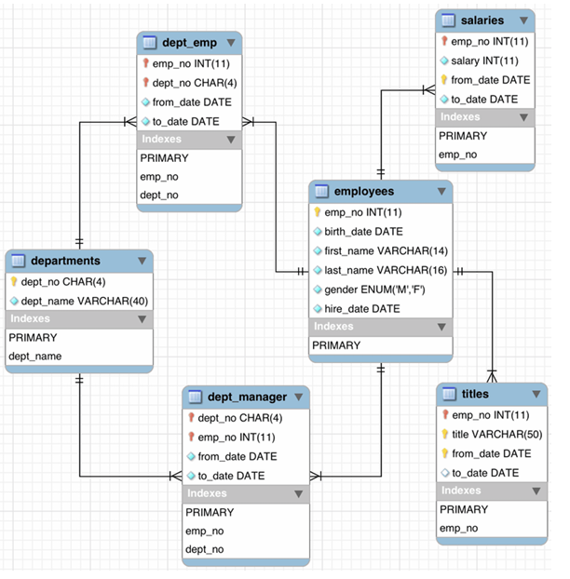

Create `entities` based on the provided `ERD` (Entity-Relationship Diagram) by defines the `entities` and their `relationship` using `JPA` (Java Persistence API) annotations.

- [Employee.java](employee/src/main/java/com/example/employee/entity/Employee.java)
- [Salary.java](employee/src/main/java/com/example/employee/entity/Salary.java)
- [Title.java](employee/src/main/java/com/example/employee/entity/Title.java)
- [Department.java](employee/src/main/java/com/example/employee/entity/Department.java)
- [DeptEmp.java](employee/src/main/java/com/example/employee/entity/DeptEmp.java)
- [DeptManager.java](employee/src/main/java/com/example/employee/entity/DeptManager.java)

These entities defines the relationships between `employees`, `salaries`, `titles`, `departments`, `dept_emp`, and `dept_manager` tables in the database.

## Composite key – research in Data JPA​

The composite keys are handled using `@IdClass` and the appropriate composite key classes (`SalaryId`, `TitleId`, `DeptEmpId`, and `DeptManagerId`).

- [SalaryId.java](employee/src/main/java/com/example/employee/entity/SalaryId.java)
- [TitleId.java](employee/src/main/java/com/example/employee/entity/TitleId.java)
- [DeptEmpId.java](employee/src/main/java/com/example/employee/entity/DeptEmpId.java)
- [DeptManagerId.java](employee/src/main/java/com/example/employee/entity/DeptManagerId.java)

Example one of that composite class:

`Salary` entity:

```java
@IdClass(SalaryId.class)
public class Salary {
    // ...
}
```

That `@IdClass` annotations is used to specify the composite primary key class, and because there is two field that act as `@Id`.

`SalaryId` key:

```java
public class SalaryId implements Serializable {
    private Integer employee;
    private LocalDate fromDate;

    public SalaryId() {
    }

    public SalaryId(Integer employee, LocalDate fromDate) {
        this.employee = employee;
        this.fromDate = fromDate;
    }

    @Override
    public boolean equals(Object o) {
        if (this == o) return true;
        if (o == null || getClass() != o.getClass()) return false;
        SalaryId salaryId = (SalaryId) o;
        return Objects.equals(employee, salaryId.employee) &&
                Objects.equals(fromDate, salaryId.fromDate);
    }

    @Override
    public int hashCode() {
        return Objects.hash(employee, fromDate);
    }
}
```

This `SalaryId` is a composite primary key class for the `Salary` entity. It has two fields for the key, that is `employee` that connected to the `empNo` field and `fromDate`. It implements the serializable interface, also it overrides the `equals()` methods to compare fields and `hashCode()` methods to generate a hash code.

## Manage Employees

Design a `REST API` that involves defines the endpoints and their functionalities for managing employees.

- [EmployeeController.java](employee/src/main/java/com/example/employee/controller/EmployeeController.java)
- [EmployeeRepository.java](employee/src/main/java/com/example/employee/repository/EmployeeRepository.java)
- [EmployeeService.java](employee/src/main/java/com/example/employee/service/EmployeeService.java)
- [EmployeeServiceImpl.java](employee/src/main/java/com/example/employee/service/impl/EmployeeServiceImpl.java)

### Show list of employee with paging

```java
@GetMapping
public ResponseEntity<Page<EmployeeDTO>> getAllEmployees(Pageable pageable) {
    Page<EmployeeDTO> employees = employeeService.getAllEmployees(pageable);
    return ResponseEntity.ok(employees);
}
```

This GET HTTP request retrieves a paginated list of `EmployeeDTO` objects. The method uses `Pageable` as a parameter to receive pagination and sorting information from the client. It calls the `employeeService.getAllEmployees(pageable)` to fetch the data, and the result `Page<EmployeeDTO>` encapsulates the paginated employee, returned within a `ResponseEntity` with an HTTP status of `200 OK`.

`localhost:8080/api/v1/employees?page=0&size=2`

By adding the `page` and `size` in the query parameters for pagination. The result will contain just 2 employee in the `content` field.

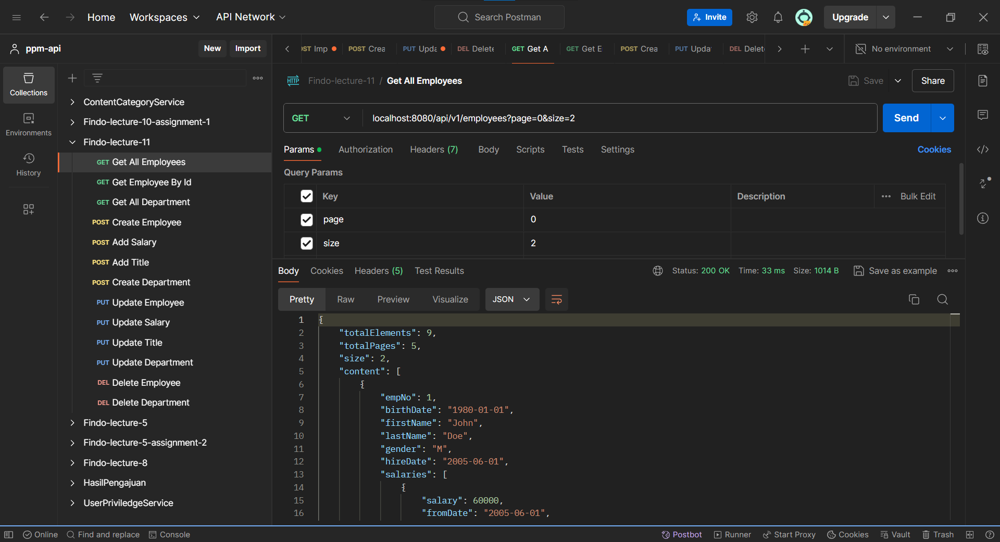

### Add/update/delete employee

- [EmployeeController.java](employee/src/main/java/com/example/employee/controller/EmployeeController.java)
- [EmployeeServiceImpl.java](employee/src/main/java/com/example/employee/service/impl/EmployeeServiceImpl.java)

The `EmployeeController` class is a REST controller that manages employee operations with a RESTful API. It maps HTTP requests to handle CRUD (Create, Read, Update, Delete) operations on employee data, and the endpoints are prefixed with `"/api/v1/employees"`. This class uses an `EmployeeService` to handle the business logic and as dependency injection. The `getEmployeeById` method retrieves an employee by their ID, `addEmployee` creates a new employee, `updateEmployee` modifies an existing employee, and `deleteEmployee` removes an employee by their ID. The `ResponseEntity` wrapper is used to control the HTTP response codes and bodies for each operation.

## Manage Departments

Design a `REST API` that involves defines the endpoints and their functionalities for managing departments.

- [DepartmentController.java](employee/src/main/java/com/example/employee/controller/DepartmentController.java)
- [DepartmentRepository.java](employee/src/main/java/com/example/employee/repository/DepartmentRepository.java)
- [DepartmentService.java](employee/src/main/java/com/example/employee/service/DepartmentService.java)
- [DepartmentServiceImpl.java](employee/src/main/java/com/example/employee/service/impl/DepartmentServiceImpl.java)

The `DepartmentController` class is a REST controller that designed to manage department operations through a RESTful API, with endpoints prefixed by `"/api/v1/departments"`. The class uses an injected `DepartmentService` to handle the business logic. It includes methods for fetching all departments (`getAllDepartments`), fetching a single department by ID (`getDepartmentById`), creating a new department (`addDepartment`), updating an existing department (`updateDepartment`), and deleting a department by ID (`deleteDepartment`).

## Update/Add Salary, Title Change for Employee

Implements the `repository`, `service`, and `controller` layers for handling salary and title for employees.

### Salary

The following are files and class that used to handle the `salary`.

- [SalaryRepository.java](employee/src/main/java/com/example/employee/repository/SalaryRepository.java)
- [SalaryService.java](employee/src/main/java/com/example/employee/service/SalaryService.java)
- [SalaryServiceImpl.java](employee/src/main/java/com/example/employee/service/impl/SalaryServiceImpl.java)

#### Add Salary

```java
/**
 * Add salary for employee
 * @param id employee id
 * @param salaryDTO salary information
 * @return salary DTO
 */
@Override
public SalaryDTO addSalary(Integer id, SalaryDTO salaryDTO) {
    Employee employee = employeeRepository.findById(id).
            orElseThrow(() -> new RuntimeException("Employee not found"));
    Salary salary = new Salary();
    salary.setEmployee(employee);
    salary.setSalary(salaryDTO.getSalary());
    salary.setFromDate(salaryDTO.getFromDate());
    salary.setToDate(salaryDTO.getToDate());
    salary = salaryRepository.save(salary);
    return mapToSalaryDTO(salary);
}
```

The `addSalary` method is to add a new salary record for a specific employee. It takes an employee ID (`empNo`) and a `SalaryDTO` object as input parameters. The method first retrieves the employee from the database using the provided ID. It then creates a new `Salary` object, setting its properties (employee, salary amount, start date, and end date) based on the `SalaryDTO` input. This new `Salary` object is saved to the `salaryRepository`, and the saved entity is then converted back into a `SalaryDTO` object via the `mapToSalaryDTO` method, which is returned as the result.

- **Result**:
    
    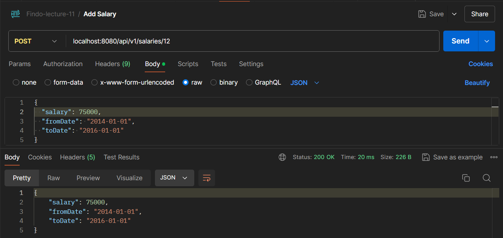

- **In Employee**:
    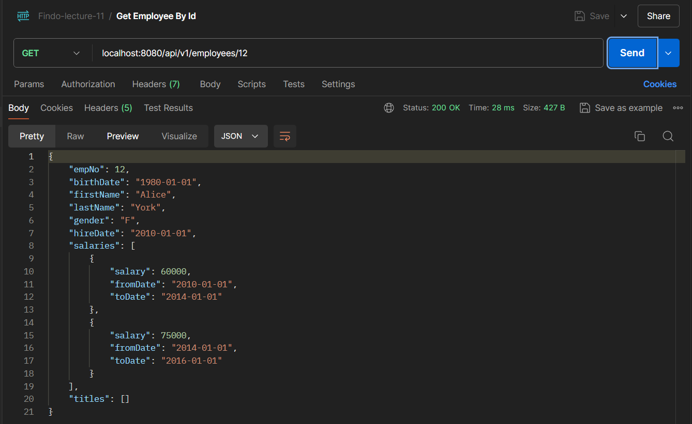

#### Update Salary

```java
/**
 * Update salary for employee
 * @param id employee id
 * @param salaryDTO salary information
 * @return updated salary DTO
 */
@Override
public SalaryDTO updateSalary(Integer id, SalaryDTO salaryDTO) {
    Salary salary = salaryRepository.findById(new SalaryId(id, salaryDTO.getFromDate())).
            orElseThrow(() -> new RuntimeException("Salary not found"));
    salary.setSalary(salaryDTO.getSalary());
    salary.setToDate(salaryDTO.getToDate());
    salary = salaryRepository.save(salary);
    return mapToSalaryDTO(salary);
}
```

The `updateSalary` method updates an existing salary record for a specific employee. It takes an employee ID (`empNo`) and a `SalaryDTO` object as input parameters. The method retrieve the salary record from the `salaryRepository` using a composite key composed of the employee ID (`empNo`) and the `start date` from the `SalaryDTO`. Updates the salary amount and end date with the values from the `SalaryDTO`. The updated salary record is then saved back to the `salaryRepository`, and the saved entity is converted back into a `SalaryDTO` as the result.

- **Result**:
    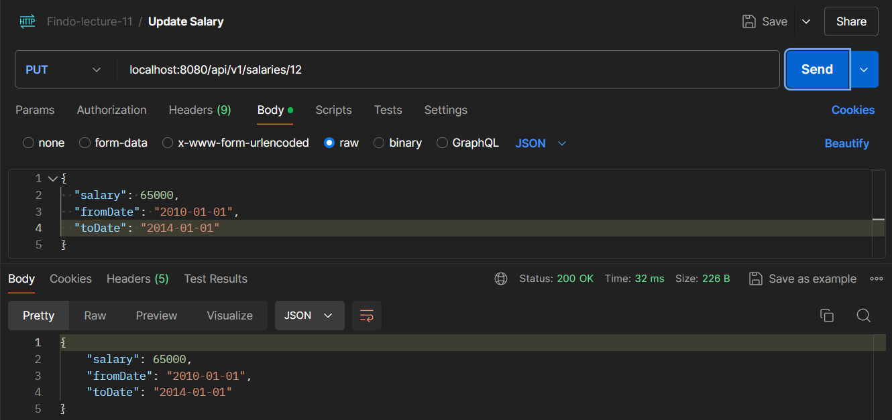

- **In Employee** changed `60000` to `65000`:
    

### Title Change

The following are files and class that used to handle the `title`.

- [TitleRepository.java](employee/src/main/java/com/example/employee/repository/TitleRepository.java)
- [TitleService.java](employee/src/main/java/com/example/employee/service/TitleService.java)
- [TitleServiceImpl.java](employee/src/main/java/com/example/employee/service/impl/TitleServiceImpl.java)

```java
/**
 * Add title for employee
 * @param id employee id
 * @param titleDTO title information
 * @return title DTO
 */
@Override
public TitleDTO addTitle(Integer id, TitleDTO titleDTO) {
    Employee employee = employeeRepository.findById(id).
            orElseThrow(() -> new RuntimeException("Employee not found"));
    Title title = new Title();
    title.setEmployee(employee);
    title.setTitle(titleDTO.getTitle());
    title.setFromDate(titleDTO.getFromDate());
    title.setToDate(titleDTO.getToDate());
    title = titleRepository.save(title);
    return mapToTitleDTO(title);
}
```

The `addTitle` method adds a new title record for a specific employee. It takes an employee ID and a `TitleDTO` object as input parameters. The method retrieves the employee from the database using the provided ID. It creates a new `Title` object, setting its properties (employee, title, start date, and end date) based on the `TitleDTO` input. This new `Title` object is saved to the `titleRepository`, and the saved entity is then converted back into a `TitleDTO` object with the `mapToTitleDTO` as the result.

```java
/**
 * Update title for employee
 * @param id employee id
 * @param titleDTO title information
 * @return updated title DTO
 */
@Override
public TitleDTO updateTitle(Integer id, TitleDTO titleDTO) {
    Title title = titleRepository.findById(new TitleId(id, titleDTO.getTitle(), titleDTO.getFromDate())).
            orElseThrow(() -> new RuntimeException("Title not found"));
    title.setTitle(titleDTO.getTitle());
    title.setToDate(titleDTO.getToDate());
    title = titleRepository.save(title);
    return mapToTitleDTO(title);
}
```

The `updateTitle` method updates an existing job title record for an employee. It takes an employee ID and a `TitleDTO` object as input parameters. The method retrieve the existing title record from the database using a composite key composed of the employee ID, the title, and the start date from the `TitleDTO`. The method updates the title and end date fields with the values from the `TitleDTO`. The updated title record is then saved back to the `titleRepository`, and the saved entity is converted back into a `TitleDTO` object with the `mapToTitleDTO` method as the result.

- **Result**:
    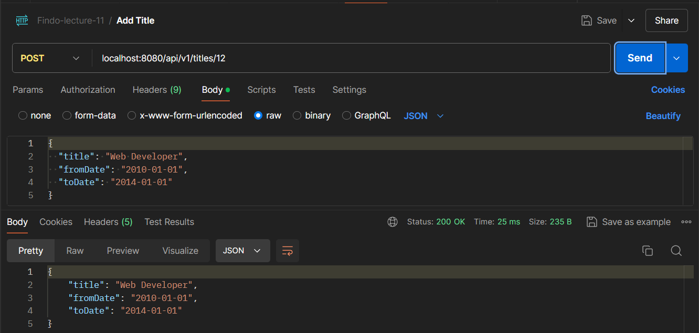

- **In Employee**:
    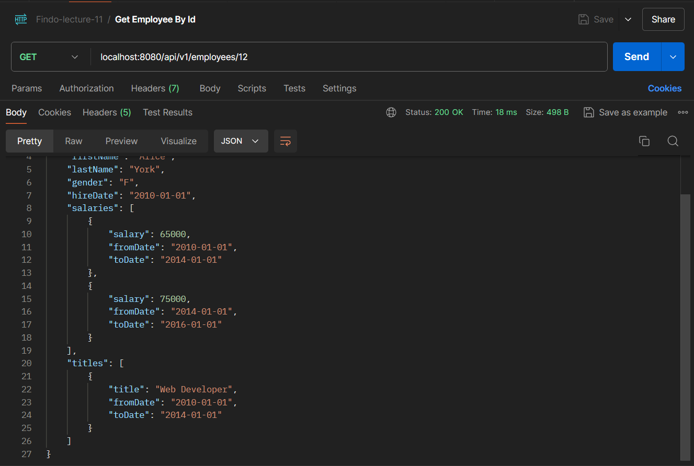

## POSTMAN Result For Manage Employees and Departments

### Manage Employees

- Get All Employees
    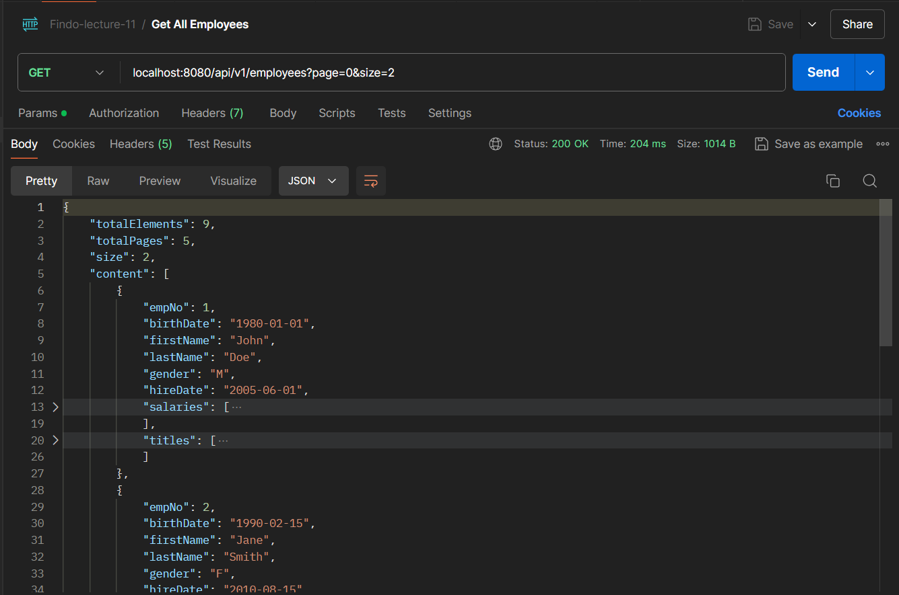
- Get Employee by Id
    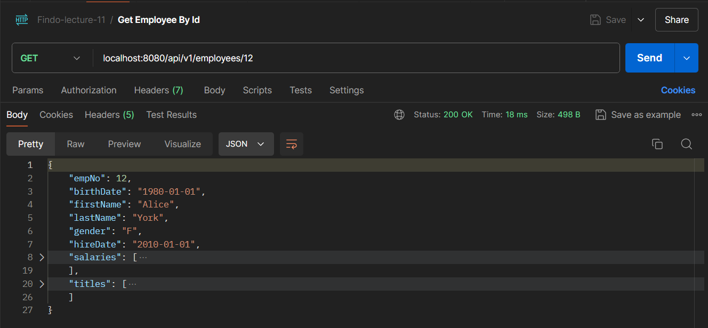
- Create Employee
    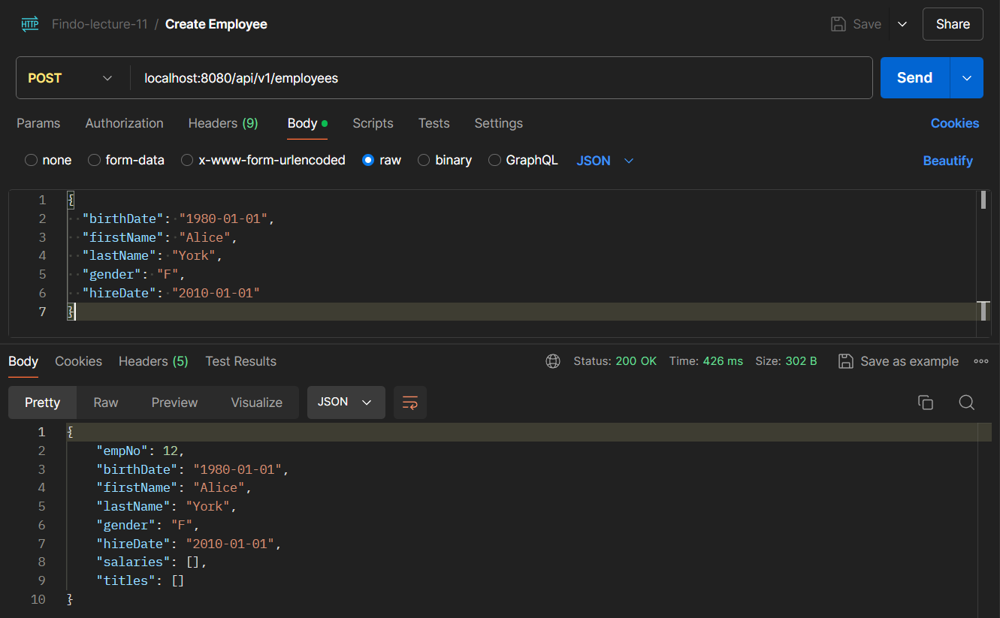
- Update Employee
    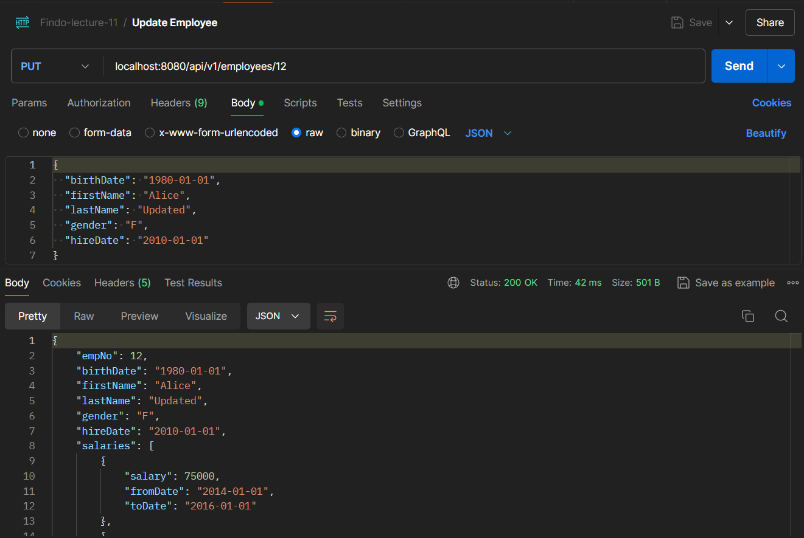
- Delete Employee
    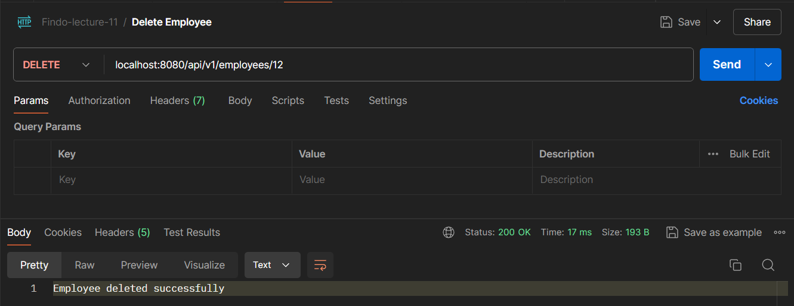

### Manage Departments

- Get All Departments
    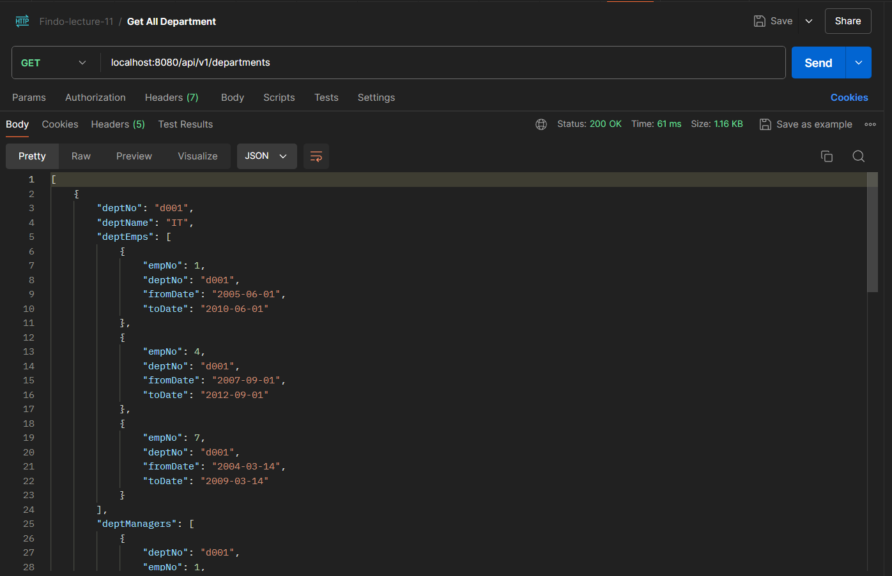
- Get Department by Id
    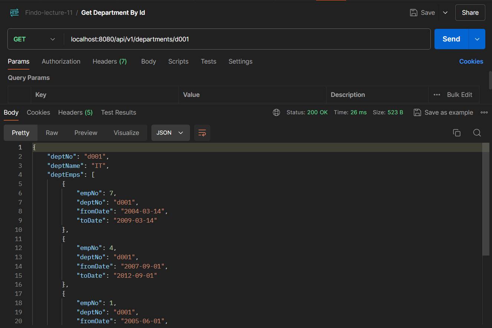
- Create Department
    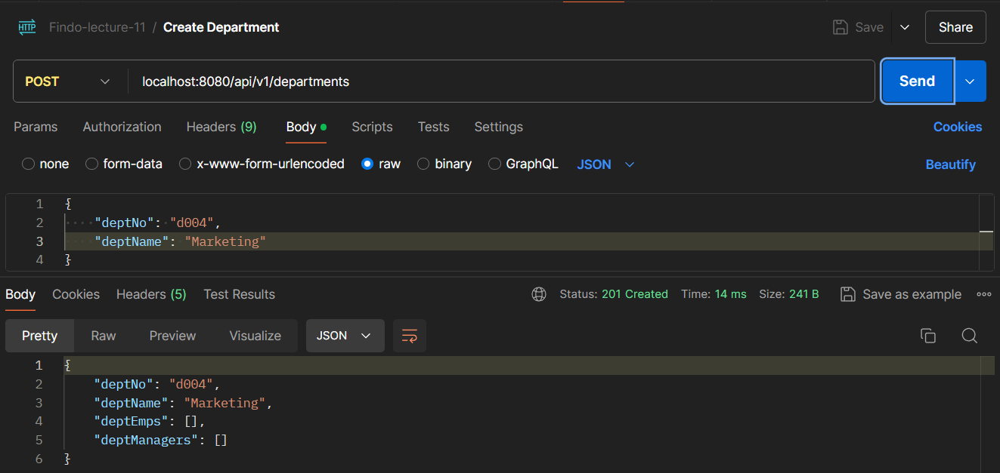
- Update Department
    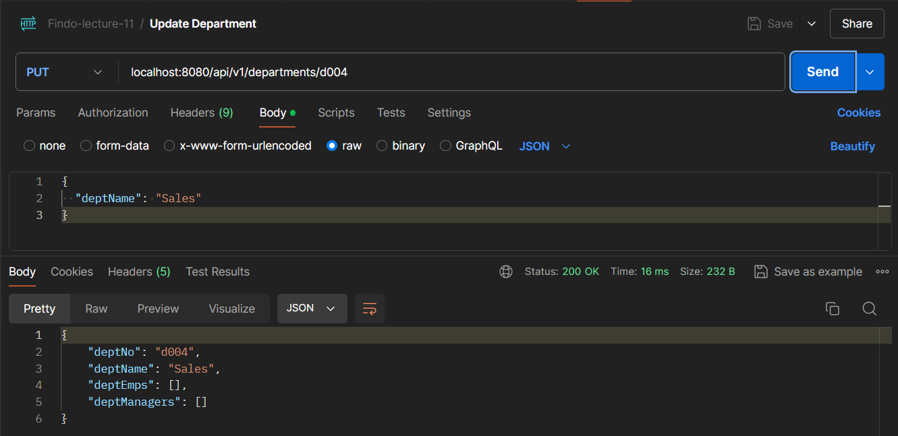
- Delete Department
    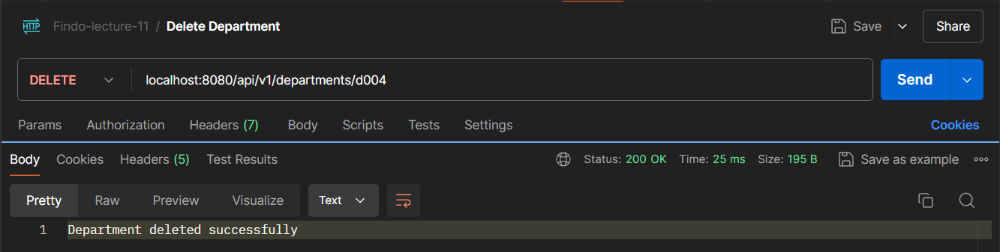