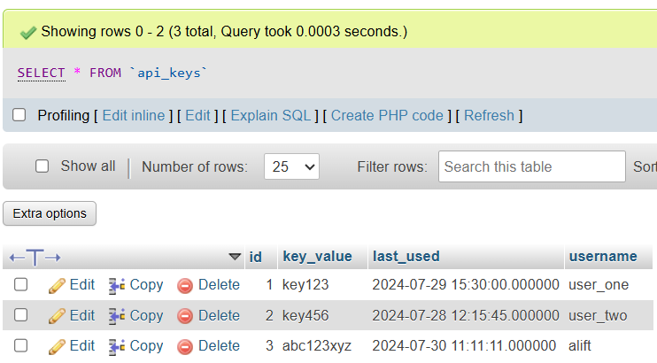
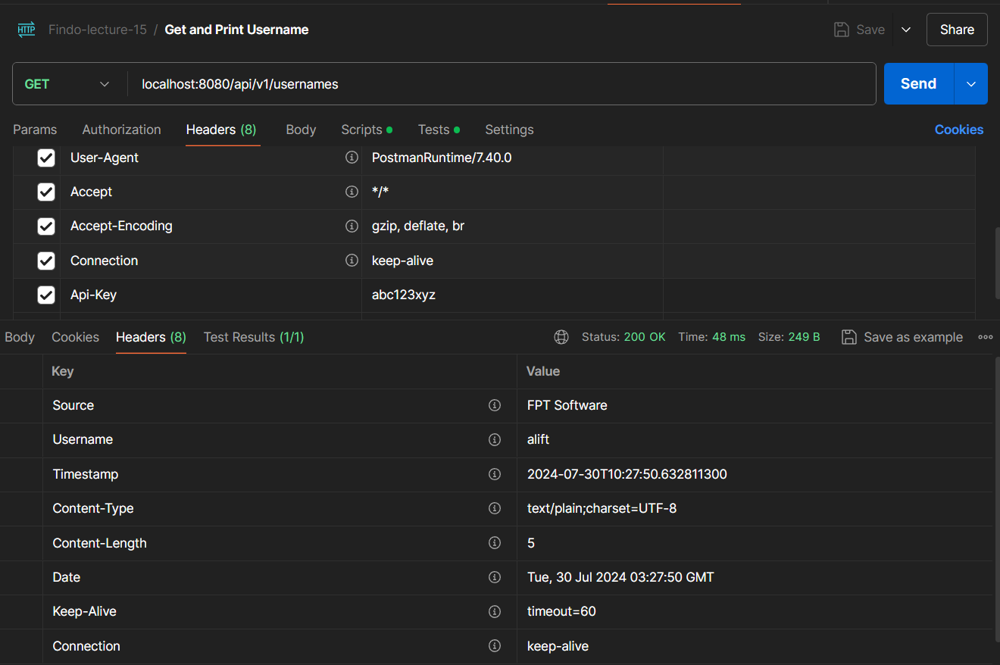
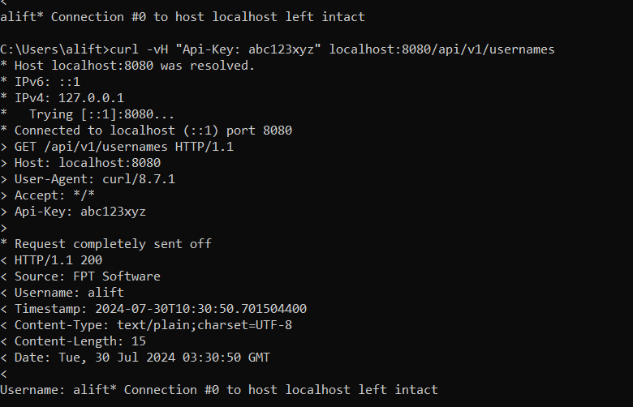

# Assignment 3 - Lecture 15

[Full-Code](assignment3/src/main/java/com/fsoft/lecture15/assignment3/)

# Interceptor

This project is about a simple `interceptor`. In Spring Boot, `interceptor` is a component that will intercept every request and response dispatch inside the Spring MVC and perform some operations on it. In this project, the interceptor used to manage `API key validation`, `track the usage`, and `customize responses with additional headers`.

**Project Structure**

```bash
com/fsoft/lecture15/assignment3/
├── Assignment3Application.java
├── config/
│   └── FilterConfig.java
│   └── InterceptorConfig.java
├── controller/
│   ├── EmployeeController.java
│   └── UsernameController.java
├── entity/
│   ├── ApiKey.java
│   └── Employee.java
├── filter/
│   └── RequestResponseApiKeyFilter.java
├── interceptor/
│   └── RequestResponseApiKeyInterceptor.java
└── repository/
    └── ApiKeyRepository.java
    └── EmployeeRepository.java
```

## Entity

The `ApiKey` entity represents the API key data stored in the database, [ApiKey.java](assignment3/src/main/java/com/fsoft/lecture15/assignment3/entity/ApiKey.java)

```java
@Data
@Entity
@Table(name = "api_keys")
public class ApiKey {
    @Id
    @GeneratedValue(strategy = GenerationType.IDENTITY)
    private Long id;
    @Column(nullable = false, unique = true)
    private String keyValue;
    private String username;
    private LocalDateTime lastUsed;
}
```

The `ApiKey` entity defines the structure of the `api_keys` table, including the `API key` that unique, `username`, and the `lastUsed` field helps in tracking the most recent use of the key.

## Interceptor Class

The implemented interceptor class in this project is `RequestResponseApiKeyInterceptor` to intercept the Request and Response of the API. [RequestResponseApiKeyInterceptor.java](assignment3/src/main/java/com/fsoft/lecture15/assignment3/interceptor/RequestResponseApiKeyInterceptor.java)


```java
@Component
public class RequestResponseApiKeyInterceptor implements HandlerInterceptor {
    private final ApiKeyRepository apiKeyRepository;
    private static final Logger logger = LoggerFactory.getLogger(RequestResponseApiKeyInterceptor.class);

    @Autowired
    public RequestResponseApiKeyInterceptor(ApiKeyRepository apiKeyRepository) {
        this.apiKeyRepository = apiKeyRepository;
    }
    
    // ...
}
```

The `RequestResponseApiKeyInterceptor` class implements the `HandlerInterceptor` interface to intercept incoming HTTP requests and responses.

### PreHandle Method

The `preHandle` method is called before the execution of the actual handler.

```java
@Override
public boolean preHandle(HttpServletRequest request, HttpServletResponse response, Object handler) throws Exception {
    String apiKey = request.getHeader("API-KEY");

    Optional<ApiKey> optionalApiKey = apiKeyRepository.findByKeyValue(apiKey);

    if (apiKey == null || !optionalApiKey.isPresent()) {
        response.sendError(HttpServletResponse.SC_UNAUTHORIZED, "API key is missing or invalid");
        return false;
    }

    ApiKey key = optionalApiKey.get();
    String username = key.getUsername();

    if (username == null) {
        response.sendError(HttpServletResponse.SC_UNAUTHORIZED, "Username is missing");
        return false;
    }

    request.setAttribute("username", username);
    response.setHeader("Username", username);

    String currentLocalDateTime = java.time.LocalDateTime.now().toString();
    response.setHeader("Timestamp", currentLocalDateTime);

    return true;
}
```

The `preHandle()` method checks for a valid API key in the request headers. If valid, it retrieves the `username` field, stores it in the request attributes, and sets the `username` and current `timestamp` in the response headers.

### PostHandle Method

The `postHandle` method is called after the handler is executed.

```java
@Override
public void postHandle(HttpServletRequest request, HttpServletResponse response, Object handler, ModelAndView modelAndView) throws Exception {
    logger.info("Request {} completed with status {}", request.getRequestURI(), response.getStatus());
    logger.debug("Request details: {}", request);
    logger.debug("Response details: {}", response);
}
```

The `postHandle()` method logs the completion of a request, it will log the status and debug about the `request` and `response`.

### AfterCompletion Method

The `afterCompletion` method is called after the complete request is finished and the view is generated.

```java
@Override
public void afterCompletion(HttpServletRequest request, HttpServletResponse response, Object handler, Exception ex) throws Exception {
    ApiKey key = apiKeyRepository.findByKeyValue(request.getHeader("API-KEY")).get();
    key.setLastUsed(java.time.LocalDateTime.now());
    apiKeyRepository.save(key);
}
```

The `afterCompletion()` method ensures the `lastUsed` timestamp for the API key is updated.

## Interceptor Configuration Class

The configuration class for the implemented interceptor is in `InterceptorConfig` class. [InterceptorConfig.java](assignment3/src/main/java/com/fsoft/lecture15/assignment3/config/InterceptorConfig.java)

```java
@Configuration
public class InterceptorConfig implements WebMvcConfigurer {
    private ApiKeyRepository apiKeyRepository;

    @Autowired
    public InterceptorConfig(ApiKeyRepository apiKeyRepository) {
        this.apiKeyRepository = apiKeyRepository;
    }

    @Override
    public void addInterceptors(InterceptorRegistry registry) {
        registry.addInterceptor(new RequestResponseApiKeyInterceptor(apiKeyRepository))
                .addPathPatterns("/api/v1/*");
    }
}
```

The `InterceptorConfig` configuration class sets up the `RequestResponseApiKeyInterceptor` as an interceptor for all requests matching the `/api/v1/*` path.

## Controller

The controller to demonstrates the interceptor is in `UsernameController`. [UsernameController.java](assignment3/src/main/java/com/fsoft/lecture15/assignment3/controller/UsernameController.java)

```java
@RestController
@RequestMapping("/api/v1/usernames")
public class UsernameController {

    private static final Logger logger = LoggerFactory.getLogger(EmployeeController.class);

    @GetMapping
    public ResponseEntity<String> getAndPrintUsername(HttpServletResponse response) {
        String username = (String) response.getHeader("Username");
        logger.info("Username: {}", username);
        return ResponseEntity.ok("Username: " + username);
    }
}
```

In this controller, the `getAndPrintUsername()` retrieves the `username` from the response header and logs or print it. This demonstrates the example of interceptors.

## Result

Using a tool like `curl`, we can test the interceptor's functionality.

```bash
curl -vH "Api-Key: abc123xyz" localhost:8080/api/v1/usernames
```

This command sends a GET request with the specified `API key`.

```bash
* Host localhost:8080 was resolved.
* IPv6: ::1
* IPv4: 127.0.0.1
*   Trying [::1]:8080...
* Connected to localhost (::1) port 8080
> GET /api/v1/usernames HTTP/1.1
> Host: localhost:8080
> User-Agent: curl/8.7.1
> Accept: */*
> Api-Key: abc123xyz
>
* Request completely sent off
< HTTP/1.1 200
< Source: FPT Software
< Username: alift
< Timestamp: 2024-07-30T10:30:50.701504400
< Content-Type: text/plain;charset=UTF-8
< Content-Length: 15
< Date: Tue, 30 Jul 2024 03:30:50 GMT
<
Username: alift* Connection #0 to host localhost left intact
```

The response includes headers for the `username` and `timestamp`, demonstrating the interceptor's successful operation.

```bash
2024-07-30T10:04:45.499+07:00  INFO 22324 --- [assignment3] [nio-8080-exec-2] c.f.l.a.controller.EmployeeController    : Username: alift
```

This is the result of loggin/printing functionality that implemented in the `UsernameController` controller. 



The `last_used` column is always updated when the API is used, demonstrates the `afterCompletion()` method that ensures the `lastUsed` timestamp for the API key is updated.

### Screenshot

- Postman to see response
    

- Logger to see the printed username
    

- cURL to see detailed request and response
    

## Additional

This is the `DDL` and `DML` of the `api_keys` table in `MySQL`

```sql
CREATE TABLE `api_keys` (
  `id` bigint(20) NOT NULL,
  `key_value` varchar(255) NOT NULL,
  `last_used` datetime(6) DEFAULT NULL,
  `username` varchar(255) DEFAULT NULL
) ENGINE=InnoDB DEFAULT CHARSET=utf8mb4 COLLATE=utf8mb4_general_ci;

INSERT INTO `api_keys` (`id`, `key_value`, `last_used`, `username`) VALUES
(1, 'key123', '2024-07-29 15:30:00.000000', 'user_one'),
(2, 'key456', '2024-07-28 12:15:45.000000', 'user_two'),
(3, 'abc123xyz', '2024-07-30 11:11:11.000000', 'alift');


ALTER TABLE `api_keys`
  ADD PRIMARY KEY (`id`),
  ADD UNIQUE KEY `UKpp6b99o4acta2wol0qnnod7bb` (`key_value`);


ALTER TABLE `api_keys`
  MODIFY `id` bigint(20) NOT NULL AUTO_INCREMENT, AUTO_INCREMENT=4;
```