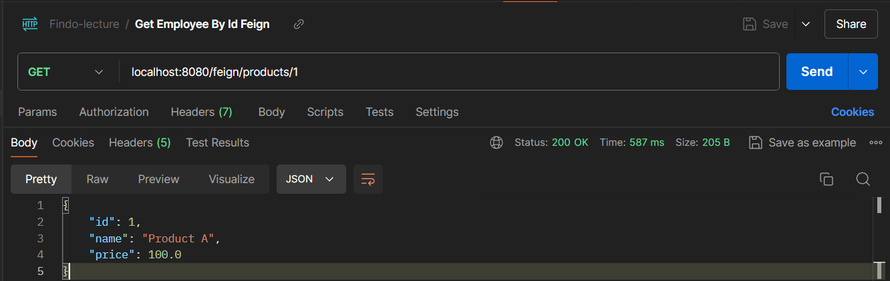
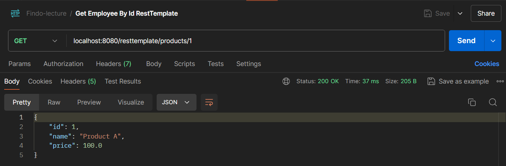
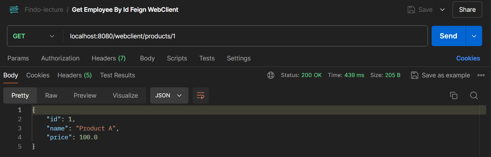

# Assignment 1 - Lecture 16

Implementation of Invoice and Product Application that contains FeignClient, RestTemplate, WebClient

**Invoice Application**
- Project: [Project/invoice_application](Project/invoice_application)

**Product Application**
- Project: [Project/product_application](Project/product_application)

Example implementation of FeignClient, RestTemplate, WebClient

**FeignClient**
- Project:
    [Project/try/openfeign/](Project/try/openfeign/)
- Code:
    [Project/try/openfeign/src/main/java/com/fsoft/lecture16/openfeign/](Project/try/openfeign/src/main/java/com/fsoft/lecture16/openfeign/)
- Test API:
    

**RestTemplate**
- Project:
    [Project/try/resttemplate/](Project/try/resttemplate/)
- Code:
    [Project/try/resttemplate/src/main/java/com/fsoft/lecture16/resttemplate/](Project/try/resttemplate/src/main/java/com/fsoft/lecture16/resttemplate/)
- Test API:
    

**WebClient**
- Project:
    [Project/try/webclient/](Project/try/webclient/)
- Code:
    [Project/try/webclient/src/main/java/com/fsoft/lecture16/webclient/](Project/try/webclient/src/main/java/com/fsoft/lecture16/webclient/)
- Test API:
    
