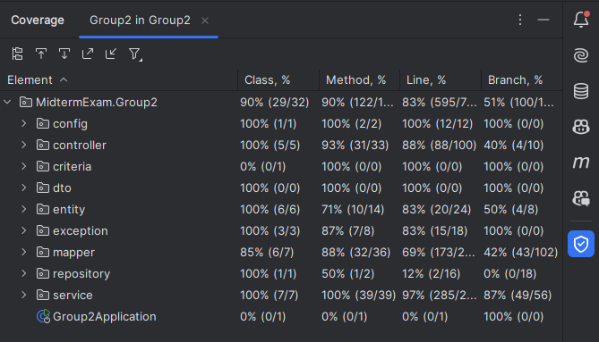
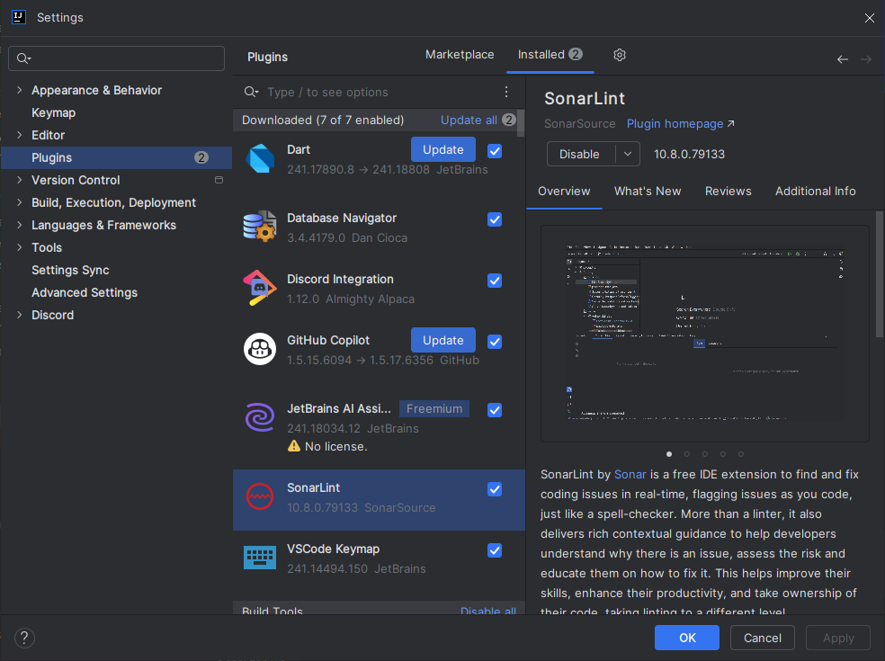
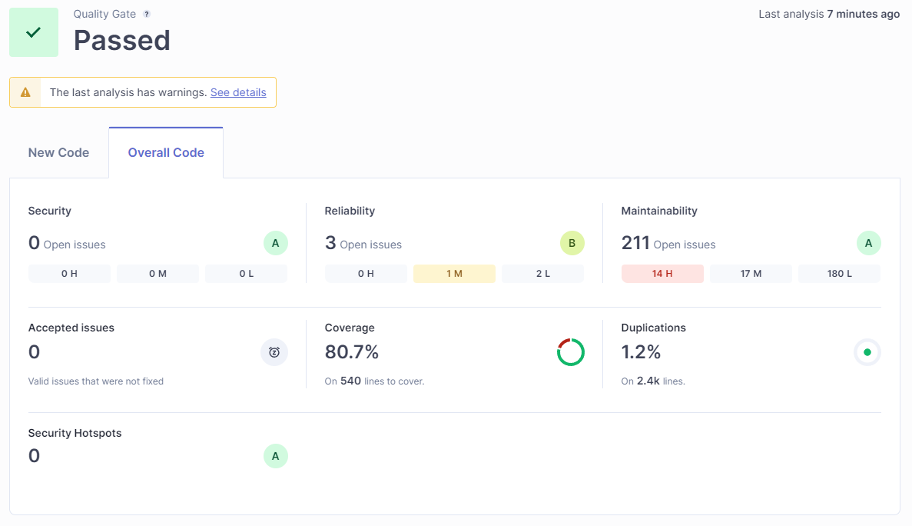
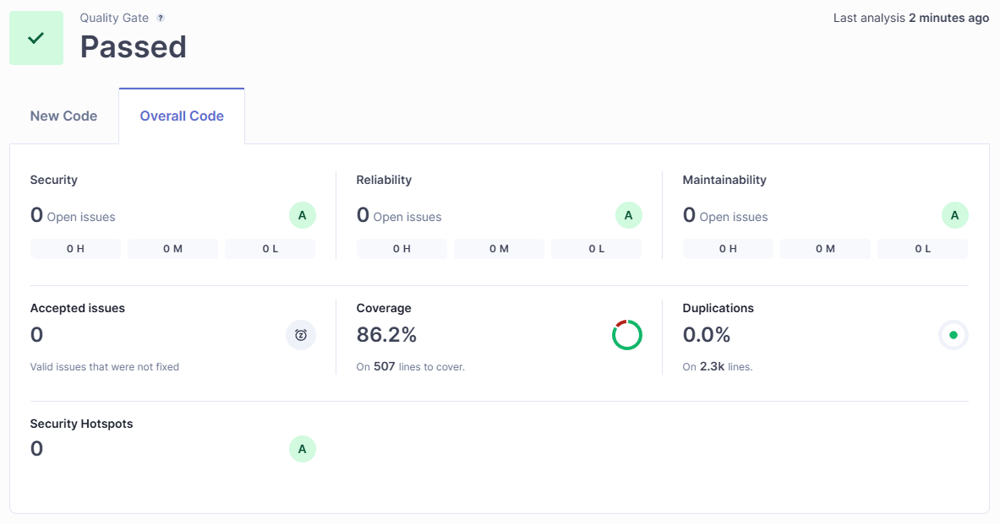
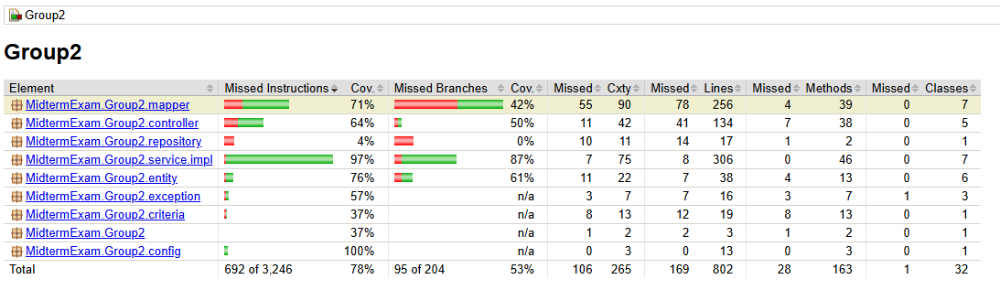

# Assignment Week 9 - Ensure Code Quality

`Unit Testing` involves testing individual components of software in isolation to ensure they function correctly, using frameworks like `JUnit` and `Mockito`. For this assignment, unit tests were aimed at achieving >= 75% coverage. `SonarLint` provided immediate feedback on code quality within IntelliJ IDEA, helping to catch issues early. `SonarQube` offered a detailed analysis of code quality, deeper issues and code smells. `JaCoCo` generated reports on test coverage.

## 1. Unit Tests

**Steps:**

1. **Configure H2 Database**: In the `application-test.properties`, configure H2 as the in-memory database.
    ```properties
    spring.datasource.url=jdbc:h2:mem:testdb
    spring.datasource.driverClassName=org.h2.Driver
    spring.datasource.username=sa
    spring.datasource.password=password
    spring.jpa.database-platform=org.hibernate.dialect.H2Dialect
    spring.jpa.hibernate.ddl-auto=create-drop
    ```

2. **Write Unit Tests**: Create test classes for services, controllers, and repositories in the `src/test/java` directory. Use `@Test` to create test methods within the test classes, `@MockBean` for mocking dependencies, `@SpyBean` for partial mocks where needed, and other needed methods.

3. **Test Result**:
    \
    

4. **Coverage in Intellij IDEA**:
    \
    

## 2. Installing and Configuring SonarLint

**Steps:**

1. **Install SonarLint**:
   - Open IntelliJ IDEA.
   - Go to `File > Settings > Plugins`.
   - Search for `SonarLint` and click `Install`.

**Screenshot of SonarLint Installed:**



## 3. Ensuring Code Quality with SonarQube

**Steps:**

1. **Install SonarQube**:
   - Download SonarQube from the [SonarQube website](https://www.sonarqube.org/downloads/).
   - Extract the archive and start the server by running `sonar.sh start` (Linux/Mac) or `StartSonar.bat` (Windows) from the `bin` directory.

2. **Initiate SonarQube**:
   - Access SonarQube at `http://localhost:9000`.
   - Create a new project and note the project key and token.

3. **Add Sonar Plugin to `pom.xml`**:
    ```xml
    <plugin>
        <groupId>org.sonarsource.scanner.maven</groupId>
        <artifactId>sonar-maven-plugin</artifactId>
        <version>3.4.0.905</version>
    </plugin>
    ```

3. **Configure SonarLint**:
   - In Intellij IDEA, go to `File > Settings > Tools > SonarLint`.
   - Click on `+` to bind a project with SonarQube or SonarCloud.

3. **Run SonarQube Analysis**:
   - Using the SonarQube scanner to analyze the code by running the maven command:
     ```bash
     mvn clean verify sonar:sonar -Dsonar.projectKey=<key> -Dsonar.projectName=<name> -Dsonar.host.url=http://localhost:9000 -Dsonar.token=<token>
     ```

- **Before SonarQube Fixes:**
  
  

- **After SonarQube Fixes:**
  
  

### 4. Creating a JaCoCo Report

**Steps:**

1. **Add JaCoCo Plugin to `pom.xml`**:
   - **Plugin**:
    ```xml
    <plugin>
        <groupId>org.jacoco</groupId>
        <artifactId>jacoco-maven-plugin</artifactId>
        <version>0.8.8</version>
        <executions>
            <execution>
                <goals>
                    <goal>prepare-agent</goal>
                </goals>
            </execution>
            <execution>
                <id>report</id>
                <phase>prepare-package</phase>
                <goals>
                    <goal>report</goal>
                </goals>
            </execution>
        </executions>
    </plugin>
    ```
   - **Properties**:
    ```xml
    <sonar.java.coveragePlugin>jacoco</sonar.java.coveragePlugin>
    <sonar.dynamicAnalysis>reuseReports</sonar.dynamicAnalysis>
    <sonar.jacoco.reportPath>${project.basedir}/../target/jacoco.exec</sonar.jacoco.reportPath>
    <sonar.language>java</sonar.language>
    ```
2. **Generate Report**:
   Run `mvn clean test jacoco:report`.
3. **View JaCoCo Report**:
   Find the report in `target/site/jacoco` directory.

**Screenshot of JaCoCo Report:**

