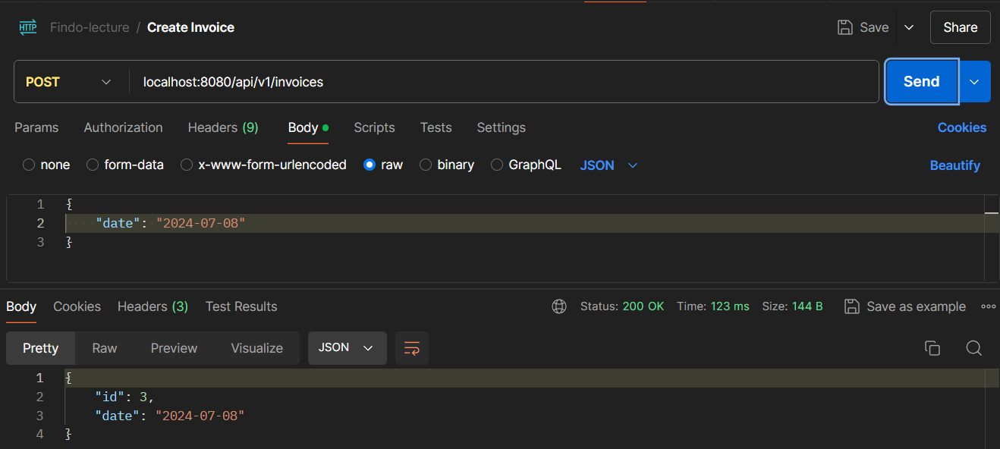
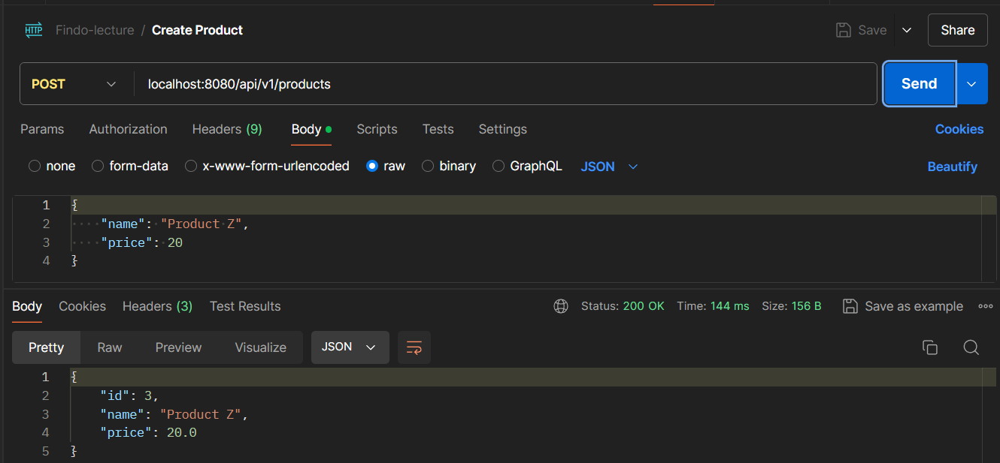
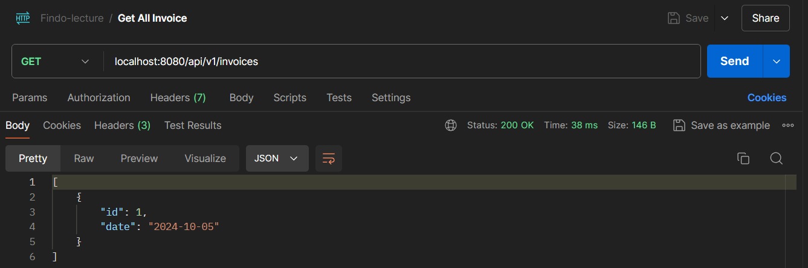
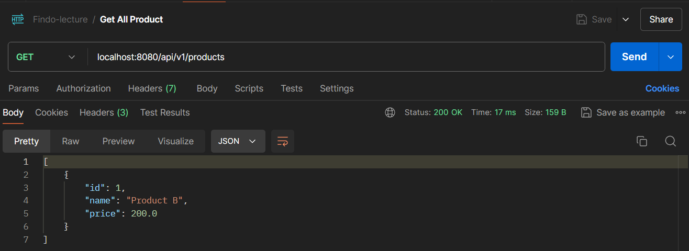
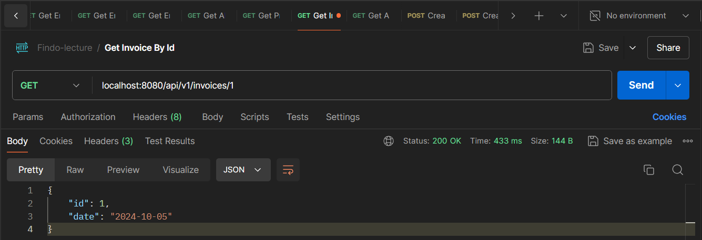
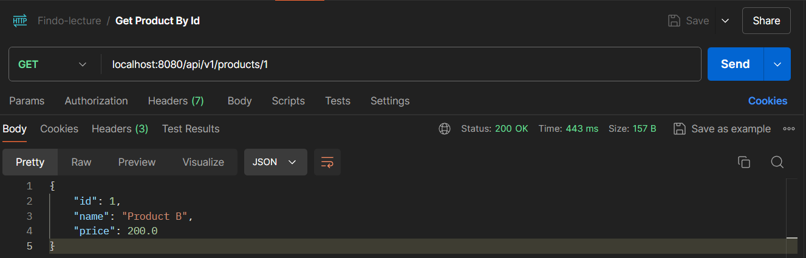
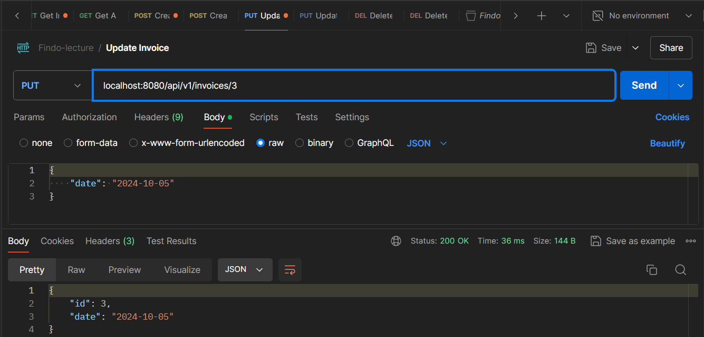
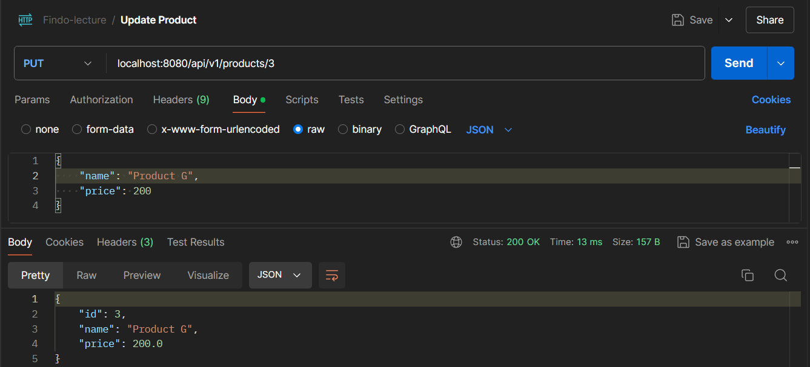
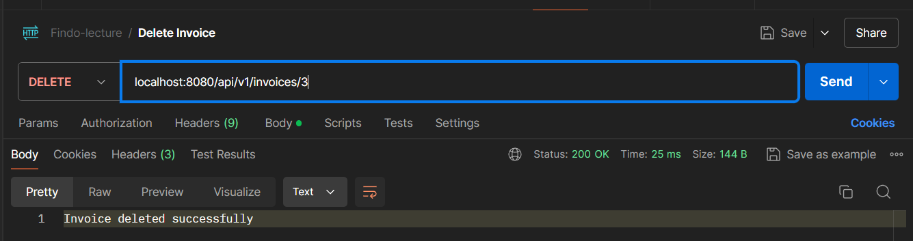
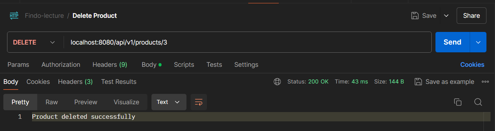

# Assignment 1 - Lecture 19 - Microservices

This directory contains a microservice application using Spring Boot that consists of three main projects:

1. **Gateway Service**
2. **Invoice Application**
3. **Product Application**

The `img` folder contain screenshots of API testing on Postman.

## Repository Structure

```bash
├── gateway-service/
├── invoice-service/
├── product-service/
├── img/
└── README.md
```

## Gateway Service

The Gateway Service acts as a reverse proxy and routing service, directing incoming requests to the microservices (Invoice or Product). This Gateway Service configured using the application.yml file, to defines the routing rules.

### Project Structure

```bash
/src/main/
├── java/com/fsoft/gateway/
│   └── GatewayApplication.java
└── resources/
    └── application.yml
```

### Application.yml

The file is configured as follows:

```yml
server:
  port: 8080

spring:
  application:
    name: gateway-service
  cloud:
    gateway:
      routes:
        - id: invoice-service
          uri: http://localhost:8081
          predicates:
            - Path=/api/v1/invoices/**
        - id: product-service
          uri: http://localhost:8082
          predicates:
            - Path=/api/v1/products/**

logging:
  level:
    org:
      springframework.cloud.gateway: DEBUG
    reactor.netty.http.client: DEBUG
```

Server Port: The Gateway Service runs on port `8080`.

Routing Configuration:
- Requests with the path `/api/v1/invoices/**` are routed to the Invoice Service running on `http://localhost:8081`.
- Requests with the `path /api/v1/products/**` are routed to the Product Service running on `http://localhost:8082`.

Logging Level: The logging level for `springframework.cloud.gateway` and `reactor.netty.http.client` is set to DEBUG to provide detailed logs during debugging.

## Invoice Application

The Invoice Application responsible for handling all operations related to invoices and product, also it contains a `RESTful API`.

### Project Structure

```bash
/invoice_application/src/main
├── java/com/fsoft/
│   └── invoice_application/
│       ├── InvoiceApplication.java
│       ├── client/
│       │   └── ProductFeignClient.java
│       ├── config/
│       │   ├── RestTemplateConfig.java
│       │   └── WebClientConfig.java
│       ├── controller/
│       │   └── InvoiceController.java
│       ├── dto/
│       │   ├── InvoiceDto.java
│       │   └── ProductDto.java
│       ├── mapper/
│       │   └── InvoiceMapper.java
│       ├── model/
│       │   └── Invoice.java
│       ├── repository/
│       │   └── InvoiceRepository.java
│       └── service/
│           ├── InvoiceService.java
│           ├── ProductRestTemplateService.java
│           └── ProductWebClientService.java
└── resources/
    └── application.properties
```

### API Endpoints

**Port**: `8081`

**API Endpoints**:
- `POST /api/v1/invoices/` - Create a new invoice
- `GET /api/v1/invoices/` - Retrieve an list of invoices
- `GET /api/v1/invoices/{id}` - Retrieve an invoice by ID
- `PUT /api/v1/invoices/{id}` - Update an existing invoice
- `DELETE /api/v1/invoices/{id}` - Delete an invoice by ID

## Product Application

The Product Application manages product-related operations, providing a RESTful API for CRUD operations on products.

### Project Structure

```bash
/Product_application/src/main
├── java/com/fsoft/
│   └── Product_application/
│       ├── ProductApplication.java
│       ├── controller/
│       │   └── ProductController.java
│       ├── model/
│       │   └── Product.java
│       ├── repository/
│       │   └── ProductRepository.java
│       └── service/
│           └── ProductService.java
└── resources/
    └── application.properties
```

### API Endpoints

**Port**: `8082`

**API Endpoints**:
- `POST /api/v1/products/` - Create a new product
- `GET /api/v1/products/` - Retrieve an list of products
- `GET /api/v1/products/{id}` - Retrieve an product by ID
- `PUT /api/v1/products/{id}` - Update an existing product
- `DELETE /api/v1/products/{id}` - Delete an product by ID

## API Testing Screenshots

**Gateway** API testing performed in Postman.

**Port**: Gateway port is `8080`.










