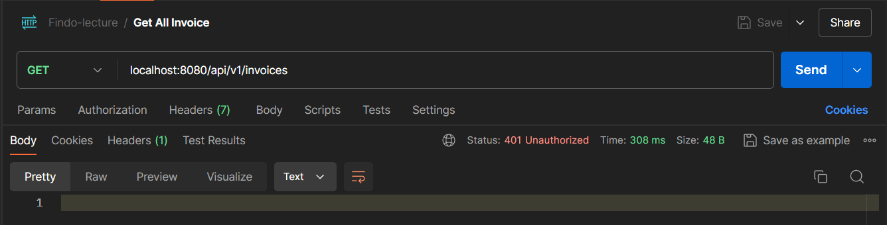
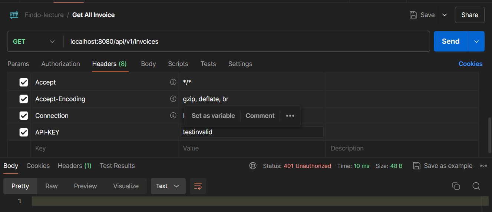
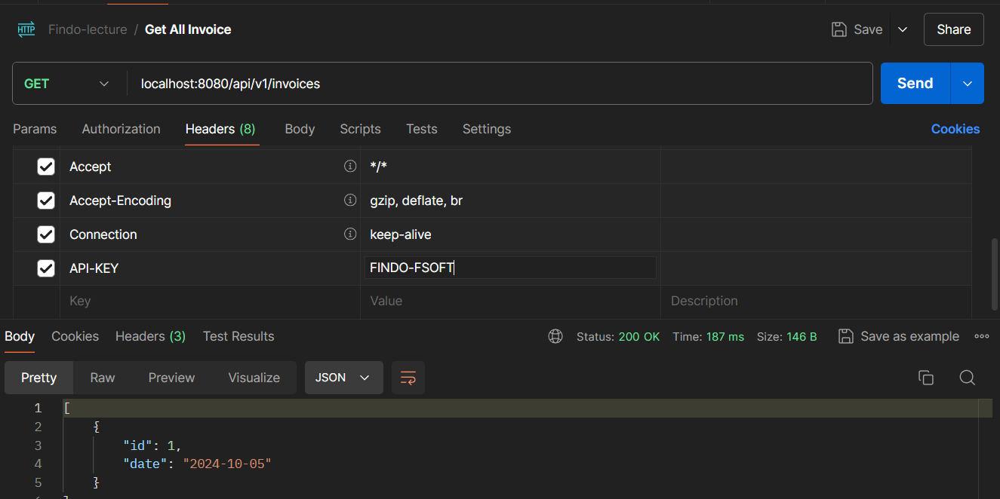

# Assignment 2 - Lecture 19

## Gateway Service With Filter.

[Full-Code](gateway/src/main/java/com/fsoft/gateway/)

The **Gateway** Service serves as the entry point for the microservice architecture, routing incoming requests to the appropriate services (Invoice or Product). This **Gateway** also includes a security filter to verify API keys before forwarding requests.

### API Key Entity and Repository

[ApiKey Entity](gateway/src/main/java/com/fsoft/gateway/model/ApiKey.java)

This `ApiKey` entity represents the API keys that stored in the MySQL database.

```java
@Entity
public class ApiKey {

    @Id
    @GeneratedValue(strategy = GenerationType.IDENTITY)
    private Long id;

    private String apiKey;

    // Getters and setters...
}
```

The `ApiKeyRepository` provides an interface for database operations related to API keys.

[ApiKeyRepository.java](gateway/src/main/java/com/fsoft/gateway/repository/ApiKeyRepository.java)

```java
public interface ApiKeyRepository extends JpaRepository<ApiKey, Long> {
    boolean existsByApiKey(String apiKey);
}
```

This repository interface extends `JpaRepository`, offering methods for interacting with the database.

### Authentication Service

[AuthenticationService.java](gateway/src/main/java/com/fsoft/gateway/service/AuthenticationService.java)

The `AuthenticationService` is responsible for validating API keys that stored in the database.

```java
@Service
public class AuthenticationService {

    private final ApiKeyRepository apiKeyRepository;

    public AuthenticationService(ApiKeyRepository apiKeyRepository) {
        this.apiKeyRepository = apiKeyRepository;
    }

    public boolean isValidApiKey(String apiKey) {
        return apiKeyRepository.existsByApiKey(apiKey) && !apiKey.isEmpty();
    }
}
```

### API Key Filter

[ApiKeyGatewayFilterFactory.java](gateway/src/main/java/com/fsoft/gateway/filter/ApiKeyGatewayFilterFactory.java)

The Gateway Service uses a custom filter from `AbstractGatewayFilterFactory` to ensure that only request with a valid `API-KEY` header are processed.

```java
@Component
public class ApiKeyGatewayFilterFactory extends AbstractGatewayFilterFactory<ApiKeyGatewayFilterFactory.Config> {

    @Autowired
    private AuthenticationService authenticationService;

    public final Logger logger = LoggerFactory.getLogger(ApiKeyGatewayFilterFactory.class);

    public ApiKeyGatewayFilterFactory() {
        super(Config.class);
    }

    @Override
    public GatewayFilter apply(Config config) {
        return (exchange, chain) -> {
            logger.info("Pre GatewayFilter logging: " + config.getBaseMessage());

            String apiKey = exchange.getRequest().getHeaders().getFirst("API-KEY");

            if (!authenticationService.isValidApiKey(apiKey)) {
                exchange.getResponse().setStatusCode(HttpStatus.UNAUTHORIZED);
                logger.error("API key is invalid: " + apiKey);
                return exchange.getResponse().setComplete();
            }

            logger.info("Post GatewayFilter logging: " + config.getBaseMessage());
            return chain.filter(exchange);
        };
    }

    public static class Config {
        private String baseMessage;
        private boolean preLogger;
        private boolean postLogger;

        // constructor, getter, setter ...
    }
}
```

It retrieves the `API-KEY` from the incoming request headers and uses the `AuthenticationService` to check if the key is valid. If the key is invalid, the filter responds with an `UNAUTHORIZED` status. If valid, the request is forwarded to the service, with pre and post filter logging.

### Application.yml

[application.yml](gateway/src/main/resources/application.yml)

This is the configured `application.yml` for the Gateway Service.

```yml
server:
  port: 8080

spring:
  application:
    name: gateway-service
  cloud:
    gateway:
      routes:
        - id: invoice-service
          uri: http://localhost:8081
          predicates:
            - Path=/api/v1/invoices/**
          filters:
            - name: ApiKey
              args:
                baseMessage: This is a base message
                preLogger: true
                postLogger: true

        - id: product-service
          uri: http://localhost:8082
          predicates:
            - Path=/api/v1/products/**
          filters:
            - name: ApiKey
              args:
                baseMessage: This is a base message
                preLogger: true
                postLogger: true

  datasource:
    url: jdbc:mysql://localhost:3306/fsoft-lecture-w8
    username: root
    password:
  jpa:
    hibernate:
      ddl-auto: update
    show-sql: true
    properties:
      hibernate:
        dialect: org.hibernate.dialect.MySQLDialect
        format_sql: true

logging:
  level:
    org:
      springframework.cloud.gateway: DEBUG
      hibernate:
        sql: DEBUG
        type.descriptor.sql.BasicBinder: TRACE
    reactor.netty.http.client: DEBUG
```

**Server Port**: The Gateway Service operates on port 8080.

**Routing Configuration**:
- Requests to /api/v1/invoices/** are routed to the Invoice Service at http://localhost:8081.
- Requests to /api/v1/products/** are routed to the Product Service at http://localhost:8082.

**API Key Filter**: The ApiKey filter is applied to both routes. It validates the presence of a valid API key in the request headers before forwarding the request to the respective service.

**Database Configuration**: The API keys are stored in a MySQL database. The application.yml file includes database connection details and Hibernate settings for automatic schema updates and SQL logging.

## API Testing Screenshot

- UNAUTHORIZED Without API KEYS
    

- UNAUTHORIZED with invalid API KEYS
    

- With valid API KEYS
    