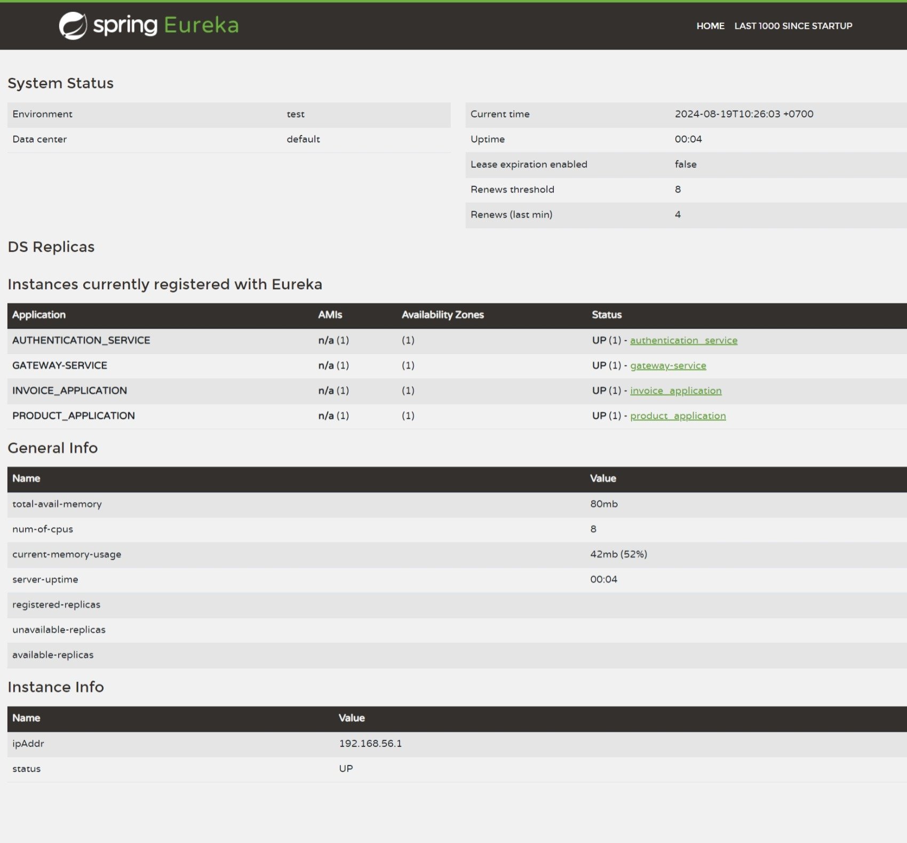

# Discovery Service - Eureka Server

This microservices utilizes `Netflix Eureka` as a Discovery Service to manage and track all the services running in the system. The Discovery Service allows services to register themselves and discover each other dynamically, facilitating load balancing and fault tolerance.

## Eureka Server - Discovery Service

The `discovery_service` in this project act as `Eureka Server` using `Spring Cloud Netflix Eureka`.

### Maven Dependency

Add the `Eureka Server` dependency to the `pom.xml` file in `discovery_service`.

```xml
<dependency>
    <groupId>org.springframework.cloud</groupId>
    <artifactId>spring-cloud-starter-netflix-eureka-server</artifactId>
</dependency>

<dependencyManagement>
    <dependencies>
        <dependency>
            <groupId>org.springframework.cloud</groupId>
            <artifactId>spring-cloud-starter-parent</artifactId>
            <version>2023.0.0</version>
            <type>pom</type>
            <scope>import</scope>
        </dependency>
    </dependencies>
</dependencyManagement>
```

### Enable Eureka Server

To enable the Eureka Server, annotate the main application of the `discovery_service` with `@EnableEurekaServer`

```java
@SpringBootApplication
@EnableEurekaServer
public class DiscoveryServiceApplication {
    public static void main(String[] args) {
        SpringApplication.run(DiscoveryServiceApplication.class, args);
    }
}
```

### Application Configuration

The `application.properties` file configures the Eureka server to run on a specific port and manage service instances.

```properties
spring.application.name=discovery_service

server.port=8761

eureka.client.register-with-eureka=false
eureka.client.fetch-registry=false
eureka.instance.hostname=localhost
```

- **Port Configuration**: The Eureka server runs on port `8761`
- **Eureka Configuration**: The Discovery Service does not need to register itselft with Eureka (`register-with-eureka: false`), and it will not fetch the registry because it's acts as the server. The host name is `localhost` where the Eureka server will be running.

## Integrate Microserices with Eureka

Configure the microservices (Gateway, Authentication, Invoice, Product) to register with Eureka server.

### Maven Dependency

Add the `Eureka Client` dependency to each microservice's `pom.xml` file.

```xml
<dependencies>
    <dependency>
        <groupId>org.springframework.cloud</groupId>
        <artifactId>spring-cloud-starter-netflix-eureka-client</artifactId>
    </dependency>
</dependencies>
```

That dependency will automatically annotate the main application act as the client.

### Microservice Configuration

Configure the `application.properties` or `application.yml` file in each microservice to connect to the eureka server.

```properties
eureka.client.service-url.defaultZone=http://localhost:8761/eureka/
eureka.instance.hostname=localhost
eureka.instance.instance-id=${spring.application.name}
```

- **Eureka Server URL**: All microservices point to the Eureka server running at `http://localhost:8761/eureka/`.
- **Eureka Instance**: The service's hostname is set to `localhost` and the instance ID is generated using the application name.

### Gateway - Load Balancing and Service Discovery

Once the microservices are registered with Eureka, configure the `Gateway Service` to use dynamic discovery. Replace the hardcoded `uri` values with Eureka service names.

```yml
spring:
  application:
    name: gateway-service
  cloud:
    inetutils:
      preferred-networks: 127.0.0.1
    gateway:
      discovery:
        locator:
          enabled: true
          lower-case-service-id: true
      routes:
        - id: invoice_application
          uri: lb://invoice_application
          predicates:
            - Path=/api/v1/invoices/**
        - id: product_application
          uri: lb://product_application:8082
          predicates:
            - Path=/api/v1/products/**
      default-filters:
        - name: ApiKey
```

- **Dynamic Routing**: The uri now points to `lb://<service-name>`, where lb indicates that load balancing should be applied using the registered service instances in Eureka.

- **Service Discovery**: The Gateway Service will use Eureka to discover the appropriate instances for routing requests.

## Accessing the Eureka Dashboard

When the `Discovery Service` is running, access the Eureka dashboard at:

```uri
http://localhost:8761
```
\
Screenshot:
