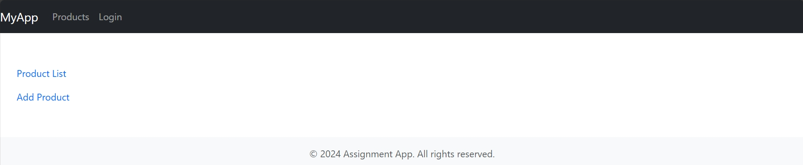
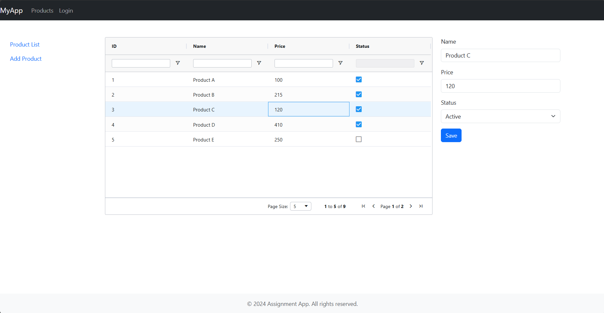
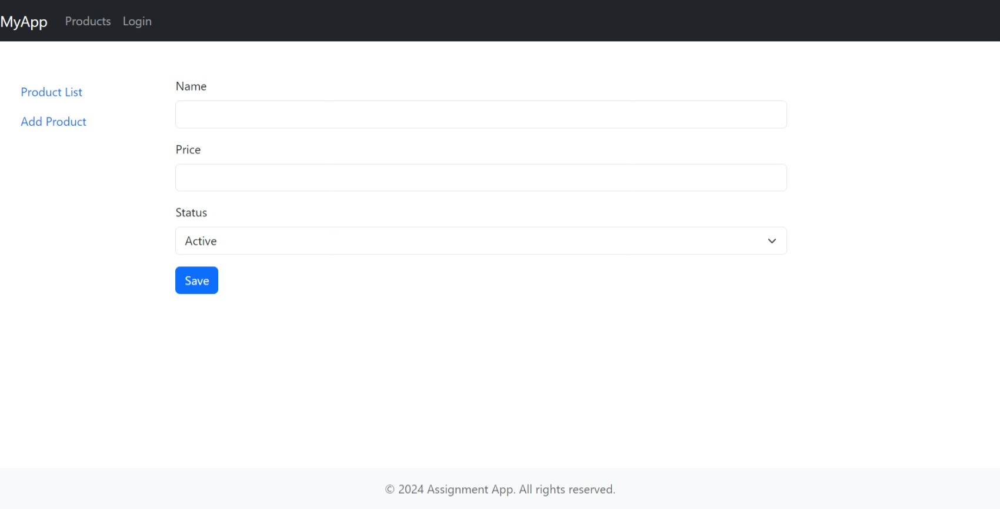
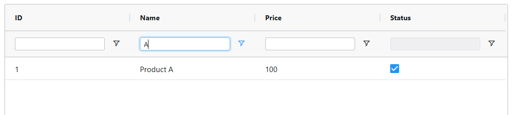

# Angular - Assignment Week 11 Session 1

## 1: Build a Base Project Structure

This is the base project structure for an Angular application that includes modules. The project structure is organized to support scalability, maintainability, and modularity.

```bash
src/app/
│
├── app.config.ts
├── app.routes.ts
│
├── config/
│   └── app.constants.ts
│
├── main/
│   └── components/
│       ├── header/header.component
│       ├── footer/footer.component
│       ├── menu/menu.component
│       └── main/app.component
│
├── models/
│   ├── user.model.ts
│   └── product.model.ts
│
├── pages/
│   ├── auth/
│   │   └── login/login.component.
│   │
│   ├── product/
│   │   ├── product-list/product-list.component
│   │   ├── product-form/product-form.component
│   │   └── product-management/product-management.component
│   │
│   └── home/home.component
│
└── services/
    ├── auth.service.ts
    └── product.service.ts
```

## 2: Demo With "Parent Listens For Child Events"

The parent component listens for events emitted by the child component. In this case, the `ProductListComponent` emits an event when a product is selected, and the `ProductManagementComponent` listens for this event. When a product is selected in the `ProductListComponent`, the `ProductManagementComponent` displays the selected product within the `ProductFormComponent`.

### Product List Component (Child Component)

[product-list.component.html](assignment-app/src/app/pages/product/product-list/product-list.component.html)

```html
<ag-grid-angular
  ...
  (rowClicked)="onRowClicked($event)"
  ... >
</ag-grid-angular>
```

The `ProductListComponent` emits a `rowClicked` event when a row is clicked in the grid. The event contains the selected product.

[product-list.component.ts](assignment-app/src/app/pages/product/product-list/product-list.component.ts)

```typescript
export class ProductListComponent implements OnInit {
  
  @Output() productSelected = new EventEmitter<any>();
  
  onRowClicked(event: any): void {
    this.productSelected.emit(event.data);
  }

  // ...
}
```

The `ProductListComponent` emits the `productSelected` event when a row is clicked in the grid. The event contains the selected product data.

### Product Form Component (Child Component)

[product-form.component.ts](assignment-app/src/app/pages/product/product-form/product-form.component.ts)

```typescript
export class ProductFormComponent implements OnInit {
  @Input() product: any;

  ngOnChanges(changes: SimpleChanges) {
    if (changes['product'] && this.product) {
      this.productForm.patchValue(this.product);
    }
  }

  loadProductData(id: string) {
    this.productService.getProductById(id).subscribe((product: Product) => {
      this.productForm.patchValue(product);
    });
  }

  // ...
}
```

The `ProductFormComponent` receives the selected product data as an input property. When the product data changes, the form is updated with the new product data.

### Product Management Component (Parent Component)

[product-management.component.ts](assignment-app/src/app/pages/product/product-management/product-management.component.ts)

```typescript
export class ProductManagementComponent {
  selectedProduct: any = null;

  onProductSelected(product: any): void {
    this.selectedProduct = product;
  }
}
```

The `ProductManagementComponent` listens for the `productSelected` event emitted by the `ProductListComponent`. When a product is selected, the `selectedProduct` property is updated with the selected product data.

[product-management.component.html](assignment-app/src/app/pages/product/product-management/product-management.component.html)

```html
<div class="row">
  <div class="col-md-8">
    <app-product-list (productSelected)="onProductSelected($event)"></app-product-list>
  </div>
  <div class="col-md-4">
    <app-product-form [product]="selectedProduct"></app-product-form>
  </div>
</div>
```

The `ProductManagementComponent` includes the `ProductListComponent` and `ProductFormComponent`. The `ProductListComponent` emits the `productSelected` event, which is handled by the `onProductSelected` method in the `ProductManagementComponent`. The selected product is then passed to the `ProductFormComponent` as an input property.

## 3: Build Main Component Including Header, Footer, Menu, Router Outlet, etc.

Creating the main layout of the application, which includes the `header`, `footer`, `menu`, and `router outlet`. These components structure the overall layout and navigation of the app.

### Main Component

The main component is the root component of the application. It contains the header, footer, menu, and router outlet components.

[app.component.html](assignment-app/src/app/main/components/main/app.component.html)

```html
<app-header *ngIf="!isLoginPage"></app-header>
<div class="container-fluid">
  <div class="row mt-5">
    <div class="col-md-2">
      <app-menu *ngIf="!isLoginPage"></app-menu>
    </div>
    <div class="col-md-10" [ngClass]="{'col-md-12': isLoginPage}">
      <router-outlet></router-outlet>
    </div>
  </div>
</div>
<app-footer *ngIf="!isLoginPage"></app-footer>
```

The `app-header` component is displayed if the current route is not the login page.
The `app-menu` component is displayed if the current route is not the login page.
The `router-outlet` component is used to display the content of the current route.
The `app-footer` component is displayed if the current route is not the login page.

[app.component.ts](assignment-app/src/app/main/components/main/app.component.ts)

```typescript
@Component({
  selector: 'app-root',
  standalone: true,
  imports: [
    RouterOutlet,
    HeaderComponent,
    MenuComponent,
    FooterComponent,
    CommonModule,
    RouterModule
],
  templateUrl: './app.component.html',
  styleUrl: './app.component.scss'
})
export class AppComponent {
  title = 'assignment-app';

  constructor(public router: Router) { }

  get isLoginPage(): boolean {
    return this.router.url.includes('login');
  }
}
```

The `isLoginPage` property is used to determine if the current route is the login page. It returns `true` if the current route includes 'login'.

### Header Component

The header component includes the navigation bar with links to different part of the applications.

Command to generate the header component:

```bash
ng generate component main/components/header
```

[header.component.html](assignment-app/src/app/main/components/header/header.component.html)

```html
<nav class="navbar navbar-expand navbar-dark bg-dark">
  <a class="navbar-brand" href="#">MyApp</a>
  <button class="navbar-toggler" type="button" data-toggle="collapse" data-target="#navbarNav" aria-controls="navbarNav" aria-expanded="false" aria-label="Toggle navigation">
    <span class="navbar-toggler-icon"></span>
  </button>
  <div class="collapse navbar-collapse" id="navbarNav">
    <ul class="navbar-nav ml-auto">
      <li class="nav-item">
        <a class="nav-link" [routerLink]="['/products']">Products</a>
      </li>
      <li class="nav-item">
        <a class="nav-link" [routerLink]="['/auth/login']">Login</a>
      </li>
    </ul>
  </div>
</nav>
```

The header component contains a navigation bar with links to the `'Products'` page and the `'Login'` page. The links are defined using the `routerLink` directive.

[header.component.ts](assignment-app/src/app/main/components/header/header.component.ts)

```typescript
@Component({
  selector: 'app-header',
  standalone: true,
  imports: [
    CommonModule,
    RouterModule
  ],
  templateUrl: './header.component.html',
  styleUrl: './header.component.scss'
})
export class HeaderComponent {

}
```

### Footer Component

The `FooterComponent` is a simple component that contains footer information.

Command to generate the footer component:

```bash
ng generate component main/components/footer
```

[footer.component.html](assignment-app/src/app/main/components/footer/footer.component.html)

```html
<footer class="footer mt-5 py-3 bg-light">
  <div class="container text-center">
    <span class="text-muted">&copy; 2024 Assignment App. All rights reserved.</span>
  </div>
</footer>
```

[footer.component.ts](assignment-app/src/app/main/components/footer/footer.component.ts)

```typescript
@Component({
  selector: 'app-footer',
  standalone: true,
  imports: [CommonModule],
  templateUrl: './footer.component.html',
  styleUrl: './footer.component.scss'
})
export class FooterComponent { }
```

### Menu Component

The `MenuComponent` contains links to different pages within the application.

Command to generate the menu component:

```bash
ng generate component main/components/menu
```

[menu.component.html](assignment-app/src/app/main/components/menu/menu.component.html)

```html
<nav class="nav flex-column">
  <a class="nav-link" [routerLink]="['/products']">Product List</a>
  <a class="nav-link" [routerLink]="['/products/add']">Add Product</a>
</nav>
```

The menu component contains links to the `'Product List'` page and the `'Add Product'` page. The links are defined using the `routerLink` directive.

[menu.component.ts](assignment-app/src/app/main/components/menu/menu.component.ts)

```typescript
@Component({
  selector: 'app-menu',
  standalone: true,
  imports: [
    CommonModule,
    RouterModule
  ],
  templateUrl: './menu.component.html',
  styleUrl: './menu.component.scss'
})
export class MenuComponent { }
```

### Router Configuration

The router configuration defines the routes for the application.

[app.routes.ts](assignment-app/src/app/app.routes.ts)

```typescript
export const routes: Routes = [
    {
        path: RouterConfig.AUTH.path,
        loadChildren: () =>
            import('./pages/auth/auth.routes')
                .then(m => m.authRoutes)
    },
    {
        path: RouterConfig.PRODUCT.path,
        loadChildren: () =>
            import('./pages/product/product.routes')
                .then(m => m.productRoutes)
    },
    {
        path: RouterConfig.HOME.path,
        component: HomeComponent
    }
];
```

The routes are defined using the `Routes` array. The routes include the authentication routes, product routes, and the home route.

[product.routes.ts](assignment-app/src/app/pages/product/product.routes.ts)

```typescript
export const productRoutes: Routes = [
  { path: '', component: ProductManagementComponent },
  { path: 'add', component: ProductFormComponent},
  { path: 'edit/:id', component: ProductFormComponent },
];
```

The product routes include the following routes:
- The default route displays the `ProductManagementComponent`.
- The `add` route displays the `ProductFormComponent` for adding a new product.
- The `edit/:id` route displays the `ProductFormComponent` for editing an existing product.

[auth.routes.ts](assignment-app/src/app/pages/auth/auth.routes.ts)

```typescript
export const authRoutes: Routes = [
  { path: 'login', component: LoginComponent }
];
```

The authentication routes include the `login` route, which displays the `LoginComponent`.

### Screenshots



## 4: Build UI Pages for Product Management

The UI pages for product management include the product list, product form, and product management components.

[Product Form Component](assignment-app/src/app/pages/product/product-form)

The `product form` component is used to add or edit product details. It includes form fields for entering product information such as `name`, `price`, and `status`.

[Product List Component](assignment-app/src/app/pages/product/product-list)

The `product list` component displays a list of products in a grid format. Each row in the grid represents a product, and the user can click on a row to select a product.

[Product Management Component](assignment-app/src/app/pages/product/product-management)

The product management component includes the `product list` and `product form` components. It listens for events emitted by the `product list` component and updates the `product form` component with the selected product data.

### Screenshots





