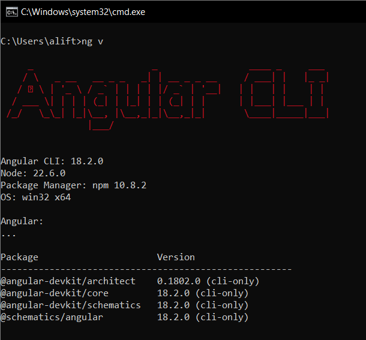

# Angular - Assignment Week 11

`Angular` is a web framework that empowers developers to build fast, reliable applications. This guide will provide the information about the steps to get started with `Angular`, explain the structure of an `Angular` project, dive into component lifecycles, and explore the differences between standalone and non-standalone applications. Finally, we'll demonstrate how to create a fully functional login component using Bootstrap in a standalone `Angular` application.

## Setup Environment and Install

Steps to get started with Angular.

1. **Install Node.js and npm**:
    Angular requires `Node.js` and `npm` (Node Package Manager). Download and install the latest version from [nodejs.org](https://nodejs.org/).

    

2. **Install Angular CLI**:
    To install the Angular CLI globally (not in just some directory), run the following command.

    ```bash
    npm install -g @angular/cli
    ```

    

3. **Create a New Angular App Project**:
    To create the angular app project, run the following commant.

    ```bash
    ng new my-angular-app
    ```

4. **Navigate to the Project Directory**:
    Change the directory to the new angular app directory.

    ```bash
    cd my-angular-app
    ```

5. **Run the Development Server**:

    ```bash
    ng serve
    ```

    The app will be accessible at `http://localhost:4200`.

## Structure [https://github.com/helenhash/angular-demo](https://github.com/helenhash/angular-demo)

This is the detailed overview of that Angular project structure.

in that md file, change the ## Code and Folder Structure section to this (including the indentation):

- **src**:  
  Contains the main source code for the Angular application.

- **src/app**:  
  The core directory for the Angular application, where all components, services, and modules reside.

- **src/app/app.component.html**:  
  The HTML template for the root component, defining the structure and layout of the main application view.

- **src/app/app.component.css**:  
  The CSS file associated with the root component, providing styles specific to the `app.component.html`.

- **src/app/app.component.spec.ts**:  
  The unit test file for the root component, containing Jasmine tests to verify component behavior.

- **src/app/app.component.ts**:  
  The TypeScript file for the root component, handling the logic, data, and interaction with the template.

- **src/app/app.config.ts**:  
  Configuration file contain application-wide settings or initialization logic for the app.

- **src/app/app.routes.ts**:  
  Defines the application's routes, mapping URLs to specific components for navigation.

- **src/app/customer/customer.component.html**:  
  The HTML template for the `CustomerComponent` for displaying customer-related information.

- **src/app/customer/customer.component.scss**:  
  The SCSS (Sassy CSS) file for the `CustomerComponent`, allowing for more advanced styling.

- **src/app/customer/customer.component.spec.ts**:  
  The unit test file for the `CustomerComponent`.

- **src/app/customer/customer.component.ts**:  
  The TypeScript file for the `CustomerComponent`, containing the logic and data handling for customer views.

- **src/app/models**:  
  A directory where data models are defined, a TypeScript interfaces or classes to represent data structures.

- **src/app/models/customer.model.ts**:  
  A TypeScript file defining the data model for a customer.

- **src/app/services**:  
  A directory for services, containing classes that handle business logic, data fetching, and communication with APIs.

- **src/app/services/customer.service.ts**:  
  A service file that provides methods to interact with customer data.

- **src/favicon.ico**:  
  The favicon file for the application, representing the small icon shown in the browser tab.

- **src/index.html**:  
  The main HTML file that loads the Angular application. Includes the base structure and references to scripts and styles.

- **src/main.ts**:  
  The entry point for the Angular application, bootstrapping the root module and starting the app.

- **src/style.css**:  
  The global stylesheet for the application, applying styles across all components unless overridden by component-specific styles.

- **.editorconfig**:  
  A configuration file for defining and maintaining consistent coding styles between different editors and IDEs.

- **angular.json**:  
  The main configuration file for Angular CLI, defining how the project is built, tested, and served.

- **db.json**:  
  A file that might be used for mock data or a JSON database, often used with tools like `json-server` for local development.

- **package-lock.json**:  
  A file automatically generated by npm that records the exact versions of installed dependencies, ensuring consistent installs across environments.

- **package.json**:  
  Contains metadata about the project, including dependencies, scripts, and other configuration options for npm.

- **tsconfig.app.json**:  
  The TypeScript configuration file specific to the application code, excluding tests.

- **tsconfig.json**:  
  The base TypeScript configuration file, defining how TypeScript compiles the project.

- **tsconfig.spec.json**:  
  The TypeScript configuration file for the test files, ensuring proper compilation and support for testing frameworks.


## Component Lifecycle

A component lifecycle in Anguler is the sequence of steps that happen between the component's creation and its destruction. Each step representas a different part of Angular's process for rendering components and checking them for updates over time.

| Phase | Method | Summary |
| --- | --- | --- |
| Creation | `constructor` | Runs when Angular instantiates the component. | 
| Change Detection | `ngOnInit` | Runs once after Angular has initialized all the component's inputs. |
| | `ngOnChanges` | Runs every time the component's inputs have changed. |
| | `ngDoCheck` | Runs every time this component is checked for changes. |
| | `ngAfterContentInit` | Runs once after the component's content has been initialized. |
| | `ngAfterContentChecked` | Runs every time this component content has been checked for changes. |
| | `ngAfterViewInit` | Runs once after the component's view has been initialized. |
| | `ngAfterViewChecked` | Runs every time the component's view has been checked for changes. |
| Rendering	| `afterNextRender` | Runs once the next time that all components have been rendered to the DOM. |
| | `afterRender` | Runs every time all components have been rendered to the DOM. | 
| Destruction | `ngOnDestroy` | Runs once before the component is destroyed. |

## Comparison: Standalone vs Non-Standalone Applications

Angular offers two approaches for structuring the application, `standalone` and `non-standalone`.

| Feature/Aspect                      | Standalone Application                            | Non-Standalone Application                           |
|-------------------------------------|---------------------------------------------------|-----------------------------------------------------|
| **Main Structure**                  | No `AppModule`, components are self-contained     | Requires `AppModule` to manage components and services |
| **Component Declaration**           | Declared directly within the component itself     | Declared in the `declarations` array of NgModules    |
| **Service Provision**               | Services provided directly in the component       | Services provided in NgModules or via `@Injectable`  |
| **Bootstrap Process**               | Focuses on a single root component                | Uses `AppModule` to bootstrap the application        |
| **Module Dependency Management**    | No need for NgModules; dependencies are handled individually within each component | Dependencies are managed through NgModules           |
| **Reuse of Components**             | Components can be reused independently across projects | Components typically tied to their module dependencies |
| **Performance**                     | Potentially faster due to reduced module overhead  | Standard performance with more module processing     |
| **Configuration Complexity**        | Lower configuration complexity                    | Higher configuration complexity due to multiple modules |
| **Flexibility**                     | Highly flexible and modular                       | Less flexible; relies on modular structure           |
| **Scalability**                     | Suitable for smaller projects or micro frontends  | Well-suited for large, complex applications          |
| **Use Case**                        | Ideal for small apps or standalone components     | Ideal for large-scale enterprise applications        |

### Why we should use standalone type?

Standalone applications in Angular offer several benefits and advantages over the non-standalone or traditional module-based approach. The following are the advantages of the standalone type:

1. **Simplified Architecture**: Standalone components reduce the need for NgModules, simplifying the codebase and making it easier to understand.
2. **Improved Performance**: Reduces the overhead of module processing, leading to faster load times.
3. **Enhanced Flexibility**: Standalone components can be used independently, making them more reusable across different projects.

#### Files and Configuration

**Standalone Components**:

- **Component Declaration**: Standalone components use the `standalone: true` property in  @Component, meaning that's no need to be declared in an NgModule.
- **Imports**: Standalone components directly import other components, directives, or pipes they rely on.

```ts
// header.component.ts
import { Component } from '@angular/core';
import { CommonModule } from '@angular/common';

@Component({
  selector: 'app-header',
  standalone: true,
  imports: [CommonModule],
  templateUrl: './header.component.html',
  styleUrls: ['./header.component.css']
})
export class HeaderComponent { }
```

**Non-Standalone Components**:

- **Component Declaration**: Non-standalone components are declared in an `NgModule`, means that is part of a module and rely on the module for their dependencies.
- **Imports**: Modules import other modules, and components within that modules can use the declarations and providers.

```ts
// header.component.ts
import { Component } from '@angular/core';

@Component({
  selector: 'app-header',
  templateUrl: './header.component.html',
  styleUrls: ['./header.component.css']
})
export class HeaderComponent { }

// app.module.ts
import { NgModule } from '@angular/core';
import { CommonModule } from '@angular/common';
import { HeaderComponent } from './header/header.component';

@NgModule({
  declarations: [HeaderComponent],
  imports: [CommonModule],
  exports: [HeaderComponent]
})
export class AppModule { }
```

#### Configuration

**Standalone Application**:

- **App Configuration**: The `app.config.ts` file is used to configure the application.

```ts
// app.config.ts
import { provideHttpClient } from '@angular/common/http';
import { ApplicationConfig } from '@angular/core';

export const appConfig: ApplicationConfig = {
  providers: [
    provideHttpClient(),
    // other providers
  ],
};
```

**Non-Standalone Application (Module-Based)**:

- **App Configuration**: This is the root module of the Angular application. It declares the components, imports other modules, and sets up the dependency injection system.
- **Structure**: This module imports other feature modules and provides a place to bootstrap the root component.

```ts
// app.module.ts
import { NgModule } from '@angular/core';
import { BrowserModule } from '@angular/platform-browser';
import { AppComponent } from './app.component';
import { AppRoutingModule } from './app-routing.module';

@NgModule({
  declarations: [AppComponent],
  imports: [BrowserModule, AppRoutingModule],
  bootstrap: [AppComponent],
})
export class AppModule { }
```

#### Code Usage

**Standalone Components**:

- **Usage**: It can directly import and use standalone components without an NgModule.
- **Bootstrap**: Standalone components can directly bootstrapped in an Angular application.

```ts
// app.component.ts
import { Component } from '@angular/core';
import { HeaderComponent } from './components/header/header.component';

@Component({
  selector: 'app-root',
  standalone: true,
  imports: [HeaderComponent],
  template: `
    <app-header></app-header>
    <router-outlet></router-outlet>
  `,
  styleUrls: ['./app.component.css']
})
export class AppComponent { }
```

## Create a 'Login' Component

In this section, I'll create a new Angular project called `assignment-app`, create a `Login` component with Bootstrap, using `Bootstrap` as CSS framework for styling, and mock the backend using `json-server` to validate user credentials. Upon successful login, the user will be redirected to a home page displaying a "Welcome" message.


1. Create the project.
    
    Using CLI:

    ```bash
    ng new assignment-app
    ```

    and move to the created project directory:

    ```bash
    cd assignment-app
    ```

2. Install `Bootstrap`, `json-server`, and `rxjs`.

    Install `Bootstrap` via npm:

    ```bash
    npm install bootstrap
    ```

    Install `json-server` vua npm, the `--save-dev` is used to install a package as a development dependency.:

    ```bash
    npm install json-server --save-dev
    ```

    Install `rxjs` via npm:

    ```bash
    npm install rxjs
    ```


3. Configure Bootstrap

    Including `Bootstrap` in the Angular project by modifying `angular.json`:

    ```json
    "styles": [
        "node_modules/bootstrap/dist/css/bootstrap.min.css",
        "src/styles.css"
    ],
    ```

4. Set Up json-server

    Create a `db.json` file in the root directory of the project to mock the data.

    ```json
    {
        "users": [
            { "id": 1, "username": "admin", "password": "admin" }
        ]
    }
    ```

    Add a script to the `package.json` to start the `json-server`.

    ```json
    "scripts": {
        "start": "ng serve",
        "json-server": "json-server --watch db.json --port 3000"
    }
    ```

    Start the `json-server` in the different terminal.

    ```bash
    npm run json-server
    ```

5. Generate the Auth Service

    Generate a `Auth` service using Angular CLI:

    ```bash
    ng generate service auth --path=src/app/services
    ```

6. Implement the Auth Service

    Implement the Auth service in `auth.service.ts` file:

    ```ts
    import { HttpClient } from '@angular/common/http';
    import { Injectable } from '@angular/core';
    import { map, Observable } from 'rxjs';
    import { User } from '../models/user.model';

    const baseUrl = 'http://localhost:3000/users';

    @Injectable({
      providedIn: 'root'
    })
    export class AuthService {

      constructor(private http: HttpClient) {}

      login(username: string, password: string): Observable<boolean> {
        return this.http.get<User[]>(baseUrl, {
          params: {
            username,
            password
          }
        }).pipe(
          map( users => users.length > 0)
        );
      }
    }
    ```

    This `AuthService` uses `HttpClient` to send a `GET` request to a server, checking if a user with `username` and `password` exists in the users endpoint. The login method returns an `Observable<boolean>` that `true` if a matching user is found or `false` otherwise.

7. Generate the Login Component

    Generate a `Login` component using Angular CLI:

    ```bash
    ng generate component login
    ```

8. Implement Login View

    Open `src/app/login/login.component.html` and add the code:

    ```html
    <div class="container mt-5">
      <h2>Login</h2>
      <form (ngSubmit)="onSubmit()">
        <div class="mb-3">
          <label for="username" class="form-label">Username</label>
          <input type="text" class="form-control" id="username" [(ngModel)]="username" name="username" required>
        </div>
        <div class="mb-3">
          <label for="password" class="form-label">Password</label>
          <input type="password" class="form-control" id="password" [(ngModel)]="password" name="password" required>
        </div>
        <button type="submit" class="btn btn-primary">Sign In</button>
      </form>
      <p class="mt-3">{{ message }}</p>
      <p class="mt-3">Don't have an account? <a href="#">Sign up</a></p>
    </div>
    ```

    The `[(ngModel)]` directive is used for two-way data binding, linking the `username` and `password` input fields to the `username` and `password` properties in the component class. Any changes in the input fields immediately update the corresponding properties, and vice versa. The form's `ngSubmit` directive is bound to the `onSubmit()` method, which is triggered when the form is submitted. The `{{ message }}` in the `<p>` tag dynamically displays the value of the `message` property from the component.

9. Implement Login Logic

    Open src/app/login/login.component.ts and implement the login logic:

    ```ts
    import { CommonModule } from '@angular/common';
    import { Component, OnInit } from '@angular/core';
    import { FormsModule } from '@angular/forms';
    import { Router, RouterLink } from '@angular/router';
    import { AuthService } from '../services/auth.service';

    @Component({
      selector: 'app-login',
      standalone: true,
      imports: [
        CommonModule,
        FormsModule,
        RouterLink
      ],
      templateUrl: './login.component.html',
      styleUrl: './login.component.scss'
    })
    export class LoginComponent implements OnInit {
      username: string = '';
      password: string = '';
      message: string = '';

      constructor(
        private router: Router,
        private authService: AuthService
      ) {}

      ngOnInit() {}
      
      onSubmit(): void {
        this.authService.login(this.username, this.password).subscribe({
          next: (success) => {
            if (success) {
              this.router.navigate(['/home']);
            } else {
              this.message = 'Invalid username or password';
            }
          },
          error: (error) => {
            this.message = 'An error occurred';
          }
        });
      }
    }
    ```

    This code and file handles the login funcitonality corresponding to the `login` view. The component imports Angular modules, that is `CommonModule`, `FormsModule`, and `RouterLink`, and injects `Router` and `AuthService` via the constructor. It initializes `username`, `password`, and `message` properties, that connect to the template using two-way data binding and interpolation. The `onSubmit()` method is triggered when the form is submitted, it calls the `login()` method from the `AuthService` with the entered credentials. If the login is successful, the user is navigated to the `/home` route, otherwise, an error message is displayed in the `message` property.

10. Set Up Routing.

    To handle navigation, set up routing in `src/app/app.routes.ts`:

    ```ts
    export const routes: Routes = [
    {path: '', component: LoginComponent},
    {path: 'home', component: HomeComponent}
    ];
    ```

11. App Config

    Add the `provideHttpClient()` in app.config.ts to inject the `HttpClient` that used in the component.

    ```ts
    export const appConfig: ApplicationConfig = {
      providers: [provideZoneChangeDetection({ eventCoalescing: true }), provideRouter(routes), provideClientHydration(), provideHttpClient()]
    };
    ```

12. Run The App

    via npm:

    ```bash
    npm start
    ```

    via Angular CLI:
    
    ```bash
    ng serve
    ```

### Screenshot

- Login Page
  

- Success Login To Home
  

- Failed Login Message
  