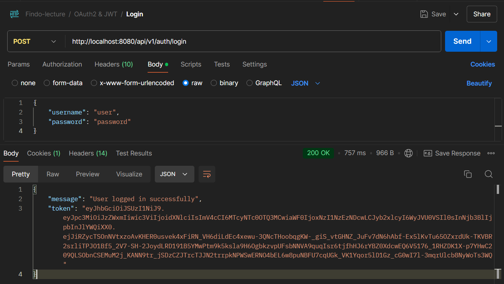
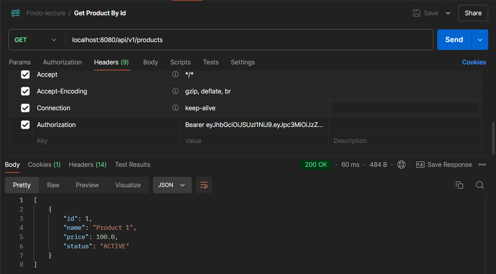
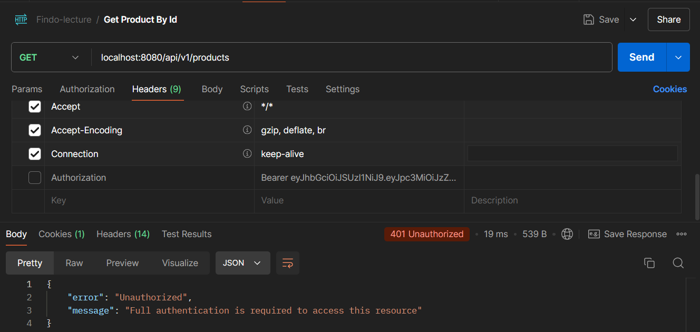
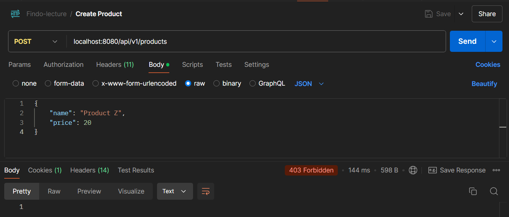
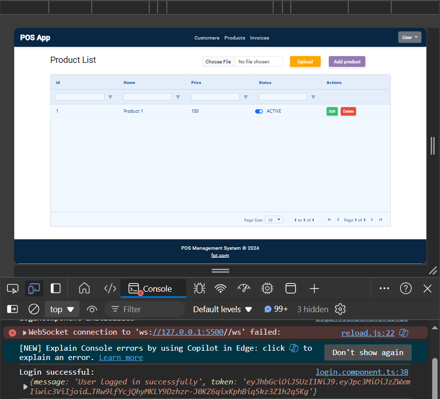

# OAuth2 with JWT Authentication in Spring Boot and Angular

Assignment 1 Lecture 25 Week 13.

## Overview

This project demonstrates the implementation of `OAuth2 authentication` with `JWT` in `Spring Boot` application (version `3.x`) with `Spring Security` (version `6.x`). The project also includes an `Angular` application (version `18.x`) to interact with the secured backend.

## **Information**

The official Spring blog has announced that the `Spring Security OAuth` and `Spring Security OAuth Boot 2 auto-configurations` have reached end of life or `deprecated`. 

\
Information: [https://spring.io/blog/2022/06/01/spring-security-oauth-reaches-end-of-life](https://spring.io/blog/2022/06/01/spring-security-oauth-reaches-end-of-life)

> **Spring Security OAuth reaches End-of-Life**.

> The Spring Security OAuth and Spring Security OAuth Boot 2 auto-configuration projects have reached end of life.
> The Spring Security OAuth project has been replaced by the Client and Resource Server support provided by Spring Security and the Authorization Server support provided by Spring Authorization Server.

In `Spring Security 6.x,` the configuration for `OAuth2` `authorization server` and `resource server` has changed. Both are now configured within the `SecurityFilterChain` bean. The previous separate configurations for authorization and resource servers have been unified.

## Notes

The `password` grant type has been deprecated in Spring Security 6.x. In this project, the `password` grant type is required, it will need to customize its usage.

## Table of Contents

### Spring Boot Application

1. [Asymmetric Key Pair](#1-asymmetric-key-pair)
2. [Security Configuration (Authorization Server and Resource Server)](#2-security-configuration-authorization-server-and-resource-server)
3. [Authentication Controller](#3-authentication-controller)
4. [Authentication Service](#4-authentication-service)
5. [User Details Service](#5-user-details-service)
6. [RSA Key Configuration](#6-rsa-key-configuration)
7. [Pre Authorize Product Controller](#7-pre-authorize-product-controller)
8. [User Entity](#8-user-entity)
9. [Auth User](#9-auth-user)

### Angular Application

1. [Authentication Service](#1-authentication-service)
2. [Product Service](#2-product-service)

### Screenshot

1. [POSTMAN](#1-postman)
2. [Angular](#2-angular)

## **Spring Boot Application**

### 1. Asymmetric Key Pair

The project uses an `asymmetric key pair` to sign and verify the `JWT` tokens. The `private key` is used to sign the token, and the `public key` is used to verify the token.

The `private key` and `public key` are stored in the `resources` folder of the `Spring Boot` application, the key is generated using `openssl`.

File:
- [private-key.pem](spring/product_application/src/main/resources/certs/private-key.pem)
- [public-key.pem](spring/product_application/src/main/resources/certs/public-key.pem)

### 2. Security Configuration (Authorization Server and Resource Server)

[SecurityConfig.java](spring/product_application/src/main/java/com/fsoft/product_application/config/SecurityConfig.java)

The `Security Configuration` class configures the `OAuth2` `authorization server` and `resource server` within the `SecurityFilterChain` bean.

```java
@Configuration
@EnableWebSecurity
@EnableMethodSecurity
public class SecurityConfig { ... }
```

`@EnableWebSecurity` enables `Spring Security` for the application. `@EnableMethodSecurity` enables `method-level security` with `@PreAuthorize` and `@Secured` annotations.

```java
@Bean
public SecurityFilterChain securityFilterChain(HttpSecurity http, HandlerMappingIntrospector introspector) throws Exception {
    return http
            .csrf(csrf -> {
                csrf.disable(); // Disables CSRF protection
            })
            .authorizeHttpRequests(auth -> {
                auth.requestMatchers("/error/**").permitAll(); // Allows access to error endpoints
                auth.requestMatchers("/api/v1/auth/**").permitAll(); // Allows access to auth endpoints
                auth.anyRequest().authenticated(); // Requires authentication for all other endpoints
            })
            .exceptionHandling(exceptions -> exceptions
                    .authenticationEntryPoint((request, response, authException) -> {
                        response.setContentType("application/json");
                        response.setStatus(HttpServletResponse.SC_UNAUTHORIZED);
                        response.getWriter().write("{\"error\": \"Unauthorized\", \"message\": \"" + authException.getMessage() + "\"}");
                    })
            )
            .cors(cors -> cors.configurationSource(request -> {
                CorsConfiguration corsConfig = new CorsConfiguration();
                corsConfig.setAllowedOrigins(Collections.singletonList("http://localhost:4200")); // Allows CORS from Angular frontend
                corsConfig.setAllowedMethods(Arrays.asList("GET", "POST", "PUT", "DELETE", "OPTIONS"));
                corsConfig.setAllowedHeaders(Arrays.asList("*"));
                corsConfig.setAllowCredentials(true);
                return corsConfig;
            }))
            .sessionManagement(s -> s.sessionCreationPolicy(SessionCreationPolicy.STATELESS)) // Sets session management to stateless
            .oauth2ResourceServer(oauth2 -> oauth2.jwt((jwt) -> jwt.decoder(jwtDecoder()))) // Configures JWT decoder
            .userDetailsService(userDetailsService) // Configures custom user details service
            .httpBasic(Customizer.withDefaults())
            .build();
}
```

The `SecurityFilterChain` bean configures the `HTTP security` for the application. The configuration includes:

- `csrf.disable()` Disables `CSRF` protection.
- `authorizeHttpRequests()` Sets up access rules for the application endpoints. Public access is allowed for `/api/v1/auth/**` and `/error/**` endpoints. All other endpoints require authentication.
- `exceptionHandling()` Configures the `authenticationEntryPoint` to handle unauthorized requests.
- `cors.configurationSource()` Configures `CORS` for the application. Allows `CORS` from the `Angular` frontend.
- `sessionManagement()` Sets the session management to `stateless`.
- `oauth2ResourceServer()` Configures JWT-based authentication for OAuth2 resource server functionality.
- `userDetailsService()` Configures the custom user details service.
- `httpBasic()` Configures `HTTP Basic` authentication with default settings.

```java
@Bean
public JwtDecoder jwtDecoder() {
    return NimbusJwtDecoder.withPublicKey(rsaKeyConfigProperties.publicKey()).build();
}
```

The `jwtDecoder()` method configures the `JWT decoder` with the `public key` for verifying the `JWT` tokens using the `NimbusJwtDecoder`.

```java
@Bean
JwtEncoder jwtEncoder() {
    JWK jwk = new RSAKey.Builder(rsaKeyConfigProperties.publicKey())
            .privateKey(rsaKeyConfigProperties.privateKey())
            .build();

    JWKSource<SecurityContext> jwks = new ImmutableJWKSet<>(new JWKSet(jwk));

    return new NimbusJwtEncoder(jwks);
}
```

The `jwtEncoder()` method configures the `JWT encoder` with the `public key` and `private key` for signing the `JWT` tokens.

`RSAKey.Builder` is used to build a `JWK` object with the `public key` and `private key`. The `NimbusJwtEncoder` is created with the `JWKSource` object to encode the `JWT` tokens.

```java
@Bean
public AuthenticationManager authenticationManager() {
    var authProvider = new DaoAuthenticationProvider();
    authProvider.setUserDetailsService(userDetailsService);
    authProvider.setPasswordEncoder(passwordEncoder());
    return new ProviderManager(authProvider);
}
```

The `authenticationManager()` method configures the `authentication manager` with the custom `userDetailsService` and `passwordEncoder`.

```java
@Bean
public PasswordEncoder passwordEncoder() {
    return new BCryptPasswordEncoder();
}
```

The `passwordEncoder()` method configures the `BCryptPasswordEncoder` for encoding passwords.

### 3. Authentication Controller

[AuthenticationController.java](spring/product_application/src/main/java/com/fsoft/product_application/controller/AuthController.java)

The `Authentication Controller` class provides endpoints for user authentication and token generation.

```java
@PostMapping("/login")
public ResponseEntity<?> login(@RequestBody AuthDto.LoginRequest userLogin) throws IllegalAccessException {
    Authentication authentication =
            authenticationManager
                    .authenticate(new UsernamePasswordAuthenticationToken(
                            userLogin.username(),
                            userLogin.password()
                    ));

    SecurityContextHolder.getContext().setAuthentication(authentication);

    AuthUser userDetails = (AuthUser) authentication.getPrincipal();

    log.info("Token requested for user : {}", authentication.getAuthorities());
    String token = authService.generateToken(authentication);

    AuthDto.Response response = new AuthDto.Response("User logged in successfully", token);

    return ResponseEntity.ok(response);
}
```

The `login()` method authenticates the user with the provided username and password. If the authentication is successful, a `JWT` token is generated using the `authService` and returned in the response.

The `authenticationManager.authenticate()` method is used to authenticate the user with the provided credentials. The `generateToken()` method in the `authService` generates a `JWT` token for the authenticated user.

### 4. Authentication Service

[AuthenticationService.java](spring/product_application/src/main/java/com/fsoft/product_application/service/AuthService.java)

The `Authentication Service` class provides methods for generating `JWT` tokens and validating user credentials.

```java
public String generateToken(Authentication authentication) {
    Instant now = Instant.now();

    Set<String> scope = authentication.getAuthorities()
            .stream()
            .map(GrantedAuthority::getAuthority)
            .flatMap(role -> {
                if (role.equals("ADMIN")) return Stream.of("read", "write");
                return Stream.of("read");
            })
            .collect(Collectors.toSet());

    Set<String> authorities = authentication.getAuthorities()
            .stream()
            .map(GrantedAuthority::getAuthority)
            .collect(Collectors.toSet());

    JwtClaimsSet claims = JwtClaimsSet.builder()
            .issuer("self")
            .issuedAt(now)
            .expiresAt(now.plus(10, ChronoUnit.HOURS))
            .subject(authentication.getName())
            .claim("roles", authorities)
            .claim("scope", scope)
            .build();

    return jwtEncoder.encode(JwtEncoderParameters.from(claims)).getTokenValue();
}
```

The `generateToken()` method creates a `JWT` token for the authenticated user. The method constructs the `JWT` claims set with the required information such as issuer, subject, expiration time, roles, and scope. The `jwtEncoder.encode()` method is used to encode the `JWT` token with the claims set.

### 5. User Details Service

[UserDetailsServiceImpl.java](spring/product_application/src/main/java/com/fsoft/product_application/service/JpaUserDetailsService.java)

The `User Details Service` class provides the user details for authentication.

```java
@Override
public UserDetails loadUserByUsername(String username) throws UsernameNotFoundException {
    return userRepository
            .findByUsername(username)
            .map(AuthUser::new)
            .orElseThrow(() -> new UsernameNotFoundException("User not found"));
}
```

The `loadUserByUsername()` method loads the user details by username from the `userRepository`.

### 6. RSA Key Configuration

[RsaKeyConfigProperties.java](spring/product_application/src/main/java/com/fsoft/product_application/config/RsaKeyConfigProperties.java)

The `RSA Key Configuration` class provides the `public key` and `private key` for signing and verifying the `JWT` tokens.

```java
@ConfigurationProperties(prefix = "rsa")
public record RsaKeyConfigProperties(RSAPublicKey publicKey, RSAPrivateKey privateKey) {
}
```

### 7. Pre Authorize Product Controller

[ProductController.java](spring/product_application/src/main/java/com/fsoft/product_application/controller/ProductController.java)

The `Product Controller` class provides endpoints for managing products. The endpoints are secured with `@PreAuthorize` annotations to restrict access based on user roles.

```java
@RestController
@RequestMapping("/api/v1/products")
@CrossOrigin(origins = "http://localhost:4200")
public class ProductController {

    // ...

    @GetMapping("/{id}")
    @PreAuthorize("hasAuthority('read')")
    public ResponseEntity<Product> getProductById(@PathVariable("id") Long id) {
        return productService.getProductById(id)
                .map(ResponseEntity::ok)
                .orElse(ResponseEntity.notFound().build());
    }

    @PostMapping
    @PreAuthorize("hasAuthority('write')")
    public ResponseEntity<Product> createProduct(@RequestBody Product product) {
        return ResponseEntity.ok(productService.createProduct(product));
    }

    // ...
}
```

The `@PreAuthorize` annotation is used to restrict access to the `getProductById()` and `createProduct()` methods based on the user's roles. The `read` and `write` authorities are required to access these methods.

### 8. User Entity

[User.java](spring/product_application/src/main/java/com/fsoft/product_application/model/User.java)

The `User Entity` class represents the user entity in the database.

```java
@Data
@Entity
@AllArgsConstructor
@NoArgsConstructor
@Table(uniqueConstraints = {@UniqueConstraint(columnNames = "email")})
public class User {
    @Id
    @GeneratedValue(strategy = GenerationType.UUID)
    @Column(unique = true)
    private String userId;

    @Column(name = "user_name", unique = true)
    @NonNull
    private String username;

    @Column(name = "email", unique = true)
    @NonNull
    private String email;

    @NonNull
    @JsonIgnore
    private String password;

    @ElementCollection(fetch = FetchType.EAGER)
    @CollectionTable(name = "user_roles", joinColumns = @JoinColumn(name = "user_id"))
    @Column(name = "role")
    private Set<String> roles = new HashSet<>();
}
```

The `User` class represents the user entity in the database. The class includes fields for `userId`, `username`, `email`, `password`, and `roles`. The `roles` field is a set of user roles.

### 9. Auth User

[AuthUser.java](spring/product_application/src/main/java/com/fsoft/product_application/model/AuthUser.java)

The `Auth User` class extends the `User` class and implements the `UserDetails` interface to provide user details for authentication.

```java
@AllArgsConstructor
public class AuthUser extends User implements UserDetails {

    private final User user;

    @Override
    public Collection<? extends GrantedAuthority> getAuthorities() {
        return user.getRoles().stream()
                .map(SimpleGrantedAuthority::new)
                .collect(Collectors.toSet());
    }

    @Override
    public boolean isEnabled() {
        return true;
    }

    @Override
    public boolean isCredentialsNonExpired() {
        return true;
    }

    @Override
    public boolean isAccountNonLocked() {
        return true;
    }

    @Override
    public boolean isAccountNonExpired() {
        return true;
    }

    @Override
    public String getUsername() {
        return user.getUsername();
    }

    @Override
    public String getPassword() {
        return user.getPassword();
    }
}
```

The `AuthUser` class extends the `User` class and implements the `UserDetails` interface. The class provides user details for authentication, including authorities, username, and password.

## **Angular Application**

### 1. Authentication Service

The `Authentication Service` class provides methods for user authentication and token management.

```typescript
@Injectable({
  providedIn: 'root'
})
export class AuthService { 
    private authApiUrl = 'http://localhost:8080/api/v1/auth';
    private tokenCookieName = 'jwt_token';

    // ...
}
```

The `AuthService` class provides methods for user authentication and token management. The class includes methods for login, logout, and token management.

```typescript
login(username: string, password: string): Observable<any> {
    const headers = new HttpHeaders({ 'Content-Type': 'application/json' });
    const body = { username, password };

    return this.http.post<LoginResponse>(`${this.authApiUrl}/login`, body, { headers }).pipe(
      tap(response => {
        if (response && response.token) {
          this.storeTokenInCookie(response.token);
        }
      })
    )
}
```

The `login()` method sends a `POST` request to the authentication endpoint with the user's credentials. If the response contains a token, the token is stored in a cookie.

```typescript
storeTokenInCookie(token: string): void {
    const expirationTime = new Date();
    expirationTime.setHours(expirationTime.getHours() + 10);

    this.cookieService.set(this.tokenCookieName, token, expirationTime, '/');
}
```

The `storeTokenInCookie()` method stores the token in a cookie with an expiration time of 10 hours.

```typescript
getToken(): string | null {
    return this.cookieService.get(this.tokenCookieName);
}

getUsername(): string | null {
    const token = this.getToken();
    if (token) {
      try {
        const decoded: any = jwtDecode(token);
        return decoded.sub;
      } catch (error) {
        return null;
      }
    }
    return null;
}

  checkCredentials(): void {
    if (!this.getToken()) {
      this.router.navigate(['/login']);
    }
}
```

The `getToken()` method retrieves the token from the cookie. The `getUsername()` method decodes the token and retrieves the username from the token. The `checkCredentials()` method checks if the user is authenticated and redirects to the login page if not.

```typescript
logout(): void {
    this.cookieService.delete(this.tokenCookieName, '/');
}
```

The `logout()` method deletes the token from the cookie.

### 2. Product Service

The `Product Service` class provides methods for interacting with the product API.

```typescript
@Injectable({
  providedIn: 'root'
})
export class ProductService {
  constructor(private http : HttpClient, private authService : AuthService) {}

  // ...
}
```

The `ProductService` class provides methods for interacting with the product API. The class includes methods for getting products, creating products, and handling errors.

```typescript
getAll(): Observable<Product[]> {
    const headers = new HttpHeaders({ 'Authorization': `Bearer ${this.authService.getToken()}` });
    return this.http.get<any>(baseUrl, { headers }).pipe(
      map(response => response)
    );
}
```

The `getAll()` method sends a `GET` request to the product API to retrieve all products. The request includes the `Authorization` header with the `JWT` token.

## **Screenshot**

### 1. POSTMAN

- POSTMAN Login Get Token
    
- POSTMAN Get All Product With Authorization
    
- POSTMAN Unauthorized Get All Product Because No Authorization
    
- POSTMAN Unauthorized POST Product Because Pre Authorize Scope In Controller
    

### 2. Angular

- Angular Login Successfully and Access Product
    