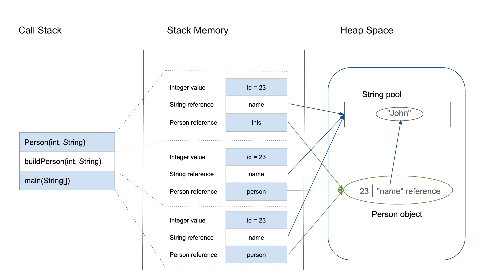

# Explain previous slice as slice 6 (stack & heap).

Memory management is a aspect for storing data and managing the execution of programs. In this section will explain about the `stack` and `heap` memory.

1. **Stack**

    The `stack` memory stores data in a last-in first-out (LIFO). It used for static memory allocation and manages the execution of threads. Also, it stores `method calls`, `local variables`, and `reference variables`​. When a method is called, a new block or `stack frame` that contains the method's local variables, parameters, and the return address will created on the top of the `stack`.

    The `stack` stores primitive data types, like `int`, `char`, and `float`, also it store references to `objects` but not the object themselves.

2. **Heap**

    The `heap` memory used for dynamic memory allocation. It stores objects and arrays. It stores `objects` and `arrays` that are created during the execution of the program. The `heap` is much larger and more complex than the `stack`. It need a `garbage collection`. The `garbage collection` reclaims memory occupied by `objects` that are no longer in use.

    All `objects` in Java are stored in the `heap` memory, including instances of `classes`, `arrays`, and other reference data types.

\
**Stack & Heap**



```java
class Person {
    int id;
    String name;

    public Person(int id, String name) {
        this.id = id;
        this.name = name;
    }
}

public class PersonBuilder {
    private static Person buildPerson(int id, String name) {
        return new Person(id, name);
    }

    public static void main(String[] args) {
        int id = 23;
        String name = "John";
        Person person = null;
        person = buildPerson(id, name);
    }
}
```

When entering the `main()` method, the `stack` memory allocates some space to store the primitive variavles and references of this method. The primitive value of integer `id` is stored directly in the `stack` memory. The reference variable `person` of type `Person` is also created in the `stack` memory and this variable will point to the actual `Person` object in the `heap`.

Then, when the `main()` method calls the constructor with parameter `Person(int, String)`, the memory is allocated on the stack. This allocation stores:

1. The `this` reference of the calling object
2. The primitive value `id`
3. The reference variable for the `String` argument `name` that pointing to the actual string in the string pool within the `heap` memory.

The `main()` method calls the `buildPerson()` static method, also the allocation will take place in the `stack` memory on the top. This method will store variables like before but with the `person` as the reference.

The `heap` memory stores all instance variables for the newly created `Person` object.

#
## Modify the object that the reference points to

```java
public class Main {
    public static void main(String[] args) {
        MyClass obj = new MyClass();
        obj.value = 5;
        obj.attr = "World";

        modifyObject(obj);
        System.out.println("obj.value after modifyObject: " + obj.value + ", " + obj.attr);
    }

    public static void modifyObject(MyClass x) {
        x.value = 10;
        x.attr = "Hello";
    }
}

class MyClass {
    int value;
    String attr;
}
```

### Explanation

```java
public class Main {
    public static void main(String[] args) {
        MyClass obj = new MyClass();
        obj.value = 5;
        obj.attr = "World";
        // ...
    }
}

class MyClass {
    int value;
    String attr;
}
```

The obj is a referece types variable of type MyClass, and the variable is stored on the stack. 'new MyClass()' creates an instance of MyClass on the heap.  The obj holds the reference of the instance. The value field is set to 5 and the attr field is set to "World"

```java
public static void main(String[] args) {
    // ...
    modifyObject(obj);
    // ...
}

public static void modifyObject(MyClass x) {
    x.value = 10;
    x.attr = "Hello";
}
```

Before calling the modifyObject(), the obj.value is 5 and the obj.attr is "World". The obj reference is passed to the modifyObject(). The parameter that is x in modifyObject() holds the same reference as obj, pointing to the same MyClass instance on the heap.

The fields value and attr of MyClass can be accessed and modified via any reference pointing to this object. x.value = 10 update the value field of the MyClass instance on the heap to 10, and x.attr = "Hello" update the attr field to "Hello". The x in parameter point to the same object of obj on the heap, the changes are reflected in the object referenced.

```java
System.out.println("obj.value after modifyObject: " + obj.value + ", " + obj.attr);
```

Prints the updated value of the instance, and the output will be
"obj.value after modifyObject: 10, Hello"

#
## Cannot change the reference itself to point to a different object

```java
public class Main {
    public static void main(String[] args) {
        MyClass obj = new MyClass();
        obj.value = 5;
        obj.attr = "World";

        changeReference(obj);
        System.out.println("obj.value after changeReference: " + obj.value + ", " + obj.attr);
        // Output: obj.value after changeReference: 5, World
    }

    public static void changeReference(MyClass x) {
        x = new MyClass();
        x.value = 10;
        x.attr = "Hello";
    }
}

class MyClass {
    int value;
    String attr;
}
```

### Explanation

```java
public static void main(String[] args) {
    // ...
    changeReference(obj);
    // ...
}

public static void changeReference(MyClass x) {
    x = new MyClass();
    x.value = 10;
    x.attr = "Hello";
}
```

Different from the previous one, the methods used here are changeReference() that has MyClass as parameters. The reference obj is passed to the method changeReference(). The parameter x in changeReference() holds the same reference as obj, and pointing to the same instance on the heap.

The changeReference() creates a new instance of MyClass on the heap in parameter x. Now x points to the new instance. The x variable sets the value filed of the new instance to 10, and sets the attr field to "Hello".

```java
    System.out.println("obj.value after changeReference: " + obj.value + ", " + obj.attr);
```

The original obj in the main method still points to the original MyClass instance with value = 5 and attr = "World", because the x in the changeReference() points to the another (new) instance of MyClass. And the output will be
"obj.value after changeReference: 5, World"